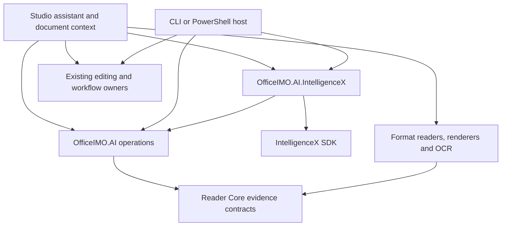

# Document assistant architecture

Status: proposed implementation design. The packages and conceptual contracts introduced below are design targets, not available APIs. [ROADMAP.md](ROADMAP.md#document-assistant) owns implementation status and the delivery checklist. This document owns the architecture and acceptance contract; it is not a second backlog.

## Product boundary

The primary deliverable is a working, provider-neutral document AI engine with a public .NET API and a repeatable headless consumer. It reads documents, returns structured blocks and extracted data, answers questions and summarizes with source evidence, and exports validated artifacts. Engine delivery and acceptance do not depend on a GUI. OfficeIMO Studio is the final integration stage, consuming already validated operations.

The initial engine scope is native PDF, scanned PDF and raster images, with an explicitly configured recognition route. Other Reader formats follow through the same API. Imported or converted documents retain original-versus-working-document provenance. Later Studio integration starts with PDF documents; Reader support does not imply native Word or Excel editing tabs in Studio.

The assistant uses the IntelligenceX SDK. It does not embed the IX Chat application, inherit its diagnostic tool packs, or recreate its provider/authentication machinery. The application remains usable with AI disabled and without credentials. No Evotec-hosted document service is required: users supply an approved hosted connection or a separately configured local endpoint whose capabilities have been verified.

Initial exclusions are autonomous filesystem work, arbitrary shell commands, web research, persistent collection indexing, custom model training, automatic redaction, and unsupervised edits. A later capability is admitted through its own evidence and permission contract, not because a model can suggest it.

## User journeys

| Journey | Input scope | Result | Completion condition |
| --- | --- | --- | --- |
| Ask about this document | Active document snapshot plus question | Answer, supporting passages, coverage and limitations | Source links resolve to the same snapshot; unsupported questions receive an explicit insufficient-evidence result |
| Explain this selection | Selected text, page, or region | Explanation with selected evidence and clearly labelled interpretation | Scope stays within the selection unless the user expands it |
| Summarize | Selected pages or whole document | Structured summary with evidence per substantive factual statement | Every requested page has a recorded processing outcome; incomplete coverage is visible |
| Extract a table or fields | Region/pages plus requested field schema | Typed values, source references, uncertain/missing/conflicting entries | Reviewed preview can be exported; values are not silently repaired or guessed |
| Propose an edit | Current snapshot, supported target, instruction | Concrete before/after proposal and consequences | User can inspect and apply through the existing editing owner; unsupported operations remain unavailable |
| Compare selected documents | Explicitly attached source snapshots | Source-linked differences and uncertainty | Each claim identifies its document and revision; structural/visual differences come from existing comparison engines |

Deliver these journeys through engine requests and typed results first. A .NET consumer and a thin CLI exercise explicit file/page/region scope and emit JSON evidence, reviewable proposals and output artifacts. No engine operation may require a tab, window, interactive dialog or Avalonia type. Studio presents these same contracts only after the engine acceptance gates pass.

## Existing owners and integration seams

| Existing owner | Reuse | Required extension or boundary |
| --- | --- | --- |
| [Reader Core](../OfficeIMO.Reader.Core/README.md) | Read results, blocks, tables, pages, chunks, diagnostics, structured extraction, page provenance | Evidence projections should preserve these models and add only AI-specific references and assessments |
| [Shared OCR](../OfficeIMO.Ocr/README.md) | `IOcrEngine`, explicit capabilities, provider provenance, bounded execution and geometry | Provider confidence and model guesses remain distinct; richer layout relationships must not be flattened into text spans |
| [Reader OCR](../OfficeIMO.Reader.Ocr/README.md) and [PDF OCR](../OfficeIMO.Pdf.Ocr/README.md) | Recognition integration and PDF rendering/text-layer operations | AI interpretation does not establish accurate word geometry or searchable-output fidelity |
| [Workflow runner](../OfficeIMO.Workflows/OfficeWorkflowRunner.cs) | Output publication, source access, cancellation, conversion and operation-specific workflows | AI-approved exports call existing typed operations and publication guards |
| [Studio services](../OfficeIMO.Studio/Infrastructure/StudioApplicationServices.cs) | Application composition, preferences, localization, diagnostics, jobs and recovery | Compose the optional assistant and credential references here; no provider calls in views |
| [Document tabs](../OfficeIMO.Studio/Features/Shell/StudioDocumentTabViewModel.cs), [reader session](../OfficeIMO.Studio/Features/Reader/PdfDocumentSession.cs), [workspace](../OfficeIMO.Studio/Features/Workspace/PdfWorkspace.cs) | Per-document lifetime, immutable read snapshot and mutable editing workspace | Add an explicit snapshot/revision bridge; never assume a disk path represents unsaved edits |
| [Command catalog](../OfficeIMO.Studio/Features/Shell/StudioCommandCatalog.cs) | Shared command discovery and availability | Register assistant actions with the same protected/unsupported/busy-state policy |
| [IntelligenceX SDK](https://github.com/EvotecIT/IntelligenceX/tree/master/IntelligenceX) | Treatment requests, text/image inputs, model transports and authentication | Prove structured output, progress/streaming, cancellation, usage and execution restrictions for each admitted transport |
| [IX OfficeIMO tool pack](https://github.com/EvotecIT/IntelligenceX/tree/master/IntelligenceX.Tools/IntelligenceX.Tools.OfficeIMO) | Existing downstream read-tool consumer | Align with the current Reader package graph; it is not a dependency of the Studio assistant |
| [IntelligenceX renderer presets](../OfficeIMO.MarkdownRenderer.IntelligenceX/README.md) | Existing transcript rendering specialization | Renderer presets are not an AI runtime. Do not adopt an HTML/webview host merely to inherit IX-specific transcript conventions |

These seams establish reuse, not completed integration. `PdfWorkspace` already exposes `Revision`, `CreateDocumentSnapshot()` and `CopyBytes()`, retains undo state, and checks an expected revision inside its verified-redaction mutation path. Reuse those foundations to capture content and revision consistently; add the assistant identity bridge rather than another session or transaction system. Provider capability proof remains an implementation requirement. Package support and public availability must be verified independently of source inspection.

## Package and dependency design

The target is two optional packages, with a narrow execution boundary proven by the first working slice before public API publication:

- `OfficeIMO.AI`: document operations, evidence planning, prompts specific to those operations, result contracts, citations, interpretation and document validation. Depends on Reader Core and minimal existing contracts; format handlers and renderers are supplied by composition. It contains no credential store, provider registry, network transport, UI toolkit, or generic chat framework.
- `OfficeIMO.AI.IntelligenceX`: adapter from the OfficeIMO execution request to the IX SDK and back. Owns mapping and provider-capability checks. References `OfficeIMO.AI` and the reusable IX SDK, never IX Chat or `IntelligenceX.Tools.OfficeIMO`.

A headless host composes readers, renderers, recognition providers, the AI operation service, the IX adapter, and existing workflow/editing services. Studio later provides presentation and action dispatch over the same composition. Vendor-specific transport and authentication improvements belong in IX, not in separate OfficeIMO packages per vendor. The neutral execution interface also accepts caller implementations for existing enterprise SDKs without requiring IX.



Arrows show references or host composition, not the request sequence. The AI service invokes a caller-supplied execution interface implemented by the adapter. Its minimal shape is a bounded evidence request, output schema, cancellation, progress and a validated execution response. Do not expose IX JSON types or chat-thread objects through the document API.

Target the first optional AI engine and headless consumers at .NET 10; Studio integration follows later. Preserve existing OfficeIMO target frameworks and dependency graphs. Add net8.0/netstandard2.0/net472 AI support only with an actual consumer and executable contract proof; existing Reader compatibility does not automatically apply to the new packages. `Reader.All`, base format packages and the core workflow runner must not acquire the IX SDK or optional recognition runtimes transitively.

## Request lifecycle

```mermaid
sequenceDiagram
    actor User
    participant Host as .NET or CLI host (Studio later)
    participant AI as OfficeIMO AI
    participant Source as Reader / Render / OCR
    participant IX as IX adapter and SDK
    User->>Host: Submit file or snapshot and explicit scope
    Host->>Host: Capture scope, revision and processing policy
    Host->>AI: Operation with immutable snapshot handle and limits
    AI->>Source: Read authorized evidence; render selected regions if needed
    Source-->>AI: Blocks, assets, provenance and coverage
    AI->>IX: Bounded evidence plus output contract
    IX-->>AI: Progress and untrusted candidate result
    AI->>AI: Validate schema, references, support and coverage
    AI-->>Host: Typed result with evidence and limitations
    Host->>Host: Check request identity and current revision
    Host-->>User: Typed result and evidence, or stale/partial/error state
```

1. Capture explicit scope: selection, selected pages, active document, or an explicitly attached document set. Scope does not expand because a model requests another path or because another tab becomes active.
2. Capture an immutable snapshot through the source owner; a headless file/stream consumer supplies bounded content and identity without a GUI session. Later Studio integration captures content under the existing workspace coordination rules. Hash the snapshot bytes and record the workspace revision, source identity and any import/conversion relationship. For unsaved edits, read a bounded snapshot of current working content; if that cannot be obtained safely, explain the limitation and require a supported save/snapshot action. Never silently analyze an older disk copy.
3. Check document permissions before extracting text or rendering for model use. OCR or screenshots must not bypass protected-document policy. Source access follows the existing storage owner, including provider-backed files.
4. Build evidence locally from native content first. Recognize/render only where the operation needs it. Record omitted pages, reading failures, uncertain order and truncation. Query retrieval can select a subset; a whole-document summary must account for all requested pages through bounded staged processing or report partial coverage.
5. Execute through the selected, verified IX transport. The request uses explicit evidence only. Remote file URLs, attachments, links and embedded resources are not fetched by implication.
6. Validate the response before promoting it to a completed result. Reject invalid schemas and dangling references. Return missing evidence or validation failure rather than inventing corrections.
7. Attach the result to its original request and snapshot. Headless output includes source identity and validation state. In the later Studio host, a switched tab cannot receive another document's result. A changed revision makes the result historical/stale: navigation must target the retained snapshot or clearly explain that reanalysis is required.

## Conceptual request and result contracts

Names below describe responsibilities; the first implementation should settle concrete names and overloads through a headless consumer. Reuse existing Reader types wherever they express the same meaning.

| Contract | Required information and invariant |
| --- | --- |
| Document snapshot | Opaque document identity, immutable content hash, working revision, original/derived relationship, media type, permitted operations and bounded source access; a path or display name alone is not identity |
| Operation request | Request ID, operation kind, user instruction, explicit snapshot scope, selected pages/regions, schema version, locale, execution profile, resource limits and cancellation |
| Evidence bundle | Source-derived block/table/asset references, observed text, logical order, page provenance, recognition method, transformations and per-page coverage; identifiers are stable within a snapshot |
| Evidence reference | Snapshot ID/hash, block/table/cell or region reference, optional exact quote, page label/index and geometry origin; never a model-created local path or executable link |
| Execution request | Bounded text/images, capability requirements, document prompt version, output schema, request ID and remaining budgets; carries no arbitrary workspace permission |
| Execution response | Provider/model identity, finish reason, response ID, candidate payload, capability outcomes, available usage and sanitized diagnostics; provider output is untrusted |
| Document result | Answer/summary or structured records, per-claim evidence, support assessment, coverage, warnings, terminal state and provenance; correctness is not inferred from valid JSON |
| Field result | Raw observed value, normalized typed value, citations and `Present`, `Missing`, `Ambiguous`, `Conflicting` or `Invalid` status; locale-sensitive dates/numbers remain ambiguous unless evidence resolves them |
| Action proposal | Allowlisted operation, typed target/arguments, source revision/hash, proposed changes/output, consequences and proposal hash; no script, arbitrary code or executable generated markup |

Results distinguish reference validity, exact-quote matching and semantic support. A valid citation proves that a location exists, not that it supports the claim. Deterministic checks can verify quotes, table cells, types and arithmetic. Semantic assessments remain fallible and must be evaluated against labelled evidence; a second model is not an oracle. Use `Supported`, `Partial`, `Unsupported` or `NotAssessed` assessments with reasons. Do not present model self-confidence as a calibrated probability.

A structured schema must bound nesting, array sizes and string lengths. Keep rejected payloads out of normal logs. Schema evolution must retain reader compatibility or fail with an explicit unsupported-version result. Record the schema, prompt, extraction configuration, renderer/OCR provider and model identity needed to reproduce an evaluation; do not promise deterministic model output.

## Visual document parsing

Visual parsing is a document operation that can produce proposed block, reading-order and table structure from page images. It is independent of the Studio chat UI and does not require an autonomous agent loop.

Prefer native Word/Excel/PDF structure when available. For scans or difficult regions, supply a bounded page image or crop, with recognized text/geometry when available. Preserve the mapping from pixels to page coordinates, including crop, rotation and scale. Model output may add an interpretation but must not overwrite original observations without a recorded reconciliation decision.

Keep native observations, OCR observations and AI interpretations distinguishable. Validate page bounds, table dimensions, merged-cell relationships, duplicates, omitted rows and disagreements. Only expose word-level coordinates as measured locations when they come from a qualified recognition/geometry path. Model-proposed boxes may support a labelled approximate preview; they cannot authorize redaction or establish a searchable PDF text layer.

Specialized layout providers may return relationships beyond `IOcrEngine` spans. Preserve them through an existing Reader projection where possible; introduce a small optional layout contract only when a real provider proves the gap. No neural runtime, Python environment, GPU requirement or model weight download enters default packages. Evaluate both model/runtime licenses and model provenance before selecting a provider.

## Studio interaction and state (final integration)

Use a document-bound assistant pane with a scope selector, processing-profile indicator, conversation, evidence cards and composer. Show `Selection`, `Pages 2-4` or the document name before submission. Suggested actions are the same shared commands as context-menu entries such as `Explain selection` and `Ask about this page`.

On wide windows, the pane sits beside the document and can reveal source details. On compact windows it becomes an accessible drawer or dedicated panel without hiding the close/back action or losing reading position. Use native typed controls for citations, tables, proposals and actions. Render narrative text using existing safe rendering capabilities selected for the actual host; disable raw HTML execution, remote images and arbitrary link actions. Only host-created citation tokens navigate the document.

The pane belongs to a document tab; preferences and connections are application-scoped. Start with one in-flight request per document and a bounded application queue. Closing a tab cancels its requests and releases snapshots. Switching tabs leaves the originating request associated with its tab. Editing during analysis is allowed against a captured snapshot, but the eventual result is marked stale when the revision differs.

The operation state is `Idle -> Preparing -> Reading/Recognizing -> Running -> Validating -> Completed`, with terminal alternatives `Partial`, `InsufficientEvidence`, `Cancelled`, `Failed` and `Stale`. Authentication and missing capabilities are actionable setup states. Progress represents observable work; do not fabricate percentages or show internal reasoning. Streamed answer text is provisional until validation completes, and incomplete JSON never becomes a clickable action. If streaming is unavailable, show stage progress and deliver the validated result when complete.

Follow-up questions reuse host-controlled conversation context plus verified evidence references. Previous answers are conversation, not new source truth. Summaries of long conversations must preserve scope and reference identity. Default to fresh provider execution with explicit bounded context; provider-side response chains may be admitted only after deletion, scope isolation and stale-context behavior are proven.

Retain conversations in memory initially. Saving or exporting a conversation is explicit and includes source/revision and verification status. A later persistent-history feature needs retention, access, deletion and stale-source rules; it must not piggyback silently on document recovery. Reuse existing localization resources, command availability, job notices and keyboard/focus conventions. Screen readers receive bounded stage and completion announcements, not every streamed token.

## Provider portability contract

ChatGPT through IX is the first test route, not the public API shape. Before declaring the engine complete, run the same consumer and operation fixtures through that route, one independently authenticated hosted vendor and one local model endpoint. Record the exact endpoint protocol, model and capability profile; an OpenAI-compatible URL is not proof of equivalent behavior. Missing access is an explicit acceptance gap, not evidence of portability.

Keep vendor model names, endpoint URLs, credential references and transport-specific settings in execution profiles. Switching a supported profile must not change document-operation code, schemas or result interpretation. Do not bake ChatGPT conversation IDs, response envelopes, tool syntax or image encodings into OfficeIMO contracts. Where IX lacks a vendor's native protocol, implement the reusable adapter in IX; do not assume all vendors expose OpenAI-compatible HTTP.

| Capability | Required behavior |
| --- | --- |
| Text inference | Required for answer, summary and extracted-text interpretation; verify instruction separation and bounded responses |
| Vision | Required only for image interpretation; text-only models may consume locally recognized text with explicit loss of visual coverage, or return an unsupported-capability result |
| Structured output | Prefer provider-enforced schemas where supported; otherwise use an explicitly declared prompted-JSON mode with identical local schema validation and bounded repair. Report the weaker generation guarantee; invalid results never become successful extraction |
| Streaming | Optional progress enhancement; a non-streaming route must still complete the same operation/result contract |
| Context and image limits | Preflight each profile's limits, retain page/table relationships while batching, and report partial coverage instead of silent truncation |
| Cancellation and usage | Report actual support; suppress late results, bound local resources, and distinguish unavailable token/cost data from zero |
| Local operation | Verify that inference and required recognition stay on the configured local path with no hosted fallback; include model/runtime version, resource limits and cold-start behavior |

Separate protocol compatibility from model quality. The portability matrix records each operation as passed, failed, unavailable or not evaluated for each profile. Every admitted profile must pass source/security invariants; quality thresholds apply per supported operation. A text-only local model need not support vision, but the local acceptance lane must complete a useful native-document and scan-via-local-OCR workflow. Visual parsing requires a separately qualified vision profile.

The public execution interface needs a caller-supplied implementation smoke test as well as IX-backed integration tests. This proves that `OfficeIMO.AI` is actually usable without IX rather than merely hiding an implicit IX dependency.

## Model execution, privacy and budgets

An execution profile describes provider/endpoint, model, verified capabilities, processing location, credential reference and limits. Credentials remain in a host-approved credential store through existing IX facilities or a narrowly scoped host adapter. Never write them to recipes, document metadata, prompts, diagnostics or source control.

Before the first hosted request, show what will leave the machine and allow a deliberate processing choice. The choice persists for its stated profile and scope; do not prompt for every routine read. Expanding to more documents, a different provider or a broader data scope requires a visible new choice. A local endpoint must not silently fall back to a hosted model. The label `local` requires that the selected execution path, helpers and telemetry have been checked for that claim. Explain provider retention according to the selected service; clearing local history does not assert remote deletion.

Provider connectivity and agent network/tool permission are different controls. In particular, IX's `AllowNetwork` setting is not proof that supplied document data stays local. Admit a transport only after verifying that model execution cannot read arbitrary host files, run shell commands, use ambient tool packs or fetch source URLs. Missing enforceable restrictions make that transport unavailable for the initial assistant. A prompt telling the model to behave is insufficient.

Treat instructions found in files, OCR text, metadata and model output as data. They cannot alter the user's scope, credentials, profile or action policy. UI rendering must also prevent document/model content from registering actions or triggering requests.

Use one operation budget across read, render, OCR, inference, validation and any bounded repair attempt. Bound source bytes, pages, decoded pixels, evidence characters/tokens, output size, concurrency, total duration, tool steps and temporary storage. Check declared image and context limits before sending. Allow at most one output-repair attempt within the remaining budget; retain the original failure classification. Transport retries must be limited and visible where billing or ambiguous completion is possible. Do not automatically retry mutations.

Cancellation stops new work immediately and propagates through existing engine/IX contracts. A late or uncancellable remote response must not publish output, revive a closed tab or escape resource accounting. Report that remote processing or billing may already have occurred. Missing cost data is `unknown`, not zero; a hard monetary ceiling is only available when enforceable, with token/request limits as the baseline.

Cache local extraction/rendering in a bounded, permission-aware cache keyed by snapshot hash and full extraction settings. Share nothing across unrelated documents merely because filenames match. Avoid persistent AI-response caching initially. Delete task-owned image/temp payloads when no request or retained snapshot needs them, including failure and restart recovery paths. Default diagnostics contain timings, result categories and non-content identifiers, excluding prompts, recognized text, document paths and raw provider payloads.

## Reviewable extraction and actions

Extraction previews display typed values beside their evidence. Corrections made by the user are labelled user-supplied, not attributed to the model or source. Calculations record operands and rules. Export through the owning Word/Excel/CSV or workflow APIs, with explicit destination and the existing overwrite/source-protection policy.

AI may propose an action but cannot create authority. The host resolves an allowlisted operation against actual document capabilities, validates arguments and source identity, and shows the change or output preview. Approval binds the proposal hash, snapshot revision and output intent. Any changed target, argument or source invalidates it.

Headless hosts serialize a reviewable proposal and accept an explicit approval bound to its hash; no GUI dialog is required. Execute supported edits through the existing document/workflow mutation owner, and later through Studio's workspace transaction/undo mechanism. Recheck revision and permissions atomically with application of the edit; a preflight check alone leaves a race. Exports use existing staging, validation and publication guards, with reopen evidence and signature/protection consequences. If a suitable shared operation does not exist, implement it in the owning engine/workflow first. The assistant does not simulate editing by producing arbitrary replacement files.

Redaction, signing, protection changes and external publication are outside initial AI actions. If later exposed, they retain their existing specialized review and authorization requirements. An AI finding is a candidate, never proof that sensitive content has been removed.

## Delivery gates

Implementation checkboxes live only in [the roadmap](ROADMAP.md#document-assistant). These gates define the required evidence and order.

| Gate | Deliverable | Acceptance and dependency |
| --- | --- | --- |
| A: engine foundation | Public-shape .NET consumer for native PDF and scanned image/PDF evidence, initially through ChatGPT via IX | Labelled fixtures; source identity, schema rejection, unsupported answer and cancellation proof; establish neutral execution and capability contracts |
| B: recognition and extraction | Structured blocks, tables and typed fields with evidence plus JSON and document export | Requires A; compare native/OCR/vision on identical labels; prove coordinates, missing/conflicting values, locale handling, budgeted batching and output reopen without a GUI |
| C: document reasoning | Questions, selected-content explanations and whole-document summaries through .NET and thin CLI | Requires A and reuses B's evidence; prove coverage, citations, abstention, long-document limits and snapshot changes without Studio |
| D: provider and package acceptance | Same installed-package consumer through ChatGPT, another hosted vendor and a local model; caller-supplied non-IX implementation proof | Start adapters during A; finish shared operation/capability matrix, privacy, failure, usage and resource tests after B-C. This is the required engine delivery endpoint |
| E: advanced engine operations | Source-bound proposals for one supported edit and explicit multiple-document questions/comparisons | Separate headless extension after D; prove serialized review/approval, stale-source rejection, existing mutation/publication guards, artifact reopen and per-document isolation |
| F: Studio integration | Document assistant UI over accepted engine operations | Last stage, after D and any selected E scope; add current workspace snapshot bridge, evidence navigation, previews, tab lifetimes and actual accessible compact/wide platform proof |

Gates A-D define a complete useful engine delivery, not a disposable proof before UI work. They must produce usable packages, executable .NET/CLI examples, structured evidence and validated output artifacts with no Studio dependency. Gate E is a separately bounded engine extension and is not required to finish A-D. Studio is always last for the selected engine scope; its UI work cannot become a prerequisite for engine acceptance. None of these gates makes AI a prerequisite for the existing Studio desktop release or mobile acceptance. Calendar estimates follow measured provider/platform constraints.

## Evaluation and release acceptance

Maintain a licensed, de-identified, versioned corpus with source hashes and independent expected answers/structures. Start with Polish and English native PDFs, scans, mixed text/scans, rotated pages, multi-column content, tables, diagrams, ambiguous dates/numbers, unanswerable questions, contradictory passages, long documents, protected files and malformed inputs. Reserve held-out cases; do not tune prompts against every acceptance example.

| Evidence class | Measurement or required outcome |
| --- | --- |
| Source integrity | Exact snapshot identity, reference resolution, selected-scope enforcement and no stale action application; all invariant fixtures must pass |
| Answer quality | Claim-support accuracy, citation relevance, unsupported-claim rate, correct abstention and answer coverage; score by document/language class, not only aggregate |
| Recognition/structure | Text error rate, reading order, table/cell accuracy, omission rate and geometry alignment; do not score visual parsing as ordinary text extraction |
| Field extraction | Exact/normalized field accuracy, missing/conflicting status, row completeness and numeric fidelity; report locale-specific failures |
| Privacy/security | Injection, unauthorized file/network/tool access, cross-tab leakage, raw-payload logging and silent hosted fallback fixtures must all pass |
| Runtime | Cold/warm latency, peak memory, payload/token usage, cancellation latency, cleanup and unknown-cost handling on representative machines |
| Studio experience | Actual rendered and interaction proof at compact/wide sizes, light/dark/high contrast, scaling, expanded translations, keyboard-only and assistive technology on every claimed desktop OS |
| Package/consumer | Optional dependency graph, representative installed-package .NET consumer, supported target frameworks, exact Studio artifact and credential setup; AOT/trimming only where explicitly validated |

Record numeric quality and performance thresholds per operation before promoting it beyond Gate A. Choose them from the baseline and intended use, with labelled acceptance sets and documented remaining error rates. Security/source/publication invariants are hard gates; model-quality averages cannot excuse their failure. Live evaluation is opt-in and budgeted. Deterministic contract tests cover bounds, schemas, identity and policy; mocked provider output does not establish extraction quality. Re-evaluate material changes to model, prompt, OCR, renderer, schema or retrieval behavior.

## Cross-repository delivery and decisions

IX owns any missing reusable enforcement for structured output, streaming/progress, capability reporting, request isolation and generic usage limits. OfficeIMO owns document contracts and validation. First prove both with source builds, then publish the required IX SDK, consume its public three-part version in the optional adapter, and validate the packaged headless consumers. Validate Studio separately at the final integration gate. Published-package lag is a release dependency, not a reason for consumer compatibility shims. The existing IX OfficeIMO read tool is a reverse-consumer compatibility check, not a blocker for a Studio path that does not use it.

Defaults selected by this design are: engine delivery first, Studio last, optional AI, two narrowly separated packages, .NET 10 first, ChatGPT as the first validation route, another hosted vendor and a local model as required portability evidence, native evidence first, explicit hosted processing choice, no ambient agent tools and no persistent vector database. Later Studio integration uses per-tab context and in-memory conversation history. These choices define a complete engine milestone without committing the API to a particular commercial model.

Gate A must settle the supported provider/authentication route, transport capability matrix, exact initial limits, quality thresholds and final public contract names. These are bounded evidence-led decisions. Before specialist recognition, select the deployment/licensing footprint from measured corpus results. Before persistent collections/history or mobile AI, make a separate retention/storage/platform decision. Any database-backed feature should reuse the established shared data-access owner rather than introducing an assistant-specific database layer.
