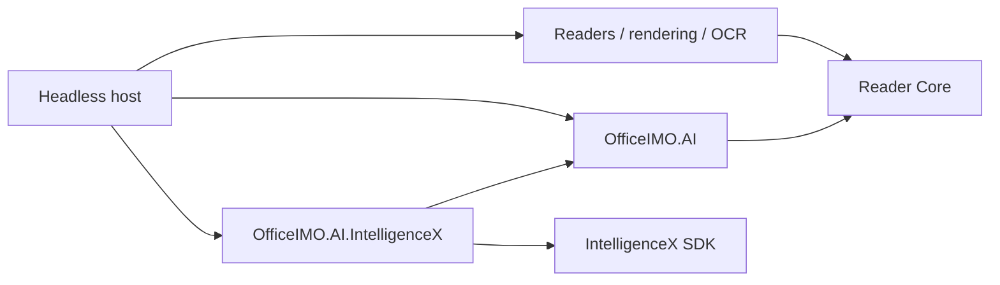

# Document AI architecture and support

`OfficeIMO.AI` provides read-only questions, explanations, summaries, typed field extraction, and proposed blocks/tables over immutable Reader evidence. `OfficeIMO.AI.IntelligenceX` supplies an optional IntelligenceX Treatment executor. Both target .NET 10. The engine and [headless example](../Examples/OfficeIMO.AI.Example/README.md) run without Studio.

Public API examples belong in the [engine README](../OfficeIMO.AI/README.md) and [adapter README](../OfficeIMO.AI.IntelligenceX/README.md). [ROADMAP.md](ROADMAP.md#document-assistant) owns open work. This page records ownership, supported behavior, and qualification limits.

Questions and explanations currently evaluate each input batch independently. Multi-batch `Ask` and `Explain` results are `Partial` with `cross-batch-reasoning-not-supported`, including when no individual batch can answer. Summary reduction is the supported operation that combines batch drafts.

## Ownership and dependencies

| Owner | Responsibility |
| --- | --- |
| `OfficeIMO.AI` | Immutable evidence capture, bounded request planning, operation prompts/schema, local response validation, typed results, and review-report projection |
| `OfficeIMO.Reader.Core` | Source observations, blocks, tables, diagnostics, geometry, page provenance, and canonical Reader JSON |
| Format readers, Drawing, PDF, and OCR | Host-composed input decoding, permission checks, rendering, recognition, and their resource limits |
| `OfficeIMO.AI.IntelligenceX` | Document request mapping, explicit connection/profile selection, and SDK lifecycle |
| IntelligenceX SDK | Native ChatGPT and compatible HTTP transports, authentication, inline images, structured output, bounded response reading, and ephemeral Treatment state |
| Headless example | Explicit file/request selection, reader/render composition, JSON reports, CSV and Excel artifacts, and opt-in evaluation |
| Studio | Future presentation and workspace integration; no dependency from the engine to the GUI |

The neutral `IOfficeAiExecutor` supports caller-owned model clients. The engine references Reader Core only. The adapter references the engine and IntelligenceX SDK, without IX Chat, tool packs, or a GUI toolkit. Base format packages and `Reader.All` do not acquire AI dependencies. Provider transport improvements belong in IX; document interpretation and validation belong in OfficeIMO.

## Request lifecycle

1. The host captures bounded bytes and reads them through the authorized format owner. PDF extraction and rendering enforce the PDF permission policy before model use.
2. `OfficeAiDocument` snapshots observations, original-byte SHA-256, source geometry and page provenance. A separate evidence-snapshot hash binds observations, image payload identities and coverage to the result. `FromReadResult` is a trusted-producer boundary: the caller must establish that observations and images belong to those bytes and that access is permitted.
3. `OfficeAiRequest` selects an operation, pages/evidence identifiers, fields, culture, optional images, limits, and hosted-processing consent. Unknown or incompatible scope is rejected before inference.
4. The engine plans bounded batches using the executor's measured prompt wrapper. Oversized records, empty pages and request-limit omissions remain visible in coverage. Images retain their page identity and share nearby page text when the request budget permits.
5. The executor receives explicit evidence and an operation-specific response schema. The response envelope stays stable, with unrelated output arrays constrained to empty. The IX adapter creates an ephemeral Treatment request without ambient tools or a fallback model. Compatible local profiles require loopback and bypass proxies; redirects are disabled.
6. The engine validates the untrusted response locally: fixed shape, duplicate/unknown properties, operation-specific arrays, bounds, evidence identifiers, exact text quotes, field names, and scalar normalization. Truncated generations are rejected. IX rejects JSON nesting beyond 128 containers before its recursive parser; the document response validator applies its narrower depth contract.
7. Results retain source identity, profile, coverage, usage where available, diagnostics, and `RequiresReview = true`. The example writes review artifacts through Reader JSON, CSV and Excel owners and reopens them.

A quote match proves occurrence, not semantic entailment. Image citations make no text-match claim. `Completed` describes structural validation and selected-evidence processing; it does not certify factual correctness or complete visual recognition. Missing evidence, conflicting fields, invalid normalization and incomplete coverage are represented explicitly. Provider errors are reported through sanitized diagnostic codes.

Cancellation stops waiting and suppresses late results. A provider that ignores cancellation keeps its executor gate until the actual call settles. Hosts should pass one deadline through reading, rendering and inference and manage the lifetime of any work that continues after cancellation. There are no automatic model repair/retry requests.

## Current support and qualification

| Contract | Implemented support | Qualification boundary |
| --- | --- | --- |
| Input | Reader snapshots; example supports text, native/scanned PDF and raster images | Additional Reader formats are caller composition, not automatically qualified AI inputs |
| Operations | Ask, Explain, Summarize, ExtractFields, Parse | Read-only proposals; no source edits, collections, redaction or signing |
| Scope | One-based pages and evidence IDs tied to the immutable source hash | No region-selection UI or live workspace revision bridge |
| Structure | Proposed Reader blocks and rectangular tables | Original geometry is preserved; model output does not invent authoritative geometry or establish searchable-PDF fidelity |
| Scalars | Explicit-culture decimals, integers, Boolean values, exact-format dates | Ambiguity/conflicts remain review states; no guessed date formats |
| Long documents | Measured text windows, original citation offsets, partial text ranges and bounded summary synthesis | No retrieval index; incomplete reduction retains drafts and reports Partial |
| ChatGPT | Native IX transport, text and inline images, enforced schema | Opt-in live synthetic corpus; model quality varies between calls |
| Compatible hosted/local | Same operations, inline image mapping, enforced-schema or prompted-JSON profiles | Qualify the actual model, context and deployment; a protocol fixture alone does not establish accuracy |
| Copilot | Restricted headless text treatment with an explicit account-available model | No image inputs or server-enforced schema; prompted responses can fail strict local validation |
| Other clients | Caller-supplied `IOfficeAiExecutor` | Capabilities and deployment locality are declared by the caller and need independent qualification |
| Exports | Versioned evidence report, proposed Reader JSON, CSV and Excel review tables | Files are created without overwrite; a multi-file export is not an atomic publication transaction |
| Runtime | .NET 10 | Other target frameworks, AOT/trimming and GUI integration are not claimed |

The native adapter disables raw payload tracing and usage telemetry. Ephemeral SDK state is removed after each request. Neither control establishes hosted-provider retention policy. A loopback address establishes the connected endpoint, not whether its service forwards inference elsewhere.

## Evaluation

The example's opt-in evaluation corpus generates English and Polish native PDFs, tables, image scans, scanned PDFs, rotated scans, mixed native/scan documents, abstention, conflicting fields, injected instructions, summary, explanation, refund, missing/ambiguous field, multi-column, directed-flow and long-summary cases. Sources are synthetic and generated by the example; reports retain source hashes, profiles, latency, token counters where available, independent gold values, positional cell precision/recall, fact-marker recall, request counts, synthesis state, coverage, evaluation-process memory samples and repeated-case outcomes. Evaluation mode explicitly saves synthetic provider responses for inspection.

Field cases require exact normalized values. Table cases require the expected cell structure. Abstention, conflicts, and source-injection cases require the corresponding safe outcome. Citation/coverage validity is additionally checked by the engine. These checks are useful regression evidence; they are not a benchmark of semantic accuracy across arbitrary documents. Repeated live runs can disagree, and prompt changes require another evaluation.

Deterministic tests cover schema rejection, scope, source identity, bounded planning, cancellation/lifetime, scalar fidelity, evidence projections, compatible transport behavior and response limits. Installed-package validation exercises the packaged dependency graph separately from source builds.

The finite synthetic cases cover selected diagrams and regional columns; they do not establish general diagram comprehension, reading-order accuracy or geometry alignment. Specialist recognition comparison, independently produced real documents, diverse scripts and equivalent-work performance benchmarks remain separate qualification work. Deployment and model-quality evidence must identify the exact model, route and resource profile; missing usage counters remain unknown.

## Later integration boundary

Studio integration consumes accepted engine contracts last. It must capture current unsaved content through the existing workspace owner, retain revision/hash identity, isolate document lifetimes, show evidence and review states, reject stale actions, and prove actual accessible compact/wide interaction on each claimed platform. Source hashes alone do not establish that an open workspace is unchanged.

Edit proposals and document collections are separate engine extensions. They must reuse existing mutation/publication owners with concrete before/after data, explicit approval, stale-source checks and artifact readback. Persistent history or indexing requires an explicit storage/retention decision. No current AI operation authorizes filesystem actions, shell commands, web research, external publication or autonomous edits.
