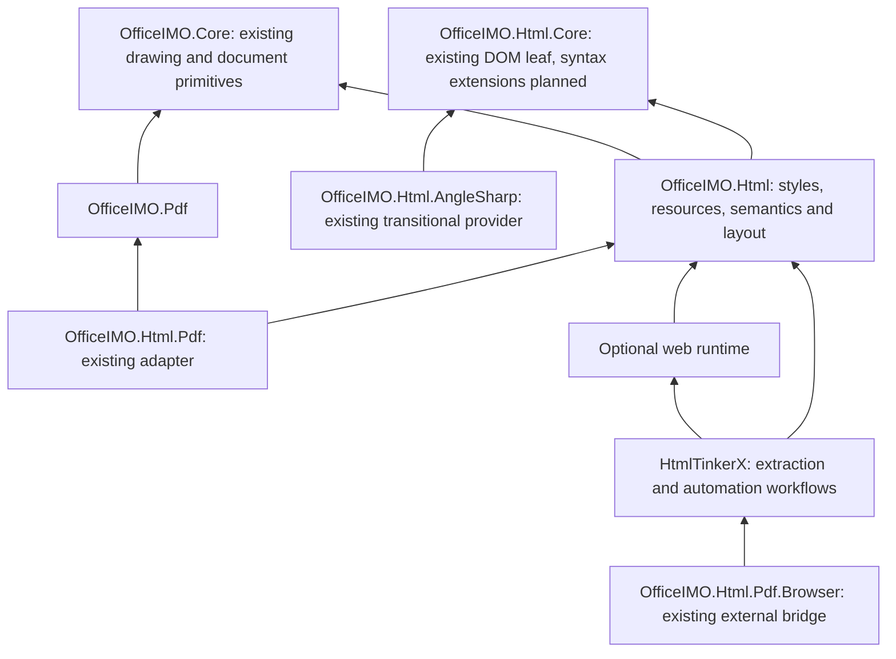
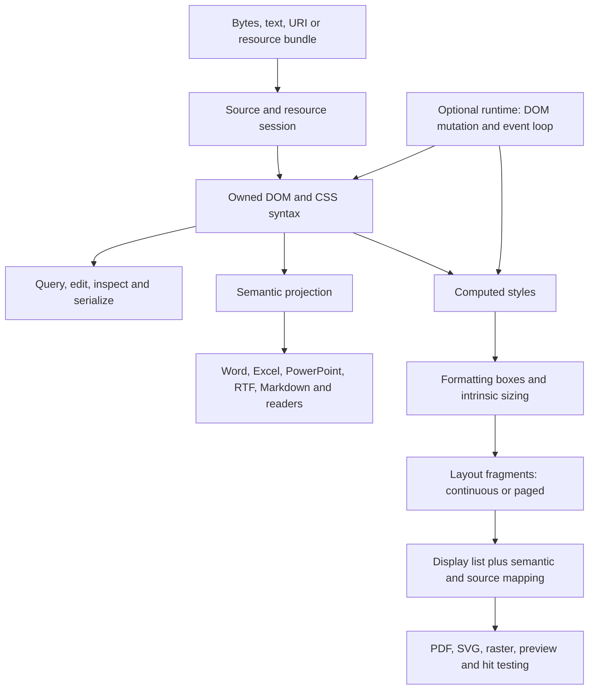

# Independent HTML engine design

This is a proposed architecture for extending OfficeIMO's existing HTML engine into a reusable web-document platform. It describes design decisions and acceptance contracts, not additional capabilities available in the current package. Implementation work and its delivery order belong in the [roadmap](ROADMAP.md#independent-html-engine). Current support remains defined by the [generated HTML support matrix](officeimo.html-support-matrix.md).

The implemented foundation is documented in the [HTML package README](../OfficeIMO.Html/README.md#inspect-and-edit-owned-html): owned document/node snapshots, explicit edits, public DOM migration, and parser/charset provider contracts. `OfficeIMO.Html.Core` is now the dependency-free contract leaf and `OfficeIMO.Html.AngleSharp` is the current syntax provider. CSS/layout still use the native adapter internally. The broader CSS syntax, contextual fragment, runtime and dependency-retirement architecture below remains a design target.

The objective is to parse, inspect, query, edit, style, lay out, render, and convert HTML through OfficeIMO-owned contracts. OfficeIMO converters, HtmlTinkerX, document readers, and preview hosts should consume the same implementation. Runtime dependencies can supply difficult algorithms initially; each must have an explicit replacement boundary and evidence for its eventual removal.

Delivery prioritizes usable components. Keep AngleSharp, HarfBuzz, CodePages and other effective providers for as long as they help deliver the required behavior. Isolate their contracts early; replace their implementations when correctness, capability, deployment, licensing, performance or maintenance evidence justifies the work. Dependency removal is a later qualification track, not a prerequisite for releasing useful rendering or runtime capabilities.

## Product boundaries

There are three separately useful products, with different acceptance criteria:

| Product | User outcome | Completion boundary |
| --- | --- | --- |
| HTML document platform | Parse and edit documents, query content, analyze CSS, normalize HTML, extract structured data, and convert to editable document formats | Published DOM, syntax, query, serialization, semantic and resource contracts work without launching a browser |
| Static web renderer | Render HTML and CSS to continuous previews, paged PDF, SVG and raster output | Declared static-web compatibility profile passes its frozen corpus without Chromium; script-dependent content is identified as unexecuted |
| Browser runtime and automation | Load pages, execute scripts, interact, wait for specified states, inspect results, and capture output | Declared web API and interaction profile passes independent runtime tests and representative site workflows without an external browser |

A static page can be complex and still require no JavaScript. A simple-looking page can require scripts to create all its content. Classify inputs by required behavior and captured state, not their appearance or URL.

Playwright is an automation layer over Chromium, Firefox and WebKit. Rendering replacement and automation replacement therefore have different owners and tests. A new engine also cannot prove how a website behaves in those other browsers; cross-browser testing remains a valid development dependency even after the runtime is independent. See [Playwright browser support](https://playwright.dev/docs/browsers).

No stage promises all websites or an identical Playwright API. The browser stage is part of the long-term design, with its own executable scope rather than an indefinite promise hidden inside HTML-to-PDF.

## Existing foundation

The design was checked against OfficeIMO source commit `cd669cee1a9924693b26a400ca03b2db01b7e347` and HtmlTinkerX source commit `04f77ddee2dd5d33bb381e5f921b440710492aad`. These identify the inspected source; they do not establish public-package or runtime qualification.

| Capability | Existing owner and evidence | Design implication |
| --- | --- | --- |
| Shared conversion input | [`HtmlConversionDocument`](../OfficeIMO.Html/Engine/HtmlConversionDocument.cs) retains source and lazily builds policy, logical, semantic, style and resource projections | Evolve this facade; preserve explicit trust and conversion profiles |
| HTML parser | [`AngleSharpHtmlParser`](../OfficeIMO.Html.AngleSharp/AngleSharpHtmlParser.cs) implements the owned `IHtmlParserProvider` contract and returns `HtmlDocument`; native parsing remains an internal provider helper | Qualify replacement parsers against the owned document contract and the same recovery fixtures |
| CSS processing | [`HtmlComputedStyleEngine.Rules`](../OfficeIMO.Html/Styles/HtmlComputedStyleEngine.Rules.cs) combines AngleSharp.Css with raw-rule recovery and protected declaration transformations | Own lossless CSS syntax before adding more parser-specific recovery layers |
| Layout | [`HtmlRenderLayoutEngine`](../OfficeIMO.Html/Rendering/HtmlRenderLayoutEngine.cs) already has block, inline, table, flex, grid, positioning, pagination and related implementations | Audit and adapt existing algorithms behind clearer intermediate representations; avoid a second permanent renderer |
| Render result | [`HtmlRenderDocument`](../OfficeIMO.Html/Rendering/HtmlRenderDocument.cs) carries shared pages, fonts, text and diagnostics | Extend its scene and semantic mapping rather than add a PDF-specific layout model |
| Shared graphics and fonts | [`OfficeIMO.Core`](../OfficeIMO.Core/OfficeIMO.Core.csproj) contains the `OfficeIMO.Drawing` namespace; [`OfficeManagedTextShapingProvider`](../OfficeIMO.Core/OfficeManagedTextShapingProvider.cs) explicitly declines some scripts and features | Keep typography and codecs shared across formats; absence of an external package does not imply full shaping coverage |
| Optional shaping | [`OfficeIMO.Drawing.HarfBuzz`](../OfficeIMO.Drawing.HarfBuzz/OfficeIMO.Drawing.HarfBuzz.csproj) supplies native shaping dependencies | Retain the existing provider contract while expanding managed shaping |
| PDF | [`OfficeIMO.Html.Pdf`](../OfficeIMO.Html.Pdf/OfficeIMO.Html.Pdf.csproj) depends on Html, Core and Pdf | HTML owns layout; PDF owns PDF serialization, fonts, tags, security and conformance |
| Browser bridge | [`OfficeIMO.Html.Pdf.Browser`](../OfficeIMO.Html.Pdf.Browser/OfficeIMO.Html.Pdf.Browser.csproj) references HtmlTinkerX | Keep external browser execution in this optional direction; never make Html depend on its browser bridge |
| HtmlTinkerX | Its inspected project already references OfficeIMO.Html and OfficeIMO.Markdown.Html, alongside AngleSharp packages, Jint, Playwright and other tools | Migrate workflows incrementally through the existing consumer relationship; HTML-engine independence does not automatically remove every HtmlTinkerX dependency |

Current code is a substantial starting point. This inspection was not a new rendering qualification run. Existing feature names, catalog entries and passing historical tests must be classified as implementation, conformance evidence, or remaining proof gaps before setting a baseline.

## Dependency direction and packages

The target package graph is acyclic:

`OfficeIMO.Html.Core` is a proposed lightweight leaf for owned source buffers, HTML/CSS syntax, DOM, serialization and selector contracts. It must not depend on graphics, PDF, Office file formats, networking sessions, JavaScript or browser installers. This gives HtmlTinkerX parsing and extraction a small dependency graph. Namespaces can distinguish `Dom`, `Css.Syntax` and `Selectors` without creating a package for every folder.

Keep computed styles, semantic projection, resource orchestration and layout in `OfficeIMO.Html` initially. Extract a separate CSS package only if a measured consumer requirement justifies it. Existing graphics primitives remain in `OfficeIMO.Core`; do not create another font or image implementation under Html. Create optional runtime/provider packages only when an executable consumer is ready to use them.

The Html composition layer may reference an AngleSharp provider to supply the default parser. The provider translates into owned nodes and tokens; it does not control the render pipeline. It can remain the implementation across multiple usable releases. A later managed parser lives in the leaf, and the default graph drops the provider only after qualification. Add optional interop only for a demonstrated consumer requirement; do not preserve provider-specific public APIs by default.

HtmlTinkerX retains website workflows, extraction recipes, sessions, authentication integration and PowerShell/CLI surfaces. Shared DOM/CSS/rendering algorithms move to OfficeIMO. Inspect each remaining HtmlTinkerX dependency by capability: replacing HTML rendering alone does not replace JavaScript minification, DOM diffing, email inlining or every legacy parser surface.

The existing HtmlTinkerX package is an aggregate with browser dependencies. Merely calling a browserless method does not make its package graph lightweight. A future parsing/extraction package can consume the new leaf while an optional browser package supplies execution; retain the existing aggregate facade during a documented packaging migration. Validate this separately from the OfficeIMO engine graph.

HtmlForgeX remains the typed HTML authoring owner. It can generate fixtures and consume previews; the HTML engine must also handle independently authored pages. Do not optimize the architecture around HTML emitted only by Evotec libraries.

## One document, several representations

The DOM, semantic model, formatting boxes, layout fragments and display list serve different purposes. A DOM node can create no box, several boxes, or fragments on several pages. CSS explicitly defines a box tree separate from the element tree; these identities must not be conflated. See [CSS Display](https://www.w3.org/TR/css-display-3/).

Extend the existing logical, semantic and render models where their contracts fit. New formatting and fragment representations address missing responsibilities; they must not become competing versions of the same semantic document.

### Public operation shape

Preserve `HtmlConversionDocument` as the familiar high-level facade while replacing provider-specific inputs and outputs with owned contracts. The following operations describe the proposed API responsibilities, not new method names available today:

| Operation | Required public contract |
| --- | --- |
| Parse/load | Explicit text/bytes/fragment/URI source, encoding/base URI, immutable options, limits and parse report; asynchronous resource I/O stays explicit |
| Query/inspect | Owned node handles, selector context, source/metadata/resource evidence and diagnostics; no layout or network work unless requested |
| Edit | Scoped mutation session, revision and source-preservation rules; commit returns a new conversion snapshot |
| Prepare/render | Explicit media, viewport/page environment, fonts, resources, renderer/provider and loss policy; returns an owned reusable render result |
| Convert/export | Target-specific semantic, visual or hybrid profile; caller-owned stream/path contract and output report |
| Execute/interact | Optional runtime/session selection, isolated execution capabilities, deadlines, readiness condition and capture-state provenance |

Results distinguish native handling, approximation, omission, unsupported behavior, policy blocking and failure. Include selected provider versions, input/environment identity and resource outcomes. Keep capability inspection available before execution, but distinguish static preflight from runtime discovery. A successful parse must not imply that rendering or a chosen target will succeed.

Separate CPU work from asynchronous I/O; expose cooperative cancellation on both. Define reusable-result disposal and thread-safety explicitly. Use interfaces at real substitution boundaries such as parser providers, resource fetchers, text shaping and output sinks; do not make every internal layout node an extensibility point.

### Source and DOM contract

Own node identity, namespaces, attributes, text, comments, doctype, document mode, template contents, fragments and parse diagnostics. A fragment parse accepts an explicit context element. HTML parsing and XML/XHTML parsing are separate modes; do not treat malformed HTML as XML with permissive flags. HTML tokenizer states and tree construction follow the [HTML parsing standard](https://html.spec.whatwg.org/multipage/parsing.html).

Separate structural preservation from conversion policy. Parsing can retain script elements without executing them. Sanitization creates a policy-governed projection; it must not silently erase the source used for inspection. Normalized HTML is a deliberate export, not a trusted substitute for original bytes.

Use stable node IDs within a document revision and explicit source spans. Mark implied nodes and generated content as such. Retain original source optionally for exact unchanged writing and diagnostics; normal DOM serialization need not preserve quote style, whitespace or malformed source byte for byte. Editing invalidates affected source ranges. Define decoded-character and original-byte offsets separately when an encoding transform occurred.

An immutable document snapshot supports concurrent conversions. An editable document/session has one mutation owner, batches changes, increments a revision and invalidates dependent projections. Start with correct full recomputation per revision; add incremental invalidation after measured need. Node handles from another document or obsolete snapshot are rejected or explicitly remapped. Returned output retains the resource/font lifetime it requires and does not reference disposed pooled buffers.

Preserve tree semantics needed for later event dispatch, ranges and shadow trees without claiming those browser APIs already exist. The [DOM Standard](https://dom.spec.whatwg.org/) is the semantic reference. Do not implement the entire browser DOM interface surface just to replace one parser dependency.

### HTML and CSS parsing

The transitional HTML provider parses once, translates into owned structures, then releases its temporary graph. Measure the peak cost of having both graphs during conversion. Rendering and conversion must not repeatedly serialize and reparse provider DOMs. Keep any old API clone/export path explicit and outside the new fast path.

The managed HTML parser needs the full selected tree-construction contract: malformed tables and foster parenting, misnested formatting, implied elements, raw text/RCDATA, character references, templates, foreign SVG/MathML content, fragments, quirks mode, and streaming chunk boundaries. A tokenizer alone is insufficient. Decoding must handle the selected BOM, transport, label, replacement and HTML encoding rules, with limits enforced during parsing. Use the [Encoding Standard](https://encoding.spec.whatwg.org/) and HTML parsing rules as references.

Own CSS tokenization and a syntax tree that preserves unknown declarations, nested component values and source spans. Then implement declaration/property grammar, selector matching, cascade and computed values separately. This permits parsing an unsupported feature without treating it as rendered. Use [CSS Syntax](https://www.w3.org/TR/css-syntax-3/) for tokenization and error recovery.

Prioritize CSS replacement when the baseline proves that current recovery transformations block correctness or duplicate substantial grammar. Keep AngleSharp for HTML while owned CSS syntax replaces sentinel rewriting and raw-rule reconciliation. Remove old recovery code only after its regression fixtures pass through the new path.

### Styles and environment

Represent specified, cascaded, computed and used values separately. Preserve unresolved percentages, `auto`, intrinsic sizes and deferred calculations until their containing context is known. Support explicit user-agent styles, author/user origins, importance, specificity, layers, inheritance, custom properties, pseudo-elements and source order. Cascade precedence comes from [CSS Cascade](https://www.w3.org/TR/css-cascade-5/), with unsupported parts visible in the capability contract.

Use one selector implementation for queries and style matching, with different calling contracts where standards require them. Include document mode, namespace/context, pseudo-state and mutation revision in relevant cache keys. Preserve every declaration required for proper fallback; do not pick a value by source order before knowing whether its grammar is supported.

The render environment explicitly fixes screen/print media, viewport, device scale, page geometry, language, direction, font set and relevant preference/media values. Container queries require style/layout dependency handling and bounded convergence; they cannot be finalized entirely before layout. Freeze animation/time for static output using an explicit policy. Do not invent hover, scroll or animation state to make a page appear complete.

### Text, sizing and fragmentation

Keep one shaping contract in the existing shared graphics owner. Layout receives glyph IDs, advances, offsets, clusters, logical-text mapping, fallback fonts and break constraints. Measurement and painting consume the same font data and shaping result. Start with optional HarfBuzz where needed, while improving the managed provider by script and font feature. [HarfBuzz shaping concepts](https://harfbuzz.github.io/shaping-concepts.html) and [cluster mapping](https://harfbuzz.github.io/clusters.html) explain the relevant input/output distinction.

Track bidirectional resolution, grapheme boundaries, line-break opportunities, shaping and final line fitting as distinct responsibilities. Re-shape at breaks where required. Include Latin, combining sequences, Arabic/Hebrew, Indic, CJK, vertical text and emoji in qualification; do not equate character count with width. Pin Unicode data and redistributable test fonts. Use [Unicode bidi](https://www.unicode.org/reports/tr9/) and [line breaking](https://www.unicode.org/reports/tr14/) tests for their respective algorithms.

Build formatting contexts around intrinsic minimum/maximum sizing, containing blocks, percentage resolution, margin behavior, anonymous boxes and logical axes. Adapt existing block, inline, table, flex and grid implementations one context at a time. Positioning, floats, replaced elements and stacking must agree on the same geometry. Unsupported combinations deserve interaction fixtures, not an ever larger collection of special cases in adapters.

Pagination is a layout constraint. Each layout operation accepts available inline/block space and a fragmentation context, then returns fragments plus an explicit continuation/break token. Page and column boundaries can change available space and child placement; cropping a tall screenshot cannot implement this. Define repeated headers, rowspans, widows/orphans, unbreakable oversized content, fixed/running elements, footnotes, page counters and named-page geometry. Iterative page-dependent content must converge within a declared limit or produce a diagnostic. See [CSS Fragmentation](https://www.w3.org/TR/css-break-3/).

### Painting and output contracts

Extend the existing render model into an ordered display list with text, paths, images, clipping, transforms, opacity groups, links and semantic/source IDs. Share stacking decisions across output backends. Retain logical reading order independently from paint order. Specify CSS pixels, device pixels and PDF-point conversion at the boundary, including the 96 CSS px to 72 PDF pt relationship at scale 1.

PDF writes searchable text, link geometry, embedded font data and supported structure tags from that scene. SVG and raster backends reuse it; SVG export must define whether text remains text or becomes paths, including portability consequences. Backend-specific unsupported effects produce a loss record or explicit rasterization policy with bounds and resolution. PDF/A, PDF/UA and PDF/X claims still require their own output validation.

Editable formats consume semantics first. A Word paragraph, Excel table or PowerPoint shape needs target-specific structure. Visual and hybrid profiles may use layout geometry, but must report approximated layout, rasterized content and reduced editability. Do not force every target through PDF or claim exact editable reconstruction from a display list.

Preview and automation hit testing can consume the same fragment geometry. Accessibility needs roles, names, language, relationships and reading order; bounding boxes alone do not provide an accessibility tree. Reuse and extend the existing accessibility owner within Html.

## Resource and execution contract

All entry points share one resource session and aggregate job budget. Pure parse/query operations perform no network access. Resource requests carry their kind, initiating node or rule, resolved URL, origin, allowed credentials, content identity and cancellation. Resolve stylesheets, imports, fonts, responsive images and nested SVG resources through that same session.

The request lifecycle is:

1. Snapshot options, source identity, policy, environment and deadlines.
2. Decode and parse under byte, node, depth and work limits.
3. Discover and resolve permitted resource dependencies under aggregate limits.
4. Resolve styles and fonts; compute semantics and/or layout as requested.
5. Validate the requested support/loss policy and construct the output.
6. Publish a completed artifact atomically where the destination supports it, then release job-owned resources.

Network access is explicit. Revalidate redirects and connected endpoints, including private-address policy and DNS changes. Define scheme, credentials, cookie, MIME, decompressed-byte, image-pixel, font and archive limits. A trusted document does not automatically authorize every network or local-file destination. Treat cancellation as cooperative inside the library; hostile hosted workloads also need externally enforced process memory/time limits.

Centralize web URL interpretation and use [WHATWG URL](https://url.spec.whatwg.org/) fixtures before claiming browser equivalence. A .NET URI object alone is not proof of identical web parsing semantics. Resource sessions partition credentialed caches and preserve caller stream ownership. No ambient authenticated browser profile is used implicitly.

Represent a captured page as a versioned resource bundle: root bytes or DOM state, URLs, response metadata, resource hashes, capture environment, fonts and resource failures. Snapshotting `outerHTML` alone misses relevant state such as canvas pixels, runtime form values and shadow content. Declare which state was retained and which was not.

Distinguish two paths: native layout of captured HTML/CSS/assets, and importing externally measured/computed browser state. The second can be useful for migration but does not prove the native CSS/layout engine. Any external-browser fallback is caller-selected and reported with provider identity; it must not silently grant network or execution permissions. HTML inspection cannot reliably detect every possible script dependency.

## Browser runtime evolution

The initial engine is inert even when the input contains scripts. A later optional runtime owns realms, DOM bindings, event dispatch, tasks/microtasks, timers, navigation, fetch, storage, origins and invalidation. Runtime mutations update the same owned DOM; there is no separate scripting DOM to synchronize.

A JavaScript interpreter can execute language code but does not supply a web platform. Evaluate the Jint dependency already present in HtmlTinkerX for the first bounded runtime, preserving a provider boundary. Language testing uses [Test262](https://github.com/tc39/test262); page behavior needs additional DOM and web API tests. Event scheduling follows the [HTML event-loop model](https://html.spec.whatwg.org/multipage/webappapis.html#event-loops).

Admit runtime features through executable profiles:

| Profile | Required behavior and evidence |
| --- | --- |
| Scripted local document | Selected language features, DOM mutation, events, timers, microtasks and deterministic capture; no unrestricted network or CLR exposure |
| Selected web application | Modules and chosen fetch/storage/history/observer APIs, origin and cookie behavior, forms, navigation, fonts and layout invalidation; representative framework application fixtures |
| Interactive automation | Input dispatch, focus, scrolling, hit testing, locator semantics, actionability, frame behavior, explicit waits and cancellation; shared HtmlTinkerX recipes pass on each advertised provider |
| Broader browser compatibility | Separately qualified shadow DOM/custom elements, canvas, workers, service workers, media, WebGL and other APIs as product scope expands |

Freeze time and disable unrelated animations in reproducibility tests; separately test real scheduling and animation behavior when those become supported. Define readiness using explicit lifecycle events, application predicates, resource/font completion and layout stability under a deadline. Network-idle alone cannot establish that a page is complete.

Untrusted scripts execute in an isolated worker with OS-enforced bounds. Interpreter constraints supplement process isolation; they are not the isolation boundary. Host objects are explicit capabilities and never expose arbitrary CLR access. Browser origins, cross-origin resource rules, credentials and navigation require dedicated security tests.

Removing a third-party JavaScript engine is a later language-runtime project covering parsing, evaluation, modules, promises, built-ins, memory management, internationalization and performance. Start with an interpreter only if the stage has its own funded scope and Test262 acceptance. A JIT is not required to begin; its absence also does not establish adequate performance for real applications. The static product must remain useful and independently releasable throughout.

## Dependency retirement

### Replaceable provider contracts

Replaceability means that the engine can use another implementation without changing its public document model or rewriting consumers. The algorithm behind that boundary can still be substantial work.

| Dependency | Boundary to establish now | What remains owned by OfficeIMO |
| --- | --- | --- |
| AngleSharp | Parse source/fragment into owned nodes and parse diagnostics | Document identity, mutation, serialization policy, query contract and consumer-facing types |
| CSS parser | Parse into owned syntax/declaration data; isolate any selector implementation used temporarily | Source retention, cascade decisions, computed-value contract and capability reporting |
| HarfBuzz | Existing shared shaping request/result contract | Fonts, glyph/cluster/logical-text mapping, lifetime, fallback policy and layout consumption |
| CodePages | Central encoding resolution/decoding boundary using owned metadata and suitable BCL types | Label policy, BOM/HTML precedence, errors, streaming behavior and limits |
| Script interpreter | Runtime provider bound to owned host/DOM contracts | Web API behavior, origins, scheduling policy, resource access and process isolation |

Do not expose provider nodes, native handles or provider exception types as normal public results. Translate errors and define cancellation, disposal and resource ownership at the boundary. Keep provider setup and configuration in composition/provider code; do not scatter encoding registrations or library-version checks through consumers. Existing .NET/BCL contracts do not need replacement wrappers merely to remove a NuGet dependency.

Use capability-specific contracts rather than mirroring every third-party method. Prove the first real implementation through contract fixtures; later run replacement providers against the same fixtures. A fake second parser does not establish replaceability. For CodePages, test actual legacy byte decoding and unavailable-encoding behavior; for shaping, test real glyph/cluster output and lifetime. Package separation follows real deployment and consumer needs, not one package per interface.

### Removal gates

Here, independence means no third-party runtime packages or browser binaries in the advertised default profile. The .NET runtime/BCL, OS services and clearly declared font/Unicode/data resources remain. Test tools and optional providers are separate. If a stronger goal excludes OS text, TLS, codecs or all external data, it requires a different platform scope.

| Dependency | Short-term role | Replacement/removal gate |
| --- | --- | --- |
| AngleSharp.Css | Current CSS parser while owned syntax is established | CSS grammar/recovery and cascade fixtures pass; existing protected-token/raw-recovery paths are removed |
| AngleSharp HTML/DOM | Production parser behind owned contracts | Selected full HTML parsing corpus, fragment/encoding tests, resource bounds and performance gates pass through a qualified replacement |
| Encoding.CodePages | Current legacy encoding support | Explicit encoding compatibility matrix passes without it, or it remains only in a separately selected encoding provider; never silently narrow accepted inputs |
| HarfBuzz/native typography | Optional complex shaping | Managed script/font/feature corpus meets text, cluster, glyph and geometry requirements on supported platforms |
| Playwright/browser binaries | Explicit external execution/capture provider and independent test reference | Static runtime graph excludes them first; later selected interactive workloads pass on the owned runtime |
| Jint or another script provider | Optional runtime implementation | Owned language runtime passes its versioned language suite and integrated web-runtime corpus within resource/performance budgets |
| Other HtmlTinkerX tools | Formatting, inlining, alternate parsers, diffing and related workflows | Separate owner and replacement proof for each capability; no blanket removal based on rendering progress |

Check complete packed transitive graphs, runtime native assets, browser downloads and data requirements for each supported target. `PrivateAssets` does not remove a runtime need. Do not describe a package as dependency-free just because its project file contains only project references.

Breaking API changes are accepted for this program. Replace public `IHtmlDocument`/`IElement` contracts during the foundation milestone once owned alternatives have end-to-end proof, while AngleSharp remains the parser implementation. Remove superseded paths and migrate affected consumers together. Do not carry duplicate APIs, obsolete overloads or compatibility wrappers solely to avoid an approved break. Preserve existing document/conversion behavior unless an intentional behavior change is separately documented and validated. Record actual upgrade actions in `MIGRATION.md` and use an appropriate breaking release version; removing the parser dependency itself can happen much later without another public API change.

## Qualification and failure analysis

Expand the existing Html tests, capability gallery, real-world corpus tooling and HTML/PDF artifact gates. Do not build a competing evidence system. Every fixture must identify its input/resource hashes, source/license, environment, engine/provider versions, tested output contract and known exceptions. Pin standards/test-suite revisions for qualification; evaluate upstream changes deliberately.

| Evidence layer | What it proves | Acceptance rule |
| --- | --- | --- |
| HTML parser tests | Token/tree construction, fragments and recovery | All tests in the declared supported subset pass; exclusions are named and counted |
| CSS/DOM tests | Syntax, queries, cascade, computed values and mutation semantics | Expected structures/values match independently defined fixtures |
| Layout fixtures | Box sizes, intrinsic constraints, line breaks, fragmentation and stacking | Geometry and text assertions pass across the selected environment matrix |
| Reference rendering | Supported pages look correct | Per-fixture tolerances plus inspection at normal reading size; no hidden clipping, missing content or accepted reference regression |
| Output round trips | Artifacts contain usable content | Reopen with independent readers; check text, links, resources, tags and target editability as applicable |
| Adversarial tests | Bounds and trust behavior | Budget exhaustion/cancellation is controlled; output is not partially published; no unauthorized access |
| Consumer packages | The contract is usable beyond project references | Real packed consumers restore, build and run on every claimed target; check transitive dependencies |
| Runtime/browser tests | Language and interaction behavior | Explicit language/API subsets and representative workflows pass; unsupported features remain visible |

Use [html5lib parser fixtures](https://github.com/html5lib/html5lib-tests) and selected [Web Platform Tests](https://web-platform-tests.org/writing-tests/) as independent inputs, respecting licenses and harness requirements. Many WPT tests require JavaScript or a browser environment. Adapt static fixtures with preserved provenance where appropriate and label them as adapted; do not report adapted tests as the complete official WPT run. Rendering comparisons can follow [WPT reftest](https://web-platform-tests.org/writing-tests/reftests.html) relationships and declared fuzzy bounds.

Use pinned Chromium references for common deployed behavior and another engine where ambiguity matters. Resolve disagreements through the specification and a minimized case; Chromium output is not the definition of every print feature. Keep browser-rendered references separate from outputs produced by the native engine and from browser-state imports.

Capture real pages with their assets and fonts for deterministic CI. Sample independently authored documentation, articles, shops/catalog pages, email, invoices, tables, dashboards, forms and multilingual documents. Script-heavy samples belong in both an unexecuted-input lane and a captured-state/runtime lane, with different expectations. Track interaction coverage such as nested grid/table pagination; isolated feature counts do not establish combination coverage.

Report passed, failed, excluded and untested separately. Maintain a held-out corpus to detect overfitting. A proposed static-release threshold is 100% of the mandatory regression/conformance subset plus at least 95% of the frozen representative-page corpus accepted against predeclared semantic and visual criteria. This is a planning target, not measured coverage or a claim that 95% of the web works. Name every remaining failed case. Adjust the target only as an explicit scope decision, never by quietly removing inconvenient fixtures.

For visual qualification, fix font bytes, viewport, device scale, media, language, page size, background and capture state. Combine image comparison with geometry and content checks: high image similarity can hide missing text, and harmless antialiasing can lower a pixel score. Inspect every page for small acceptance fixtures and use declared sampling plus automated all-page checks for large documents.

Measure cold/warm time, per-stage elapsed time, allocation, peak/retained memory, output size, cancellation latency and scaling. Include parse-only, query-only, semantics-only, continuous layout and long paged documents. Calibrate hard budgets from the initial baseline on named machines; do not invent a throughput promise before measuring. Cache by document revision, CSS, resource/font identity, environment and provider version, with bounded retention.

Diagnostics should locate the earliest divergent stage: source/token, DOM, winning declaration, computed value, box, line, fragment or paint operation. Extend the existing report with stable node/source identity, requested feature, selected provider, outcome and affected target. No-warning output means only that no known problem was reported; it is not an independent fidelity certificate.

## Implementation decisions and checkpoints

The recommended first slice crosses the whole architecture: one independently authored responsive HTML fixture with a stylesheet, font, image, link and table must support querying, one DOM edit, semantic conversion, a continuous image and paged PDF through owned contracts. Keep AngleSharp behind the parser adapter. Compare existing and new outputs and allocations before expanding the migration.

This slice tests whether the boundaries are useful to both OfficeIMO and HtmlTinkerX. Do not first rewrite every parser or expose dozens of speculative interfaces. Migrate one real HtmlTinkerX extraction/Markdown workflow as the second consumer, using packed artifacts in a local feed and explicit source pins.

After that slice, strengthen usable style/layout/conversion components and the page corpus with the existing providers. Move CSS replacement ahead only when measured recovery failures obstruct that work. HTML parser replacement can proceed once its DOM boundary is stable; it need not block static rendering improvements. Managed typography advances in the shared owner on its own corpus. Optional browser runtime work begins with an explicit first application/API profile and isolation proof, without waiting for parser, shaping or encoding independence.

The recommended first implementation PR is a complete foundation milestone: owned contracts, working provider-backed implementations, removal of replaced public paths, migration of affected in-repository consumers, representative downstream proof, preserved conversion behavior and documented upgrade actions. Include focused regression, rendering, package and resource-lifetime evidence. Keep layout expansion, new browser behavior and provider reimplementation out of that first milestone unless required to preserve an existing contract.

Prove the first slice before freezing the breaking API shape. Then submit the foundation as a normal ready-for-review PR and continue larger work from that stable base. Small follow-up PRs can deliver complete reusable components; experimental components remain on development branches until usable. A PR may still contain intentional API breaks, but each release has a coherent migration contract. A single final PR combining contract changes, consumer migration, layout redesign and dependency retirement would make regressions and review much harder to isolate. PR publication, merge and package release remain distinct actions.

The open milestones and their readiness gates are maintained once in the [roadmap](ROADMAP.md#independent-html-engine). A static-engine release, an AngleSharp-free package and an interactive-runtime release are separate reviewable outcomes. Calendar forecasts should follow the first slice and the measured remaining failure classes. Broad browser compatibility remains the largest and least predictable part of the program.
