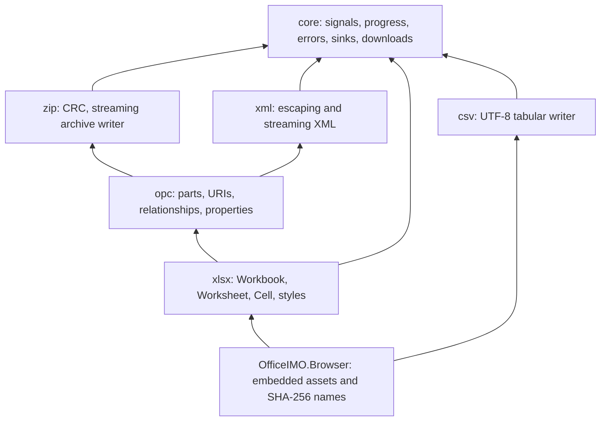

# OfficeIMO JavaScript architecture

`OfficeIMO.JavaScript` is the source owner for the single npm package `@evotecit/officeimo`. It is a document library family, with strict TypeScript, generated declarations and no runtime dependencies. `OfficeIMO.Browser` is its thin .NET asset adapter. Format behavior belongs in the TypeScript format/layer owner, rather than in report integrations or generated bundles.

## Layers and public boundaries

Each layer is a supported npm subpath with a deliberately selected `index.ts`, tests and a [package README quick start](../OfficeIMO.JavaScript/README.md). Root namespaces provide the same API identities. `package.json` exports only the root, six layers and three useful classic-script assets. Implementation modules, row projection and prepared ZIP-entry plumbing are internal. They are excluded from supported subpath exports; declarations marked `@internal` are removed by `tsc`.

The shared layers have current production callers. CSV uses core sinks and iteration; XLSX uses XML, ZIP, OPC and styles. A future reader can join `zip` beside `ZipWriter` and `Crc32`, using the same byte-source/sink and cancellation contracts. No reader API or unimplemented format namespace is shipped as a placeholder.

## Object model and C# vocabulary

| Concept | C# OfficeIMO | JavaScript |
| --- | --- | --- |
| Workbook ownership | `ExcelDocument` and its workbook/worksheets | `Workbook`, `createWorkbook` |
| Worksheet creation | `AddWorksheet` | `addWorksheet`; retained `addSheet` entry point |
| Rows and cells | Typed values, cells and worksheet operations | Ordered `addRows` and optional styled `Cell` values |
| Styles | Fonts, fills, borders, number formats | Workbook-local `StyleRegistry` with the same concepts |
| Package output | Save document to a path/stream | `toBlob`; lower layers also accept a caller-owned byte sink |
| Cancellation | .NET cancellation policy | Platform `AbortSignal` |

Public names use lower camel case for methods/options and PascalCase for model classes. JavaScript's `Date` represents an instant, so the explicit local/UTC clock policy replaces implicit .NET `DateTime` kind assumptions. CSV dates have a fixed UTC ISO spelling; the matching C# test lane configures its date format. The streaming worksheet model appends rows without keeping an editable cell graph. It does not promise the full C# editing surface, random access, formulas or readers.

Fonts, fills, borders and number formats are registered once per workbook. Registered indexes are validated and definitions are copied/normalized. Column style shorthand composes with registered styles; a `Cell` may override the style for one value. Custom column writers return typed values, never XML fragments. Package extensions use OPC-owned part and relationship validation.

## Build and distribution

Only `tsc` compiles library source. It emits ES2022 modules and declarations to ignored `dist/`; the npm archive includes that output. There are no browser/Node conditional implementations and no Node-only APIs in `src/`. Browser-only download behavior is invoked explicitly; imports remain safe in workers and server-side Node contexts. TypeScript is the sole npm development dependency.

`scripts/bundles.mjs` assembles the compiled local module graph into isolated lexical scopes. It resolves named imports/exports and namespace re-exports, rejects unknown syntax, dependencies outside `dist`, unresolved exports and cycles, and performs no transpilation or minification. Keeping this small assembler requires keeping the compiled graph inside that documented syntax subset. It preserves each module's namespace and shared identities within a bundle. Adding different module syntax requires extending and qualifying the assembler deliberately.

The build produces `officeimo.js`, `officeimo-xlsx.js`, `officeimo-csv.js` and corresponding standalone `.mjs` assets. Classic scripts extend global `OfficeIMO`; the combined script exposes all public layers and the established root helpers. Standalone format scripts include the layers their public surface needs and compose in either load order. A private symbol-keyed cache reuses identical compiled modules across classic scripts, preserving model and error class identities. Its keys hash normalized module source, relative paths and dependency identities, so changed modules cannot reuse an older implementation. These assets have canonical UTF-8/LF bytes and are committed. `--check` compares every generated byte, and `prepack` runs that check against a fresh TypeScript compilation.

The .NET project embeds these files directly from `OfficeIMO.JavaScript/bundles`; it keeps no second JavaScript source or copied asset tree. `BrowserAssets.Script`, `XlsxScript`, `CsvScript`, `Module`, `XlsxModule` and `CsvModule` retain their contracts. `ContentHash` is the first 16 lowercase hex digits of SHA-256 over exact UTF-8 bytes without BOM; `HashedFileName` binds that identity to the asset. .NET builds and consumers need no Node compiler because the bundles are committed. Contributors changing TypeScript regenerate/check the bundles before building that adapter.

Npm uses one semantic version for the whole library. The .NET adapter retains the OfficeIMO package version series and delivers the npm-built bytes; the two release identities are independent. Packaging does not publish either package. ESM imports are the application/module path; classic scripts are the portable `file://` path because local-file origins may reject module loading. The `.mjs` asset assemblies also allow a host to serve one module file without a relative dependency graph.

## Stability and extension rules

The supported contract is the exported entry points, generated types, documented input/lifecycle/error behavior and qualified format output. Patch releases preserve that contract while fixing defects. Before 1.0, a reviewed minor release may make an intentional breaking API change; its concrete upgrade actions belong in `MIGRATION.md`. After 1.0, breaking public changes require a major version. Internal module layout and emitted implementation text are not public APIs; content-hashed names change with the bytes.

Shared sinks await acceptance of each byte chunk. Streaming ZIP retains central-directory metadata and uses data descriptors; ZIP64 boundaries fail explicitly. Blob-returning writers retain output proportional to file size. XLSX compresses during row appends and retains compressed chunks, not source rows or full worksheet XML. Cancellation prevents a partial Blob from being returned; a caller-owned sink must cancel/dispose its own partially written destination.

Unknown domain column types require a registered writer. Reserved worksheet feature options throw `NotSupportedError` even when empty. They cannot silently claim merged cells, dynamic conditional formatting or validation. Tables, export-time style patches, external hyperlinks and PNG placement belong to the XLSX writer. CSV column formatters run before injection protection and quoting. Raw extra XML parts remain schema-owned inputs; XML user data belongs in `XmlWriter` values. No optional compressor, external application, network service or font asset is downloaded by the library.

Worker packaging uses compressed byte chunks directly, avoiding internal Blob reads. Native Blob input is a host capability: local-file WebKit worker contexts can reject all Blob-reading APIs. OPC reports `PLATFORM_UNAVAILABLE` with the original cause; the host can transfer bytes or provide text instead. The library does not install a main-thread proxy or silently omit the part.

## Adding a format module: DOCX outline

DOCX is a roadmap module, not an implemented API. A bounded writer can reuse the existing layers as follows:

1. Add `src/docx/index.ts` with a typed document/paragraph/run/table model that maps to `OfficeIMO.Word` concepts. Keep Word-specific paragraph/run/section semantics in that format owner.
2. Write schema-owned WordprocessingML through `XmlWriter` and `ChunkedTextSink`. User content is text or attribute data. The first vertical slice should preserve Unicode, whitespace, paragraph/run formatting and cancellation.
3. Create `/word/document.xml` through `OpcPackage` with content type `application/vnd.openxmlformats-officedocument.wordprocessingml.document.main+xml`. Add a root relationship of type `relationshipTypes.officeDocument`; OPC creates the content-type and relationship metadata.
4. Register core/app properties using `setProperties`. Word styles, media, sections and related parts use the same URI and relationship owner. Add only the parts needed by the supported Word slice.
5. Add the `/docx` npm export and root namespace, then a classic assembly entry if a portable browser consumer needs it. Keep one package version and generated declarations.
6. Place JSON/input fixtures in `OfficeIMO.TestAssets/JavaScript`; produce DOCX files from the TypeScript and browser paths. Open every positive artifact in `OfficeIMO.Word`/the relevant Reader adapter and run the Open XML SDK validator. Assert expected independent values and formatting, not only self-round-trip success.
7. Document a runnable installed-package example, supported operations, rejected options, deliberate C# differences and measured ESM/bundle sizes. Qualify the npm archive and .NET asset adapter if it exposes that new bundle.

This outline does not add Word code, dependencies or reader APIs. The [single roadmap](ROADMAP.md#officeimo-javascript) records delivery order and consumers.

## Evidence and size policy

The shared XLSX manifest covers empty output, typed text/numbers/booleans/dates, object projection, multiple sheets, styles, native tables, report highlighting, frozen panes, hyperlinks, PNG drawings, custom column writers, extra XML and valid reject-policy text. Node and browsers produce both auto-compressed and stored variants. C# tests use the same manifest and independent expectations, open files with OfficeIMO.Excel and OfficeIMO.Reader.Excel, and apply the Open XML SDK validator. Shared CSV vectors include quoting, injection, BOM/dialects, empty input, CR ending and typed UTC dates; report checks additionally qualify formatted values and explicit quoting modes.

Package checks compile a strict consumer importing every subpath, install the actual `npm pack` archive into an isolated application, inspect shipped paths/dependency boundaries and execute the imported layers. Browser verification uses the existing test-only HtmlTinkerX/Playwright owner for three engines, ESM graph loading, classic file origins, workers and offline example downloads. Host-dependent scale measurements remain explicit evidence runs outside ordinary correctness gates.

`scripts/sizes.mjs` reports raw bytes and level-9 gzip for each transitive ESM graph and each classic bundle. It also reports the sum of separately compressed ESM modules, since multi-file HTTP delivery differs from one concatenated graph. The indicative budgets are approximately 15 KiB for the XLSX classic bundle and 2 KiB for CSV. A public-layer addition can justify a documented delta; measured size and its explanation belong in the task evidence, not an invented runtime capability limit. No minifier or additional build dependency is introduced to hide that cost.
