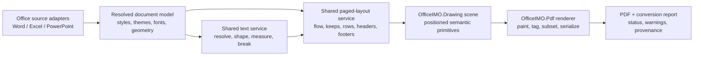

# OfficeIMO Office-to-PDF Premium Fidelity Plan

## Goal

Make OfficeIMO's managed Office-to-PDF conversions reliably preserve the document's meaning, hierarchy, page geometry, typography, colors, tables, lists, and accessibility across ordinary business documents and deliberately difficult edge cases.

The target is not pixel identity with Microsoft Office. The target is a premium, predictable rendering contract:

- text fits its intended boxes and cells;
- page size, orientation, margins, headers, footers, and page breaks are respected;
- fonts use correct or metric-compatible faces with honest diagnostics;
- paragraphs, lists, headings, and tables keep their intended rhythm and relationships;
- colors, borders, fills, alignment, and drawing order survive conversion;
- spreadsheets honor print settings and remain readable;
- presentations preserve their fixed-layout composition;
- tagged output has correct reading order and usable semantics;
- browser, server, and desktop conversions behave consistently when given the same font and rendering capabilities;
- unsupported constructs degrade deliberately and visibly rather than silently producing a plausible but wrong PDF.

## Implementation Status

The first end-to-end implementation milestone is now delivered on
`codex/pdf-fidelity-roadmap`:

- [x] The shared PDF writer prevents a table from starting with fewer than two
  body rows when that group fits on a fresh page.
- [x] Word's omitted table-layout mode follows the OOXML auto-fit default and
  preserves non-uniform authored grid proportions instead of forcing equal
  columns.
- [x] Word document-default fonts and language flow into PDF font registration,
  diagnostics, measurement, catalog metadata, and drawing.
- [x] The portable browser profile embeds the licensed, pinned Carlito,
  Noto Sans Arabic, and Noto Sans Symbols 2 font programs and publishes their
  content fingerprint.
- [x] Named fallback families no longer consume the three compatibility font
  slots, so Latin, Arabic, and symbol coverage can coexist.
- [x] Conversion results report `Faithful`, `FaithfulWithSubstitutions`, or
  `Degraded` from structured warnings.
- [x] Browser Word, Excel, and PowerPoint conversions use the same tagged,
  portable, deterministic PDF profile.
- [x] The playground no longer adds page numbers to Word documents, shows live
  duration in the result UI, and offers a deterministic JSON companion report
  with hashes, engine/font/options provenance, limits, tagging state, and
  structured warnings.
- [x] A sanitized nine-page business DOCX and a Microsoft Word
  16.0.20131.20154 reference PDF are pinned with hashes and producer metadata.
- [x] The business fixture has raster, page-count, margin, table-placement,
  text-order, language, and tagged-structure gates.
- [x] The exact supplied document now keeps the planning table together at the
  top of page two, uses the source's approximate 40/60 column relationship,
  preserves one-inch margins, embeds its portable fonts, emits tags, and adds
  no page numbers.
- [x] Deterministic PDF bytes and conversion ids are tested for identical
  inputs; browser ZIP-bomb and package limits remain enforced.

This milestone does not close the longer roadmap. The pinned nine-page raster
distance is currently `0.1520` to `0.1832` changed-pixel ratio by page, below
the previous live-output average but above the proposed `0.12` premium target
on several pages. Advanced OpenType shaping, floating Word drawings,
full Excel print-title/scale parity, PowerPoint master/effect parity, formal
PDF/UA validation, peak-memory instrumentation, and support-bundle/debug-overlay
UX remain explicit follow-on workstreams rather than hidden claims.

## Current Assessment

### Audit basis

This plan is grounded in:

- the current `origin/master` implementation at commit `ae154333132fc4c49cd21fcd55a916c277d50053`;
- the user's `delivery-summary.docx`;
- the PDF downloaded from the live [OfficeIMO playground](https://officeimo.com/playground/);
- an independent Microsoft Word PDF export of the same source;
- a conversion produced from current OfficeIMO source;
- the existing native reference-image corpus and visual budgets;
- the Word, Excel, PowerPoint, Drawing, PDF, and playground conversion paths.

The supplied document is a useful baseline because it is uncomplicated but representative: nine pages, standard headings, ordinary paragraphs, bullet lists, fifteen two-column tables, repeated table headers, one-inch margins, and theme fonts. It contains no images or exotic drawing content. A premium engine should handle it comfortably.

### What the sample proves

| Finding | Evidence | Meaning |
| --- | --- | --- |
| The supplied PDF is current live output | A fresh playground conversion had the same SHA-256 as the supplied PDF | This is not an old deployment or stale-user-version problem |
| Page count is stable | Word, the live playground, and current source all produced nine pages | The converter is not catastrophically losing content |
| Font sizes are close | The common 11, 12, 13, and 16 point sizes survive | Style parsing exists and is useful |
| Body font is wrong | Source theme resolves to Calibri; live output uses unembedded Helvetica and current source uses embedded Arial | Font resolution and registration do not honor document defaults |
| Font diagnostics are incomplete | The playground warns about Calibri Light and Symbol, but not the dominant Calibri-to-Helvetica substitution | Users cannot distinguish faithful output from silent fallback |
| Pagination is materially wrong | The first page leaves a table header row orphaned at the bottom; Word moves the table to page two | Table pagination lacks a first-page row-group constraint |
| Layout drift is systemic | Current-source and playground page text distribution is identical and differs materially from Word | Embedding a font alone does not repair the layout model |
| Accessibility is behind | Word's PDF is tagged; the playground PDF is untagged | Visual success alone is not a premium output contract |
| Playground mutates the document | It injects page numbers even though the source has none | The default conversion is not faithful-by-default |
| Reproducibility is weak | The playground exposes no engine version, commit, font pack, or capability fingerprint | Customer reports cannot be tied to a renderer configuration |

At 72 DPI, the supplied playground PDF versus Word averaged:

- changed-pixel ratio: `0.174`;
- mean absolute error: `16.080`;
- root mean square error: `53.970`;
- luminance mean absolute error: `21.488`.

Current master improved embedding and output mechanics but not the core page flow. Its averages versus Word remained `0.173`, `15.991`, `53.862`, and `21.354`.

The existing one-page Word reference fixture scores much better: `0.109`, `6.783`, `32.066`, and `9.013`. That is useful evidence for the constructs it contains, but it is not representative enough to guard ordinary multi-page business documents.

### Root causes in the current code

#### 1. Document-default fonts are resolved but not registered

`Native.DocumentDefaults.cs` correctly resolves the source document defaults and theme font to Calibri. The native PDF registration path in `OptionsAndToc.cs`, however, registers direct, character-style, paragraph-style, and table-style fonts without including the resolved document default. Rendering later falls back to Arial.

This is a correctness defect, not merely a missing font installation:

- the source's effective font is known;
- the font is omitted from registration and resolution;
- the fallback is not reported as the dominant substitution;
- the fallback metrics change wrapping and pagination.

#### 2. Table pagination permits an orphaned header

The Word adapter maps repeat-header intent into `PdfTableStyle.RepeatHeaderRowCount`. The shared PDF table paginator can still place only the header at the end of the first page. It has a last-page body-row safeguard, but no equivalent first-page minimum.

The fix belongs in the shared table layout owner, exposed through a general row-group/keep contract. It should not be a Word-only page-break workaround.

#### 3. Text measurement and fallback are not one deterministic contract

The repository already has strong ingredients:

- embedded TrueType fonts;
- actual font metrics;
- text shaping modes;
- line-break and hyphenation hooks;
- managed Arabic shaping;
- PDF tagged-structure groundwork.

They do not yet form one end-to-end typography contract. Font discovery, effective-font resolution, shaping, measuring, breaking, and drawing need to use the same resolved face and the same glyph metrics. A late fallback must invalidate or repeat measurement, not draw with a different font than the one used for layout.

#### 4. Word has two layout brains

Word-to-PDF and Word-to-image independently implement style interpretation, paragraph spacing, list layout, table layout, page flow, headers, and footers. This creates a predictable drift risk: a fix can land in one renderer while the other continues to paginate differently.

The shared `OfficeIMO.Drawing` scene model is the right cross-format primitive, but the repository needs an architecture spike before choosing the consolidation boundary. Candidate shapes are:

1. a Word-owned immutable `WordLayoutSnapshot` consumed by image and PDF backends;
2. a source-neutral paged-layout model extracted into `OfficeIMO.Drawing`;
3. a narrower shared measurement and pagination service while format-specific painters remain separate.

The spike must prove dependency direction, performance, and fidelity on real fixtures before a public abstraction is committed.

#### 5. The reference corpus is too small and too friendly

The native visual baseline currently exercises:

- one generated one-page Word document;
- one generated Excel workbook producing two pages;
- one generated PowerPoint slide.

The PowerPoint reference path also supplies conversion-specific chart styling/layout input, so it is not purely a zero-option fidelity test. The corpus does not yet cover the document classes that expose the engine's real risks: long tables, repeated headers, nested lists, section changes, mixed fonts, print areas, merged cells, slide overflow, headers/footers, charts, drawings, and tagged reading order.

### Strengths to preserve

- `OfficeIMO.Pdf` is the shared PDF composition and serialization owner.
- `OfficeIMO.Drawing` is the shared managed drawing/scene owner.
- Word, Excel, and PowerPoint adapters are separate thin-format entry points rather than independent PDF writers.
- Package-security and ZIP-bomb protections already apply to browser conversion.
- The engine is managed and can run locally in WebAssembly without uploading files.
- The current PDF layer already has the beginnings of tagged structure, embedded fonts, shaping, hyphenation, line-breaking, and deterministic output.

The roadmap should deepen these owners, not introduce a separate high-fidelity PDF engine beside them.

## Premium Quality Contract

Every conversion should finish in one of three explicit states:

| State | Contract |
| --- | --- |
| `Faithful` | All encountered constructs were handled within the format's declared fidelity profile and all required fonts were resolved |
| `FaithfulWithSubstitutions` | Layout is valid, but declared font or feature substitutions occurred and are enumerated |
| `Degraded` | Unsupported or unsafe constructs were approximated, omitted, rasterized, clipped, or otherwise changed and are enumerated |

Conversion success must never mean only “a PDF file was emitted.”

### Hard gates

A premium release must satisfy all applicable gates:

- no missing, duplicated, clipped, or reordered text;
- no text outside its cell, shape, margin, or page bounds unless the source itself overflows;
- no orphaned table header;
- no silent font substitution;
- no renderer-added content unless explicitly requested;
- deterministic pagination for the same input, renderer version, font pack, and options;
- correct page count or an explained, fixture-approved difference;
- valid PDF structure and embedded font subsets when licensing permits;
- usable tagged reading order and semantics when tagged output is requested;
- no new package-security regression;
- bounded memory, time, and output size for declared input limits.

### Proposed initial visual budgets

Visual comparison is a regression signal, not the sole correctness oracle. Start with:

| Format/profile | Changed-pixel ratio | MAE | RMSE | Luminance MAE |
| --- | ---: | ---: | ---: | ---: |
| Word basic business | `<= 0.12` | `<= 7.5` | `<= 35` | `<= 10` |
| Excel print-layout | `<= 0.12` | `<= 7.5` | `<= 35` | `<= 10` |
| PowerPoint fixed-layout | establish from expanded corpus; do not grandfather the current one-slide result | establish | establish | establish |

These budgets are a starting gate. Per-fixture exemptions require a documented rendering difference and must not hide structural failures. A page can pass a raster threshold while having wrong reading order, searchable text, links, or pagination, so semantic and geometric assertions remain mandatory.

### Non-goals

- claiming pixel identity with every Microsoft Office version;
- reproducing proprietary layout behavior through undocumented native automation;
- bundling fonts without clear redistribution and embedding rights;
- rasterizing entire documents to make screenshots look closer;
- pushing format-specific hacks into the playground;
- accepting silent fallback because the output “looks plausible.”

## Target Architecture

Ownership rules:

- source-format semantics remain in their source adapter;
- typography and text measurement have one shared owner;
- generic pagination rules live below Word/Excel and above the PDF serializer;
- the Drawing scene carries both geometry and enough semantics for tagged output;
- the PDF layer owns PDF primitives, tagging, font subsetting, resources, and serialization;
- the playground only selects options, invokes adapters, and presents the conversion report.

## Workstream 0: Evidence, Corpus, and Quality Gates

### Deliverables

- [ ] Add a sanitized version of `delivery-summary.docx` as the first multi-page Word business fixture.
- [ ] Preserve a Word-generated reference PDF and rendered page images with documented producer/version metadata.
- [ ] Add geometry manifests for each fixture: page size, margins, page count, text boxes, table boxes, overflow, and reading order.
- [ ] Separate fixtures into public redistributable inputs, locally generated references, and licensed/private validation inputs.
- [ ] Add representative fixtures for each format and feature family.
- [ ] Run raster, semantic, structural, accessibility, and performance checks in CI.
- [ ] Emit a browsable HTML artifact with side-by-side pages, overlays, heat maps, warnings, and metric deltas.
- [ ] Require explicit review when an accepted baseline changes.

### Minimum Word corpus

- ordinary multi-page business report;
- theme fonts and explicit fonts;
- missing-font substitution;
- nested bullets and numbering, restarts, hanging indents, and custom glyphs;
- long tables, repeated headers, split and non-split rows, merged cells, row spans, and nested tables;
- keep-with-next, keep-lines, widow/orphan behavior, manual page breaks, and section breaks;
- portrait/landscape and mixed page sizes;
- headers, footers, first/even/odd variants, page fields, and footnotes/endnotes;
- images, wrapped drawings, text boxes, hyperlinks, bookmarks, fields, and table of contents;
- RTL, CJK, combining marks, emoji, ligatures, and fallback chains;
- tracked-change/comment policy fixtures;
- tagged-reading-order fixtures.

### Minimum Excel corpus

- print area, titles, page order, orientation, margins, scaling, and manual page breaks;
- narrow and wide tables;
- wrapped, rotated, merged, rich, and formula-formatted cells;
- hidden rows/columns, filtered tables, outlines, freeze panes, and repeated print titles;
- row-height and column-width fidelity;
- conditional formatting;
- charts, images, shapes, comments/notes, headers, and footers;
- multiple worksheets with different print settings;
- RTL and mixed scripts;
- large-sheet performance.

### Minimum PowerPoint corpus

- text boxes with mixed runs, autofit, vertical alignment, rotation, and overflow;
- theme/master/layout inheritance;
- grouped and transformed shapes;
- crop, transparency, masks, and image effects;
- charts, tables, SmartArt fallback policy, and embedded objects;
- RTL, CJK, emoji, and font substitution;
- hidden slides, notes/handout policy, and slide-size variants;
- z-order, clipping, gradients, shadows, connectors, and custom geometry.

### Gate types

1. **Semantic:** extracted text, ordering, links, destinations, and page labels.
2. **Geometric:** bounding boxes, margins, clipping, overlap, table-row grouping, and page boundaries.
3. **Visual:** reference raster comparison and targeted region comparison.
4. **Structural:** PDF validity, fonts, resources, metadata, bookmarks, and deterministic object graph.
5. **Accessibility:** tags, role mapping, reading order, language, alternate text, and table headers.
6. **Operational:** time, peak memory, file size, browser parity, and deterministic hashes where expected.

## Workstream 1: Fonts and Typography

### Effective font resolution

- [ ] Create one `ResolvedFontRequest` model containing requested family, theme origin, script, weight, style, stretch, size, fallback chain, and source scope.
- [ ] Include document defaults in font discovery and registration.
- [ ] Resolve theme major/minor fonts per script, not only Latin defaults.
- [ ] Apply the same cascade to direct formatting, character styles, paragraph styles, table styles, document defaults, and application defaults.
- [ ] Cache resolution by font request and font-pack fingerprint.

### Honest fallback

- [ ] Report every requested-to-resolved family substitution with affected page/run counts.
- [ ] Distinguish unavailable, unlicensed-for-embedding, unsupported format, missing glyph, and deliberately configured replacement.
- [ ] Promote dominant-body-font substitution to a high-visibility warning.
- [ ] Mark conversion `Degraded` when fallback changes overflow, clipping, or pagination beyond tolerance.

### Portable browser/server font pack

- [ ] Define an explicit bundled-font manifest with license, source, version, hashes, aliases, script coverage, and embedding rights.
- [ ] Bundle only fonts whose redistribution and embedding terms are reviewed.
- [ ] Use metric-compatible replacements where useful. [Google Fonts describes Carlito as metric-compatible with Calibri](https://github.com/google/fonts/blob/main/ofl/carlito/DESCRIPTION.en_us.html); its [OFL 1.1 license](https://raw.githubusercontent.com/google/fonts/main/ofl/carlito/OFL.txt) permits redistribution and embedding subject to its conditions.
- [ ] Keep corporate/private fonts injectable through a host font resolver without placing them in OfficeIMO packages.
- [ ] Publish the active font-pack fingerprint in the conversion report.

### Shaping, measurement, and line breaking

- [ ] Make one shaped-run result the source for measurement and drawing.
- [ ] Guarantee that fallback happens before final line measurement.
- [ ] Add a pluggable full shaping backend for complex scripts and advanced OpenType behavior. [HarfBuzz documents the shaping stages and GSUB/GPOS behavior](https://harfbuzz.github.io/what-does-harfbuzz-do.html) that the premium profile needs to cover.
- [ ] Retain the bounded managed shaper as a portable fallback, with an explicit coverage profile.
- [ ] Support script-aware fallback within a run and stable cluster mapping.
- [ ] Use the same kerning, ligature, glyph advance, baseline, ascender, descender, and line-gap data everywhere.
- [ ] Make hyphenation language-aware and opt-in by document language/profile.
- [ ] Add regressions for tabs, nonbreaking spaces, soft hyphens, combining sequences, variation selectors, and emoji.

## Workstream 2: Shared Measurement and Paged Flow

### Architecture spike

- [ ] Prototype the three consolidation candidates against Word PDF and Word image rendering.
- [ ] Require both outputs to share resolved font runs, line boxes, paragraph boxes, table row groups, and page boundaries.
- [ ] Measure allocations and runtime before selecting the public boundary.
- [ ] Document the chosen dependency direction and migration sequence.

### Pagination primitives

- [ ] Introduce generic keep constraints: keep-with-next, keep-lines, widow/orphan minimums, and keep-together.
- [ ] Add table row-group constraints: repeated headers, minimum body rows on first/last page, non-splittable rows, and vertically merged regions.
- [ ] Add bounded backtracking so a heading, header row, or label is not stranded.
- [ ] Represent explicit page/column/section breaks separately from automatic flow.
- [ ] Carry source-format break reasons into diagnostics.
- [ ] Add overflow policies: reflow, scale, clip, continue, rasterize, or fail according to construct/profile.

### Geometry invariants

- [ ] Assert every drawable has finite geometry.
- [ ] Detect accidental overlap and out-of-bounds content before serialization.
- [ ] Distinguish source-intended overlap from layout-engine collision.
- [ ] Use stable rounding at one documented stage rather than accumulating rounding per adapter.
- [ ] Preserve decimal measurement until final PDF coordinate emission.

## Workstream 3: Word Basic Business Fidelity

This is the first customer-visible premium milestone.

### Page and section model

- [ ] Respect page size, orientation, margins, gutter, mirror margins, and section starts.
- [ ] Support first/even/odd headers and footers with correct distances.
- [ ] Preserve explicit page breaks without adding page numbers or other content by default.
- [ ] Handle mixed portrait/landscape sections and restartable page numbering.

### Paragraph rhythm

- [ ] Apply document-default line spacing and before/after spacing.
- [ ] Implement contextual spacing and collapse rules deliberately.
- [ ] Align first-line and hanging indents with Word list/tab behavior.
- [ ] Honor keep-next, keep-lines, widow/orphan control, and page-break-before.
- [ ] Normalize baseline and underline/strike positions from actual font metrics.

### Lists

- [ ] Resolve abstract numbering, level overrides, starts/restarts, suffixes, and level text.
- [ ] Use the declared bullet/number font rather than substituting a generic bullet.
- [ ] Support nested indentation, tabs, hanging indents, and continuation alignment.
- [ ] Map list semantics into tagged PDF list structures.

### Tables

- [ ] Prevent orphaned headers and labels.
- [ ] Repeat header rows with semantic header cells.
- [ ] Respect preferred/fixed widths, percentage widths, cell margins, table indents, and alignment.
- [ ] Handle row height exact/at-least, cant-split, vertical alignment, merged cells, and nested tables.
- [ ] Preserve table-style borders, fills, banding, first/last row/column behavior, and cell-specific overrides.
- [ ] Make wrapped cell text use the exact resolved font metrics used for pagination.

### Styles and colors

- [ ] Resolve the complete style cascade once per element.
- [ ] Support theme colors, tint/shade, highlighting, automatic colors, and document background policy.
- [ ] Preserve run-level size, weight, italic, underline, strike, superscript/subscript, and language.
- [ ] Add deterministic diagnostics for unsupported style properties.

## Workstream 4: Word Advanced Fidelity

- [ ] Define support profiles for floating drawings, anchors, wrapping, layering, and relative positioning.
- [ ] Implement text boxes and shape text with the shared text engine.
- [ ] Preserve image crop, rotation, transparency, borders, and alternate text.
- [ ] Render fields with explicit update policy and diagnostics for stale values.
- [ ] Support bookmarks, internal links, external links, outlines, and table-of-contents destinations.
- [ ] Define tracked changes and comments policies: final, original, markup summary, or rejected as unsupported.
- [ ] Add footnotes/endnotes with page-flow integration.
- [ ] Support equations through a documented vector/text/raster policy.
- [ ] Define fallbacks for SmartArt, embedded objects, and unsupported drawings.

## Workstream 5: Excel Print Fidelity

Excel conversion should reproduce a workbook's print intent, not just dump visible cells.

### Print model

- [ ] Parse print area, print titles, page order, manual breaks, orientation, paper size, margins, centering, and header/footer settings.
- [ ] Implement fit-to-width/height and percentage scale with deterministic pagination.
- [ ] Repeat title rows/columns on every applicable page.
- [ ] Respect hidden rows, hidden columns, filtered state, and sheet visibility.
- [ ] Add worksheet selection and whole-workbook policies without silently omitting printable sheets.

### Cell layout

- [ ] Use Excel-compatible column width and row height calculations with actual resolved font metrics.
- [ ] Support wrap, shrink-to-fit, rotation, indentation, merged cells, vertical alignment, and rich text.
- [ ] Format formulas using cached/calculated values according to an explicit recalculation policy.
- [ ] Preserve number formats, conditional formatting, borders, fills, and print gridline/headings settings.
- [ ] Detect cell overflow and ####-style display conditions rather than clipping silently.

### Objects

- [ ] Position charts, pictures, shapes, comments/notes, and drawings relative to cells and page breaks.
- [ ] Share chart rendering through the existing drawing/chart owner.
- [ ] Preserve image crop and aspect ratio with warnings only when a deliberate approximation occurs.

## Workstream 6: PowerPoint Fixed-Layout Fidelity

PowerPoint should be treated as a fixed-layout scene, not paginated prose.

- [ ] Resolve master, layout, theme, placeholder, and slide overrides into one immutable scene.
- [ ] Implement text autofit, shrink, overflow, margins, vertical anchoring, and rotation.
- [ ] Use the shared shaped text result for both measurement and drawing.
- [ ] Preserve z-order, grouping, transforms, clipping, connectors, and custom geometry.
- [ ] Preserve fills, gradients, patterns, transparency, shadows, lines, and effects within declared support levels.
- [ ] Share chart and table rendering with existing owners.
- [ ] Define explicit policies for SmartArt, video, audio, OLE, and unsupported effects.
- [ ] Add a representative multi-slide corpus before choosing visual budgets.
- [ ] Remove conversion-specific styling from fidelity references unless the source itself contains that styling.

## Workstream 7: Other Conversion Adapters

After Word, Excel, and PowerPoint meet their core profiles:

- [ ] Route Markdown and HTML through documented paged-media defaults and shared font/text services.
- [ ] Make email conversion preserve message headers, body alternatives, inline images, attachments policy, and pagination semantics.
- [ ] Treat Visio and project/timeline formats as scene/layout adapters over Drawing and PDF rather than separate writers.
- [ ] Publish a per-adapter support matrix and known-degradation policy.

New adapters must not bypass the shared typography, drawing, diagnostics, accessibility, or output-validation contracts.

## Workstream 8: Accessibility and Output Quality

The [PDF Association's tagged PDF guidance](https://pdfa.org/resource/tagged-pdf-q-a/) explains why tags, semantics, and predictable reading order are required for accessible output.

- [ ] Make tagged output a tested public profile rather than incidental groundwork.
- [ ] Carry source semantics through Drawing: headings, paragraphs, lists, list labels/items, tables, header cells, figures, captions, links, artifacts, and language.
- [ ] Generate logical reading order independently from paint order where necessary.
- [ ] Map document headings to PDF outlines/bookmarks.
- [ ] Preserve link annotations and internal destinations.
- [ ] Carry alternate text from Office source objects.
- [ ] Mark decorative headers, footers, borders, and repeated content as artifacts.
- [ ] Add table header associations, row/column spans, and captions.
- [ ] Add PDF/A and PDF/UA validation profiles only after the generated files pass appropriate validators.
- [ ] Never claim conformance solely because tags exist.

## Workstream 9: Playground and Product Experience

### Faithful defaults

- [ ] Stop injecting page numbers into Word conversions by default.
- [ ] Keep format-specific options minimal and map them directly to shared engine options.
- [ ] Provide named profiles such as `Faithful`, `Portable`, `Accessible`, and `Diagnostic`; document their tradeoffs.
- [ ] Keep all conversions local in the browser where supported and state precisely when a server path is used.

### Conversion report

Every downloadable PDF should have a companion in-memory/report view containing:

- engine package version and source commit when available;
- adapter and profile;
- font-pack id and hashes;
- requested and resolved fonts;
- substitutions and missing glyphs;
- unsupported or approximated constructs;
- page count, time, peak memory, and output size;
- accessibility/tagging state;
- deterministic conversion id based on input/options/engine/font-pack fingerprints.

### Diagnostic UI

- [ ] Present high-impact warnings before download.
- [ ] Group warnings by page and construct.
- [ ] Show which warning can change pagination.
- [ ] Offer a downloadable JSON report.
- [ ] Add an opt-in debug overlay for content boxes, margins, baselines, page breaks, and overflow.
- [ ] Add a privacy-safe “prepare support bundle” action that includes fingerprints and diagnostics but not document content unless explicitly chosen.
- [ ] Add automated live-playground smoke tests with representative public fixtures.

## Workstream 10: Performance, Determinism, and Safety

- [ ] Benchmark parse, resolve, layout, paint, and serialization separately.
- [ ] Record peak managed memory and largest transient buffers.
- [ ] Cache immutable font faces, shaped runs, style resolutions, images, and reusable drawing resources.
- [ ] Stream or page-buffer large documents rather than retaining unnecessary full-page rasters.
- [ ] Deduplicate PDF fonts, images, graphics states, and repeated header/footer resources.
- [ ] Keep deterministic object ordering, resource naming, metadata policy, and compression settings.
- [ ] Add cancellation and progress reporting at page/layout boundaries.
- [ ] Maintain package-part, decompression, image-dimension, page-count, cell-count, and object-count limits.
- [ ] Fuzz parsers and layout inputs, especially malformed dimensions, recursive structures, and hostile font/image payloads.
- [ ] Define browser limits separately from server/desktop limits and report the selected limit profile.

## Milestones

### Milestone 0: Truthful baseline

Exit criteria:

- [ ] the delivery-summary fixture and reference are in the corpus;
- [ ] the live playground is covered by an artifact smoke test;
- [ ] every conversion reports version/font-pack provenance and all font substitutions;
- [ ] visual, semantic, geometry, and structural reports are generated in CI;
- [ ] no fidelity claim is based only on the current one-page Word fixture.

### Milestone 1: Premium Word basic

Exit criteria:

- [ ] document-default Calibri resolves to an installed or declared metric-compatible face;
- [ ] body and heading substitutions are explicit;
- [ ] the delivery-summary document has no orphaned header, clipped text, or injected page numbers;
- [ ] tables, lists, margins, paragraph rhythm, headings, and page breaks pass the basic-business profile;
- [ ] the expanded Word corpus meets its gates on browser and desktop/server paths.

### Milestone 2: Premium Excel print layout

Exit criteria:

- [ ] print areas, titles, scaling, margins, breaks, headers/footers, widths, and heights are honored;
- [ ] wrapped/merged/rotated text does not clip;
- [ ] charts and drawings are positioned correctly;
- [ ] the expanded Excel corpus meets its semantic, geometry, visual, and performance gates.

### Milestone 3: Premium PowerPoint fixed layout

Exit criteria:

- [ ] theme/master/layout resolution is stable;
- [ ] text autofit and overflow behavior are correct;
- [ ] shape transforms, z-order, crops, and charts pass a representative corpus;
- [ ] visual budgets are derived from that corpus and enforced.

### Milestone 4: Accessible and advanced

Exit criteria:

- [ ] tagged reading order and semantics pass the selected accessibility validators;
- [ ] bookmarks, links, alternate text, table headers, and artifacts are correct;
- [ ] advanced Word constructs have either faithful implementations or explicit degradation policies.

### Milestone 5: Productized premium conversion

Exit criteria:

- [ ] conversion reports and diagnostic UI are available in the playground;
- [ ] support matrices and profiles are published;
- [ ] performance and safety budgets are enforced;
- [ ] release artifacts are validated from their packaged/browser forms, not only from source tests.

## First Implementation Slices

These slices are intentionally ordered to turn the current sample into a durable shared improvement rather than a fixture-specific patch.

### Slice 1: Establish evidence

1. Sanitize and commit the delivery-summary fixture.
2. Store the Word reference and producer metadata through the fixture-generation workflow.
3. Add page-count, text-order, table-header, and geometry assertions.
4. Add side-by-side visual artifacts.
5. Add a live playground conversion smoke test and compare its report to the engine run.

### Slice 2: Make font handling truthful

1. Register the resolved document-default font.
2. Resolve it through the active host/bundled font pack.
3. Make measurement and painting share the same resolved face.
4. Report all substitutions, including dominant body fonts and symbol glyphs.
5. Add Carlito as a separately reviewed portable-font-pack candidate, not an undocumented alias.

### Slice 3: Fix the shared table contract

1. Add generic first-page minimum-body-row/row-group semantics to `PdfTableStyle`.
2. Implement bounded paginator backtracking in the shared PDF layout engine.
3. Map Word repeat-header and cant-split behavior into those semantics.
4. Add regressions for a header plus one/multiple body rows near a page boundary.
5. Reuse the same primitive for Excel print-title rows where applicable.

### Slice 4: Repair paragraph and list rhythm

1. Unify resolved paragraph spacing and line boxes across Word image/PDF.
2. Apply keep-next/keep-lines/widow-orphan rules.
3. Resolve list glyph fonts and hanging/tab positions.
4. Add nested and restarted list fixtures.

### Slice 5: Make the playground faithful and diagnosable

1. Remove default page-number injection.
2. Expose engine and font-pack provenance.
3. Show substitutions and degradation status.
4. Download the JSON conversion report.
5. Test the packaged WebAssembly artifact with the public fixture.

### Slice 6: Carry semantics into tagged PDF

1. Extend scene primitives with semantic roles and source order.
2. Map Word headings, lists, tables, links, and figures.
3. Validate reading order, table headers, language, and alternate text.
4. Add formal conformance profiles only after validator proof.

## Validation Matrix

| Layer | Focused tests | Artifact checks | Live/package checks |
| --- | --- | --- | --- |
| Font/text | cascade, fallback, shaping, glyph metrics, line breaks | embedded/subset fonts, text extraction, run boxes | browser/server font-pack parity |
| Pagination | keep rules, rows, sections, breaks | page count, row groups, no overflow | packaged converter output |
| Word | styles, lists, tables, headers/footers | Word-reference raster and geometry | playground public fixtures |
| Excel | print settings, widths/heights, formula display | per-sheet pages, cell boxes, charts | browser large-sheet limits |
| PowerPoint | masters, transforms, text fit | slide raster/geometry, z-order | packaged fixed-layout output |
| PDF | serialization, resources, tags, links | validator output, font inspection, determinism | public package/browser build |
| Safety/perf | limits, cancellation, malformed input | benchmark and memory reports | real WebAssembly time/memory |

## Implementation Guardrails

- Improve shared owners; do not add a playground-only rendering path.
- Do not hide package or deployment lag with compatibility probes.
- Do not hand-edit generated docs or baselines without updating their source workflow.
- Do not accept whole-page rasterization as premium conversion.
- Do not treat a screenshot match as proof of semantic or accessible correctness.
- Do not silently change document content through convenience defaults.
- Keep new files focused; split layout, font, adapter, and diagnostics responsibilities.
- Add tests that protect current contracts and real regressions, not implementation trivia.
- Validate the packaged artifacts and live playground after shared fixes land.

## Definition of Done

OfficeIMO can call an Office-to-PDF path premium when:

- representative public and edge-case corpora pass their declared profiles;
- the same resolved fonts drive shaping, measurement, wrapping, and drawing;
- layout constraints prevent accidental clipping, overlap, orphaned headers, and broken keeps;
- Word, Excel, and PowerPoint use shared typography, scene, diagnostic, and PDF owners;
- format-specific semantics remain in thin adapters;
- every substitution and unsupported construct is visible;
- faithful conversion does not add content;
- tagged output has validated semantics and reading order;
- browser, packaged, and server/desktop artifacts are tested;
- performance, safety, and determinism budgets are enforced;
- the live playground exposes enough provenance to reproduce customer reports.
