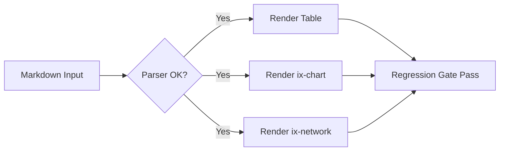
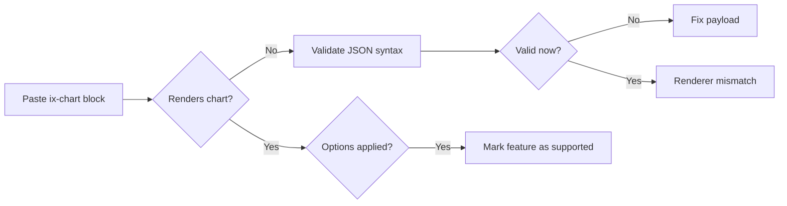

### User (20:29: 02)
hey man

### Assistant (20:29: 05)
<!-- ix:model: gpt-5.3-codex -->
Hey Przemek
Good to see you.

### User (20:30: 06)
Well lets try to show me 3 things - a table, a chart, a visnetwork and diagram so i can confirm our markdown works properly after all the changes.

### Assistant (20:30: 13)
<!-- ix:model: gpt-5.3-codex -->
## Proactive checks

| Check | What to verify | Expected pass signal |
|---|---|---|
| Fence integrity | Every code block opens/closes cleanly (` ``` `) | No bleeding formatting below blocks |
| JSON strictness | `ix-chart` / `ix-network` payloads are valid JSON | Visual renders instead of raw text |

### Mixed list edge case
1. Item one
   - sub bullet
     1. sub-numbered
2. Item two

### Deliberate invalid JSON test
```ix-chart
{
  "type": "bar",
  "data": {
    "labels": ["A","B"],
    "datasets": [
      { "label": "Broken", "data": [1,2], }
    ]
  }
}
```

### Mermaid edge-case diagram


### User (20:36: 21)
show me proper visual tests

### Assistant (20:36: 24)
<!-- ix:model: gpt-5.3-codex -->
## Risk distribution
```ix-chart
{
  "type": "bar",
  "data": {
    "labels": ["Identity", "Endpoints", "AD", "Email", "Cloud"],
    "datasets": [
      { "label": "Low", "data": [14, 22, 8, 11, 9], "backgroundColor": "#22c55e", "stack": "risk" },
      { "label": "Medium", "data": [8, 11, 6, 7, 10], "backgroundColor": "#f59e0b", "stack": "risk" },
      { "label": "High", "data": [4, 6, 5, 3, 7], "backgroundColor": "#ef4444", "stack": "risk" }
    ]
  }
}
```

## Security trend
```ix-chart
{
  "type": "line",
  "data": {
    "labels": ["D-29","D-26","D-23","D-20","D-17","D-14","D-11","D-8","D-5","D-2"],
    "datasets": [
      { "label": "Failed Logons", "data": [45, 52, 49, 63, 58, 71, 69, 66, 73, 80], "borderColor": "#ef4444", "tension": 0.3 },
      { "label": "Account Lockouts", "data": [5, 7, 6, 9, 8, 10, 9, 8, 11, 12], "borderColor": "#f59e0b", "tension": 0.3 }
    ]
  }
}
```

## Control coverage
```ix-chart
{
  "type": "doughnut",
  "data": {
    "labels": ["Compliant", "Partial", "Non-compliant", "Not Assessed"],
    "datasets": [
      { "label": "Control Coverage", "data": [62, 21, 11, 6], "backgroundColor": ["#22c55e", "#f59e0b", "#ef4444", "#f43f5e"] }
    ]
  }
}
```

## Heat-style matrix proxy
```ix-chart
{
  "type": "bar",
  "data": {
    "labels": ["Mon","Tue","Wed","Thu","Fri","Sat","Sun"],
    "datasets": [
      { "label": "Admin Logons", "data": [18, 24, 21, 28, 26, 11, 9], "backgroundColor": "#22c55e" },
      { "label": "Failed Auth Bursts", "data": [12, 15, 14, 19, 23, 8, 7], "backgroundColor": "#ef4444" }
    ]
  }
}
```

### User (20:37: 47)
you sure this is the chartjs that we support?

### Assistant (20:37: 49)
<!-- ix:model: gpt-5.3-codex -->

