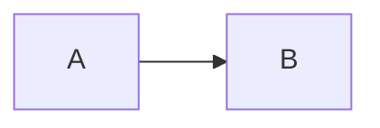

OfficeIMO.MarkdownRenderer
=========================

Small helper library to render Markdown using `OfficeIMO.Markdown` into HTML that is easy to host in WebView2 (or any browser):

- `BuildShellHtml(...)`: returns a full HTML page that preloads CSS/Prism/Mermaid once
- `RenderBodyHtml(...)`: returns an HTML fragment for a given Markdown string
- `BuildUpdateScript(...)`: returns a JavaScript snippet calling `updateContent(...)`
- `RenderUpdateScript(...)`: convenience helper that renders Markdown and returns the `updateContent(...)` snippet

Chat quickstart (WebView2)

```csharp
using OfficeIMO.MarkdownRenderer;

// 1) Load shell once
var opts = MarkdownRendererPresets.CreateChatStrict(baseHref: null);
webView.NavigateToString(MarkdownRenderer.BuildShellHtml("Chat", opts));

// 2) For each message update
await webView.ExecuteScriptAsync(MarkdownRenderer.RenderUpdateScript(markdownText, opts));
```

Alternative update path (recommended for streaming/large payloads)

`BuildShellHtml(...)` includes a WebView2 message listener, so you can send the updated HTML without calling `ExecuteScriptAsync`:

```csharp
using OfficeIMO.MarkdownRenderer;

var opts = MarkdownRendererPresets.CreateChatStrict(baseHref: null);
webView.NavigateToString(MarkdownRenderer.BuildShellHtml("Chat", opts));

// After CoreWebView2 is initialized and navigation completed:
var bodyHtml = MarkdownRenderer.RenderBodyHtml(markdownText, opts);
webView.CoreWebView2.PostWebMessageAsString(bodyHtml);
```

Presets

- `MarkdownRendererPresets.CreateChatStrict(...)`: safe defaults for untrusted content and a compact chat-friendly theme (`HtmlStyle.ChatAuto`).
- `MarkdownRendererPresets.CreateChatRelaxed(...)`: enables HTML parsing and sanitizes raw HTML blocks (still conservative).

Options (high level)

- `MarkdownRendererOptions.ReaderOptions`: parsing behavior (HTML enabled/disabled, URL scheme restrictions, etc.).
- `MarkdownRendererOptions.HtmlOptions`: HTML + CSS rendering (theme, Prism, link/image hardening, same-origin restrictions).
- `MarkdownRendererOptions.Mermaid` / `Chart` / `Math`: optional client-side renderers for fenced blocks.
- `MarkdownRendererOptions.HtmlPostProcessors`: last-mile HTML transformations (custom diagram types, host integration).

Mermaid diagrams

Write Mermaid in fenced code blocks:

```markdown

```

Charts (Chart.js)

To enable Chart.js rendering:
- set `opts.Chart.Enabled = true`

Write charts in fenced code blocks named `chart` containing JSON:

```markdown
~~~chart
{"type":"bar","data":{"labels":["A","B"],"datasets":[{"label":"Count","data":[3,7]}]}}
~~~
```

Security note

Defaults are biased for untrusted chat output:
- raw HTML parsing is disabled
- `javascript:` / `vbscript:` URLs are blocked by the reader
- `file:` URLs are blocked by default in `MarkdownRendererOptions.ReaderOptions`
