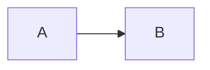

OfficeIMO.MarkdownRenderer
=========================

Small helper library to render Markdown using `OfficeIMO.Markdown` into HTML that is easy to host in WebView2 (or any browser):

- `BuildShellHtml(...)`: returns a full HTML page that preloads CSS/Prism/Mermaid once
- `RenderBodyHtml(...)`: returns an HTML fragment for a given Markdown string
- `BuildUpdateScript(...)`: returns a JavaScript snippet calling `updateContent(...)`
- `RenderUpdateScript(...)`: convenience helper that renders Markdown and returns the `updateContent(...)` snippet

Chat quickstart (WebView2)

```csharp
using OfficeIMO.MarkdownRenderer;

// 1) Load shell once
var opts = MarkdownRendererPresets.CreateChatStrict(baseHref: null);
webView.NavigateToString(MarkdownRenderer.BuildShellHtml("Chat", opts));

// 2) For each message update
await webView.ExecuteScriptAsync(MarkdownRenderer.RenderUpdateScript(markdownText, opts));
```

Alternative update path (recommended for streaming/large payloads)

`BuildShellHtml(...)` includes a WebView2 message listener, so you can send the updated HTML without calling `ExecuteScriptAsync`:

```csharp
using OfficeIMO.MarkdownRenderer;

var opts = MarkdownRendererPresets.CreateChatStrict(baseHref: null);
webView.NavigateToString(MarkdownRenderer.BuildShellHtml("Chat", opts));

// After CoreWebView2 is initialized and navigation completed:
var bodyHtml = MarkdownRenderer.RenderBodyHtml(markdownText, opts);
webView.CoreWebView2.PostWebMessageAsString(bodyHtml);
```

You can also send an object payload if you want to extend the message contract later:

```csharp
webView.CoreWebView2.PostWebMessageAsJson("{\"bodyHtml\":" + System.Text.Json.JsonSerializer.Serialize(bodyHtml) + "}");
```

Chat bubble helpers (optional)

If you want message "bubbles" without authoring HTML in the app, use the bubble wrapper helpers.
The chat presets already use `HtmlStyle.ChatAuto` which includes bubble CSS classes (opt-in):

```csharp
var opts = MarkdownRendererPresets.CreateChatStrict();

// Render a single user message as a bubble
var bubbleHtml = MarkdownRenderer.RenderChatBubbleBodyHtml(markdownText, ChatMessageRole.User, opts);
webView.CoreWebView2.PostWebMessageAsString(bubbleHtml);
```

Presets

- `MarkdownRendererPresets.CreateChatStrict(...)`: safe defaults for untrusted content and a compact chat-friendly theme (`HtmlStyle.ChatAuto`).
- `MarkdownRendererPresets.CreateChatRelaxed(...)`: enables HTML parsing and sanitizes raw HTML blocks (still conservative).
- `MarkdownRendererPresets.CreateChatStrictMinimal(...)`: strict, but disables Mermaid/Chart/Math/Prism and copy buttons.

Options (high level)

- `MarkdownRendererOptions.ReaderOptions`: parsing behavior (HTML enabled/disabled, URL scheme restrictions, etc.).
- `MarkdownRendererOptions.HtmlOptions`: HTML + CSS rendering (theme, Prism, link/image hardening, same-origin restrictions).
- `MarkdownRendererOptions.Mermaid` / `Chart` / `Math`: optional client-side renderers for fenced blocks.
- `MarkdownRendererOptions.HtmlPostProcessors`: last-mile HTML transformations (custom diagram types, host integration).

Theming and customization

- You are not stuck with the built-in styles. You can:
  - choose a built-in preset: `HtmlStyle.ChatAuto`, `HtmlStyle.GithubAuto`, `HtmlStyle.Clean`, `HtmlStyle.Plain`, etc.
  - override colors/spacing via `MarkdownRendererOptions.ShellCss` (appended after built-ins, so it wins)
  - fully replace styling by using `HtmlStyle.Plain` and providing your own CSS

Useful HTML structure and CSS hooks

- Shell root: `#omdRoot` (this is where content is injected)
- Default content wrapper (from `RenderBodyHtml`): `<article class="markdown-body">...</article>` (class is controlled by `HtmlOptions.BodyClass`)
- Optional bubble wrappers (from `RenderChatBubbleBodyHtml`):
  - `.omd-chat-row`
  - `.omd-chat-bubble`
  - roles: `.omd-role-user`, `.omd-role-assistant`, `.omd-role-system`
- Optional block helpers emitted by the renderer:
  - blocked images: `.omd-image-blocked`
  - charts: `canvas.omd-chart`
  - math: `.omd-math`

Overriding styles in the chat app

```csharp
var opts = MarkdownRendererPresets.CreateChatStrict();
opts.ShellCss = """
/* Example: tighter paragraphs + custom bubble colors */
.omd-chat-bubble { border-radius: 18px; }
.omd-chat-row.omd-role-user .omd-chat-bubble { background: rgba(0, 120, 212, .18); }
""";

webView.NavigateToString(MarkdownRenderer.BuildShellHtml("Chat", opts));
```

WebView2 host message contract (optional)

Shell listens for WebView2 messages and updates content:

- Host -> Web
  - `PostWebMessageAsString(bodyHtml)` (string payload)
  - `PostWebMessageAsJson({ type: "omd.update", bodyHtml: "..." })` (recommended object payload)

Shell may also send helper messages to the host:

- Web -> Host
  - `{ type: "omd.copy", text: "..." }` when the user clicks a copy button (code/table)

If the host handles `omd.copy`, it can put the text onto the native clipboard (more reliable than browser clipboard APIs in some environments).

Copy buttons (code + tables)

The chat presets enable copy buttons by default:

- `MarkdownRendererOptions.EnableCodeCopyButtons = true`
- `MarkdownRendererOptions.EnableTableCopyButtons = true`

If you are building your own preset, enable them explicitly:

```csharp
var opts = new MarkdownRendererOptions();
opts.EnableCodeCopyButtons = true;
opts.EnableTableCopyButtons = true;
webView.NavigateToString(MarkdownRenderer.BuildShellHtml("Chat", opts));
```

Mermaid diagrams

Write Mermaid in fenced code blocks:

```markdown

```

Charts (Chart.js)

To enable Chart.js rendering:
- set `opts.Chart.Enabled = true`

Write charts in fenced code blocks named `chart` containing JSON:

```markdown
~~~chart
{"type":"bar","data":{"labels":["A","B"],"datasets":[{"label":"Count","data":[3,7]}]}}
~~~
```

Security note

Defaults are biased for untrusted chat output:
- raw HTML parsing is disabled
- `javascript:` / `vbscript:` URLs are blocked by the reader
- `file:` URLs are blocked by default in `MarkdownRendererOptions.ReaderOptions`
