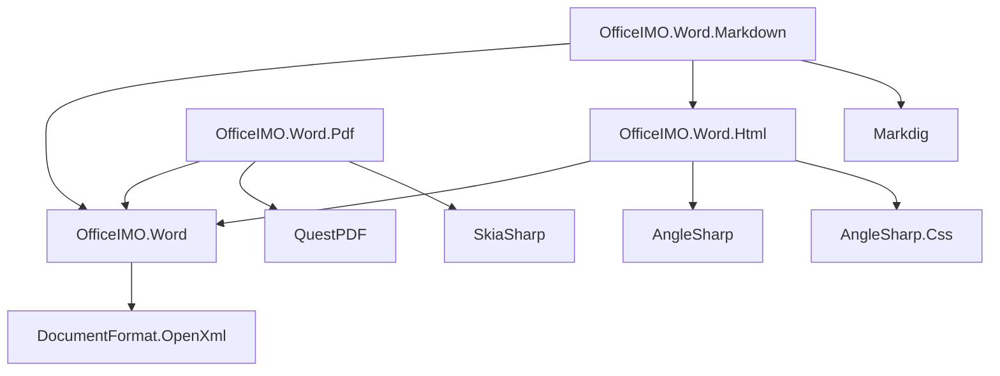
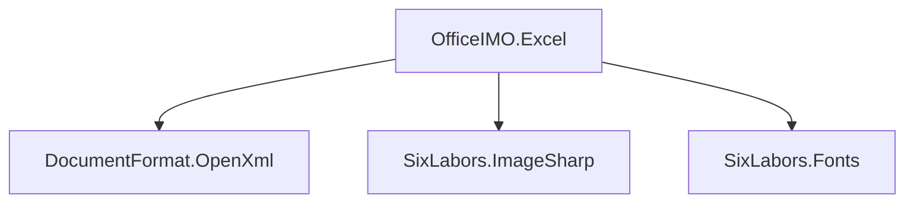
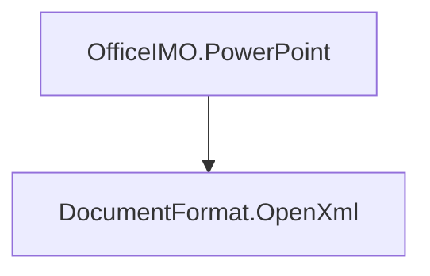
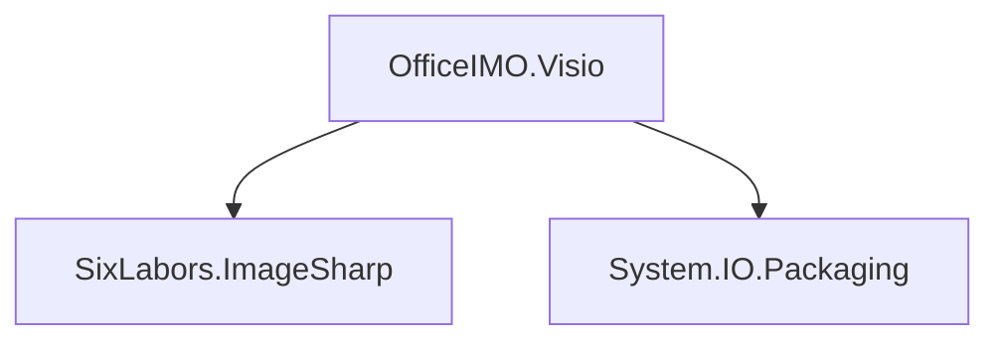

# OfficeIMO — Open XML utilities for .NET (Word, Excel, PowerPoint, Visio)

If you would like to contact me you can do so via Twitter or LinkedIn.

OfficeIMO is a family of lightweight, cross‑platform .NET libraries that make working with Office file formats easier using the Open XML SDK — no Office/COM required.

- Word: create and edit .docx documents with a friendly API
- Excel: fast read/write helpers, tables, styles, ranges, fluent composers
- PowerPoint: build .pptx slides programmatically
- Visio: basic .vsdx diagrams

Each project ships as its own NuGet package under the MIT license.

## Project READMEs

- Word → `OfficeIMO.Word/README.md`
- Excel → `OfficeIMO.Excel/README.md`
- PowerPoint → `OfficeIMO.PowerPoint/README.md`
- Visio → `OfficeIMO.Visio/README.md`
- Converters:
  - `OfficeIMO.Word.Html` — HTML ↔ Word
  - `OfficeIMO.Word.Markdown` — Markdown ↔ Word
  - `OfficeIMO.Word.Pdf` — PDF export for Word

## Targets

- Word, PowerPoint, Visio: netstandard2.0, net472, net8.0 (Linux/macOS: net8.0); select projects also net9.0
- Excel: netstandard2.0, net472, net48, net8.0/net9.0 (cross‑platform)

## Build & Coverage

- CI (Windows/Linux/macOS): single workflow badge above
- Coverage: Codecov dashboard linked above

## Licenses

All OfficeIMO packages are MIT‑licensed. See individual project READMEs for third‑party dependency licenses (Open XML SDK, ImageSharp, AngleSharp, Markdig, QuestPDF, SkiaSharp, etc.).

## Dependencies at a glance

Below are product‑centric graphs. Arrows point from a package to what it depends on.

### Word

### Excel

### PowerPoint

### Visio

### When do I need what?

- Only editing/creating Word (.docx): add `OfficeIMO.Word`.
- Word → PDF export: add `OfficeIMO.Word` + `OfficeIMO.Word.Pdf` (pulls QuestPDF + SkiaSharp).
- Word ↔ HTML: add `OfficeIMO.Word` + `OfficeIMO.Word.Html` (pulls AngleSharp + AngleSharp.Css).
- Word ↔ Markdown: add `OfficeIMO.Word` + `OfficeIMO.Word.Markdown` (pulls Markdig; also uses `OfficeIMO.Word.Html`).
- Excel read/write, tables, styles: add `OfficeIMO.Excel` (pulls ImageSharp + Fonts for sizing and header images).
- PowerPoint slides: add `OfficeIMO.PowerPoint`.
- Visio drawings: add `OfficeIMO.Visio` (uses ImageSharp and System.IO.Packaging).

## Dependency versions (high‑level)

- DocumentFormat.OpenXml: 3.3.x (constraints: [3.3.0, 4.0.0))
- SixLabors.ImageSharp: 2.1.x; SixLabors.Fonts: 1.0.x (Excel)
- AngleSharp: 1.3.x; AngleSharp.Css: 1.0.0‑beta.154 (Word.Html)
- Markdig: 0.41.x (Word.Markdown)
- QuestPDF: 2025.7.x; SkiaSharp: 3.119.x (Word.Pdf)

We keep package ranges conservative to avoid breaking changes; see each project’s csproj for exact ranges.

## Licenses

- OfficeIMO.Word, OfficeIMO.Excel, OfficeIMO.PowerPoint, OfficeIMO.Word.Html, OfficeIMO.Word.Markdown, OfficeIMO.Word.Pdf: MIT
- OfficeIMO.Visio: License TBD (not MIT yet)

Third‑party dependency licenses: see their upstream repos (Open XML SDK, SixLabors, AngleSharp, Markdig, QuestPDF, SkiaSharp).
## Support This Project

If you find this project helpful, please consider supporting its development.
Your sponsorship will help the maintainers dedicate more time to maintenance and new feature development for everyone.

It takes a lot of time and effort to create and maintain this project.
By becoming a sponsor, you can help ensure that it stays free and accessible to everyone who needs it.

To become a sponsor, you can choose from the following options:

- [Become a sponsor via GitHub Sponsors :heart:](https://github.com/sponsors/PrzemyslawKlys)
- [Become a sponsor via PayPal :heart:](https://paypal.me/PrzemyslawKlys)

Your sponsorship is completely optional and not required for using this project.
We want this project to remain open-source and available for anyone to use for free,
regardless of whether they choose to sponsor it or not.

If you work for a company that uses our .NET libraries or PowerShell modules, please consider sponsoring.
Thank you for considering support!

## Please share with the community

Please consider sharing a post about OfficeIMO and the value it provides. It really does help!

## Features
See individual project READMEs for detailed capability lists and code samples.
