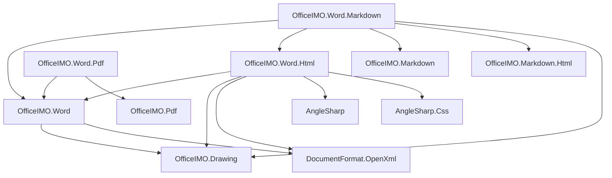
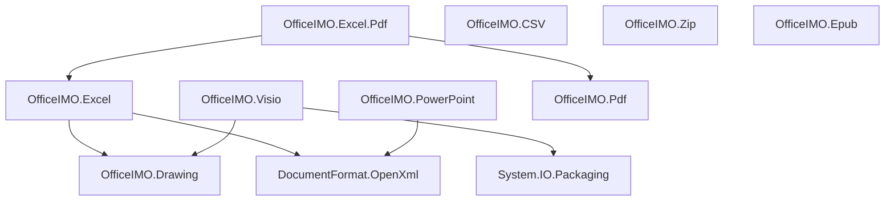
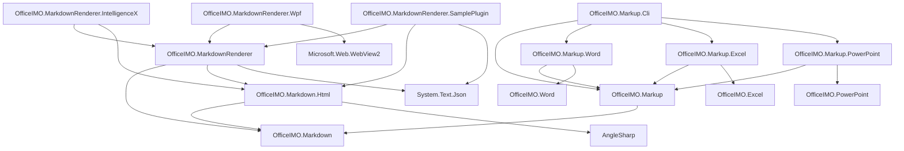
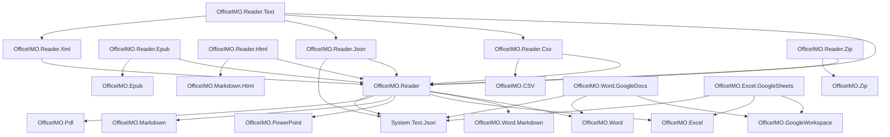

# OfficeIMO - Open XML and document utilities for .NET

OfficeIMO is a family of COM-free .NET libraries for creating, reading, converting, and exporting Office and document-related formats. The main packages work directly with Open XML formats and are designed for server, desktop, CI, and PowerShell scenarios where Microsoft Office automation is not an option.

## What is in this repo?

- Word: create, edit, inspect, and convert `.docx` documents
- Excel: create and modify `.xlsx` workbooks, worksheets, tables, ranges, styles, and reports
- PowerPoint: generate `.pptx` presentations programmatically
- Visio: create and validate basic `.vsdx` diagrams
- Markdown: typed Markdown AST, builder APIs, HTML rendering, renderer shells, and host plug-ins
- Markup: Markdown-inspired authoring for Word, Excel, and PowerPoint exports
- Reader: read-only extraction facade plus modular adapters for ingestion pipelines
- PDF, ZIP, EPUB, CSV, and Drawing primitives used across the OfficeIMO family
- Google Workspace bridges for Google Docs and Google Sheets export planning

Most packages are MIT licensed. `OfficeIMO.Visio` is a special case: the project file currently declares MIT package metadata, while the project folder still carries a restrictive `LICENSE.MD`; treat Visio licensing as unresolved until that conflict is corrected.

## Project READMEs

### Core document packages

- [OfficeIMO.Word](OfficeIMO.Word/README.md)
- [OfficeIMO.Excel](OfficeIMO.Excel/README.md)
- [OfficeIMO.PowerPoint](OfficeIMO.PowerPoint/README.md)
- [OfficeIMO.Visio](OfficeIMO.Visio/README.md)
- [OfficeIMO.CSV](OfficeIMO.CSV/README.md)
- [OfficeIMO.Drawing](OfficeIMO.Drawing/README.md)
- [OfficeIMO.Pdf](OfficeIMO.Pdf/README.md)
- [OfficeIMO.Zip](OfficeIMO.Zip/README.md)
- [OfficeIMO.Epub](OfficeIMO.Epub/README.md)

### Conversion packages

- [OfficeIMO.Word.Html](OfficeIMO.Word.Html/README.md)
- [OfficeIMO.Word.Markdown](OfficeIMO.Word.Markdown/README.md)
- [OfficeIMO.Word.Pdf](OfficeIMO.Word.Pdf/README.md)
- [OfficeIMO.Excel.Pdf](OfficeIMO.Excel.Pdf/README.md)
- [OfficeIMO.Markdown.Html](OfficeIMO.Markdown.Html/README.md)

### Markdown and rendering packages

- [OfficeIMO.Markdown](OfficeIMO.Markdown/README.md)
- [OfficeIMO.MarkdownRenderer](OfficeIMO.MarkdownRenderer/README.md)
- [OfficeIMO.MarkdownRenderer.Wpf](OfficeIMO.MarkdownRenderer.Wpf/README.md)
- [OfficeIMO.MarkdownRenderer.IntelligenceX](OfficeIMO.MarkdownRenderer.IntelligenceX/README.md)
- [OfficeIMO.MarkdownRenderer.SamplePlugin](OfficeIMO.MarkdownRenderer.SamplePlugin/README.md)
- [OfficeIMO.Markdown.Benchmarks](OfficeIMO.Markdown.Benchmarks/README.md)

### Reader and ingestion packages

- [OfficeIMO.Reader](OfficeIMO.Reader/README.md)
- [OfficeIMO.Reader.Csv](OfficeIMO.Reader.Csv/README.md)
- [OfficeIMO.Reader.Epub](OfficeIMO.Reader.Epub/README.md)
- [OfficeIMO.Reader.Html](OfficeIMO.Reader.Html/README.md)
- [OfficeIMO.Reader.Json](OfficeIMO.Reader.Json/README.md)
- [OfficeIMO.Reader.Text](OfficeIMO.Reader.Text/README.md)
- [OfficeIMO.Reader.Xml](OfficeIMO.Reader.Xml/README.md)
- [OfficeIMO.Reader.Zip](OfficeIMO.Reader.Zip/README.md)

### Authoring and export packages

- [OfficeIMO.Markup](OfficeIMO.Markup/README.md)
- `OfficeIMO.Markup.Word`
- `OfficeIMO.Markup.Excel`
- `OfficeIMO.Markup.PowerPoint`
- `OfficeIMO.Markup.Cli`

### Google Workspace packages

- [OfficeIMO.GoogleWorkspace](OfficeIMO.GoogleWorkspace/README.md)
- [OfficeIMO.Word.GoogleDocs](OfficeIMO.Word.GoogleDocs/README.md)
- [OfficeIMO.Excel.GoogleSheets](OfficeIMO.Excel.GoogleSheets/README.md)

### Examples, benchmarks, and release notes

- [OfficeIMO.Examples](OfficeIMO.Examples/README.md)
- [OfficeIMO.Excel.Benchmarks](OfficeIMO.Excel.Benchmarks/README.md)
- [Docs/officeimo.pdf.roadmap.md](Docs/officeimo.pdf.roadmap.md)
- [Docs/officeimo.excel.release-checklist.md](Docs/officeimo.excel.release-checklist.md)
- [Docs/officeimo.markdown.release-checklist.md](Docs/officeimo.markdown.release-checklist.md)
- [CHANGELOG.MD](CHANGELOG.MD)

## Website

- Public site content and GitHub Pages deployment live under [Website/](Website/)
- Maintainer notes for the website pipeline and API ingestion live in [Docs/officeimo.website.md](Docs/officeimo.website.md)

## Package families

### Word family

- `OfficeIMO.Word`: main Word document object model
- `OfficeIMO.Word.Html`: Word to/from HTML conversion helpers
- `OfficeIMO.Word.Markdown`: Word to/from Markdown conversion helpers
- `OfficeIMO.Word.Pdf`: Word to PDF export through the first-party `OfficeIMO.Pdf` engine

### Excel family

- `OfficeIMO.Excel`: workbook, worksheet, table, range, style, and reporting helpers
- `OfficeIMO.Excel.Pdf`: Excel workbook to PDF export through the first-party `OfficeIMO.Pdf` engine
- `OfficeIMO.Excel.GoogleSheets`: Excel to Google Sheets planning, batch compilation, and export helpers
- `OfficeIMO.Excel.Benchmarks`: benchmark harness for Excel package behavior

### Google Workspace family

- `OfficeIMO.GoogleWorkspace`: shared credentials, session, Drive location, retry, and translation-report abstractions
- `OfficeIMO.Word.GoogleDocs`: Word to Google Docs planning, batch compilation, and export helpers
- `OfficeIMO.Excel.GoogleSheets`: Excel to Google Sheets planning, batch compilation, and export helpers

### Markdown family

- `OfficeIMO.Markdown`: Markdown builder, typed reader/AST, HTML renderer, front matter, TOC, callouts, and query helpers
- `OfficeIMO.Markdown.Html`: HTML-to-Markdown AST bridge targeting the OfficeIMO Markdown document model
- `OfficeIMO.MarkdownRenderer`: WebView/browser-friendly rendering shell and incremental update helpers
- `OfficeIMO.MarkdownRenderer.Wpf`: reusable WPF/WebView2 `MarkdownView` host
- `OfficeIMO.MarkdownRenderer.IntelligenceX`: first-party IntelligenceX renderer feature pack
- `OfficeIMO.MarkdownRenderer.SamplePlugin`: sample renderer plug-in package
- `OfficeIMO.Markdown.Benchmarks`: representative parse/render benchmark harness

### Markup family

- `OfficeIMO.Markup`: Markdown-inspired semantic authoring layer for OfficeIMO documents
- `OfficeIMO.Markup.Word`: Word exporter for markup documents
- `OfficeIMO.Markup.Excel`: Excel exporter for markup workbooks
- `OfficeIMO.Markup.PowerPoint`: PowerPoint exporter for markup presentations
- `OfficeIMO.Markup.Cli`: command-line parser, validator, emitter, and exporter

### Reader family

- `OfficeIMO.Reader`: read-only facade for deterministic ingestion
- `OfficeIMO.Reader.Csv`: CSV adapter
- `OfficeIMO.Reader.Epub`: EPUB adapter
- `OfficeIMO.Reader.Html`: HTML adapter through the Markdown HTML bridge
- `OfficeIMO.Reader.Json`: JSON adapter
- `OfficeIMO.Reader.Text`: structured text compatibility adapter
- `OfficeIMO.Reader.Xml`: XML adapter
- `OfficeIMO.Reader.Zip`: ZIP adapter

### Other packages

- `OfficeIMO.CSV`: typed CSV read/write and schema workflows
- `OfficeIMO.Drawing`: first-party color and image metadata primitives
- `OfficeIMO.Pdf`: dependency-free PDF builder, reader, page inspector, page extractor, page editor, metadata editor, merger, and future first-party PDF engine
- `OfficeIMO.PowerPoint`: programmatic PowerPoint slide generation
- `OfficeIMO.Visio`: basic Visio diagram generation and validation
- `OfficeIMO.Zip`: safe ZIP traversal primitives
- `OfficeIMO.Epub`: EPUB extraction primitives

## Target frameworks

Most shipping libraries target `netstandard2.0`, `net8.0`, and `net10.0`. Many projects also add `net472` when building on Windows, which preserves .NET Framework support without making that target the cross-platform baseline.

Important exceptions:

- `OfficeIMO.CSV` includes `net472` directly.
- `OfficeIMO.MarkdownRenderer.Wpf` targets `net472`, `net8.0-windows`, and `net10.0-windows` for the WPF/WebView2 surface, plus non-Windows `net8.0` and `net10.0` helper targets.
- CLI, benchmark, example, and test projects generally target modern .NET only.

## AOT and trimming

- Reflection-heavy convenience APIs remain available for dynamic and PowerShell scenarios.
- For trimming-sensitive workloads, prefer typed overloads and explicit selectors.
- `OfficeIMO.Markdown`, `OfficeIMO.CSV`, `OfficeIMO.Drawing`, `OfficeIMO.Pdf`, `OfficeIMO.Zip`, and `OfficeIMO.Epub` are the lightest dependency shapes.
- Open XML-heavy packages should be tested against the exact publish options and document features your application uses.
- `OfficeIMO.Word.Pdf` and `OfficeIMO.Excel.Pdf` should be treated separately because PDF layout fidelity and host fonts still need scenario validation.

## Dependencies at a glance

Arrows point from a package to what it depends on. Test, benchmark, and example-only dependencies are intentionally excluded unless called out.

### Word and conversion

```mermaid
flowchart TB
  Word["OfficeIMO.Word"]
  Drawing["OfficeIMO.Drawing"]
  WordHtml["OfficeIMO.Word.Html"]
  WordMarkdown["OfficeIMO.Word.Markdown"]
  WordPdf["OfficeIMO.Word.Pdf"]
  Markdown["OfficeIMO.Markdown"]
  MarkdownHtml["OfficeIMO.Markdown.Html"]
  OpenXml["DocumentFormat.OpenXml"]
  Angle["AngleSharp"]
  AngleCss["AngleSharp.Css"]
  Pdf["OfficeIMO.Pdf"]

  Word --> Drawing
  Word --> OpenXml
  WordHtml --> Word
  WordHtml --> Drawing
  WordHtml --> OpenXml
  WordHtml --> Angle
  WordHtml --> AngleCss
  WordMarkdown --> Word
  WordMarkdown --> WordHtml
  WordMarkdown --> Markdown
  WordMarkdown --> MarkdownHtml
  WordMarkdown --> Drawing
  WordPdf --> Word
  WordPdf --> Pdf
```

### Excel, PowerPoint, Visio, and primitives

```mermaid
flowchart TB
  Excel["OfficeIMO.Excel"]
  ExcelPdf["OfficeIMO.Excel.Pdf"]
  PowerPoint["OfficeIMO.PowerPoint"]
  Visio["OfficeIMO.Visio"]
  Drawing["OfficeIMO.Drawing"]
  OpenXml["DocumentFormat.OpenXml"]
  Packaging["System.IO.Packaging"]
  Csv["OfficeIMO.CSV"]
  Pdf["OfficeIMO.Pdf"]
  Zip["OfficeIMO.Zip"]
  Epub["OfficeIMO.Epub"]

  Excel --> Drawing
  Excel --> OpenXml
  ExcelPdf --> Excel
  ExcelPdf --> Pdf
  PowerPoint --> OpenXml
  Visio --> Drawing
  Visio --> Packaging
```

`OfficeIMO.CSV`, `OfficeIMO.Drawing`, `OfficeIMO.Pdf`, `OfficeIMO.Zip`, and `OfficeIMO.Epub` are dependency-light first-party packages. Color and image metadata live in `OfficeIMO.Drawing`, and Excel text measurement is handled by first-party code.

### Markdown, renderer, and markup

```mermaid
flowchart TB
  Markdown["OfficeIMO.Markdown"]
  MarkdownHtml["OfficeIMO.Markdown.Html"]
  Renderer["OfficeIMO.MarkdownRenderer"]
  RendererWpf["OfficeIMO.MarkdownRenderer.Wpf"]
  RendererIx["OfficeIMO.MarkdownRenderer.IntelligenceX"]
  RendererSample["OfficeIMO.MarkdownRenderer.SamplePlugin"]
  Markup["OfficeIMO.Markup"]
  MarkupWord["OfficeIMO.Markup.Word"]
  MarkupExcel["OfficeIMO.Markup.Excel"]
  MarkupPowerPoint["OfficeIMO.Markup.PowerPoint"]
  MarkupCli["OfficeIMO.Markup.Cli"]
  Word["OfficeIMO.Word"]
  Excel["OfficeIMO.Excel"]
  PowerPoint["OfficeIMO.PowerPoint"]
  Angle["AngleSharp"]
  Json["System.Text.Json"]
  WebView2["Microsoft.Web.WebView2"]

  MarkdownHtml --> Markdown
  MarkdownHtml --> Angle
  Renderer --> Markdown
  Renderer --> MarkdownHtml
  Renderer --> Json
  RendererWpf --> Renderer
  RendererWpf --> WebView2
  RendererIx --> Renderer
  RendererIx --> MarkdownHtml
  RendererSample --> Renderer
  RendererSample --> MarkdownHtml
  RendererSample --> Json
  Markup --> Markdown
  MarkupWord --> Markup
  MarkupWord --> Word
  MarkupExcel --> Markup
  MarkupExcel --> Excel
  MarkupPowerPoint --> Markup
  MarkupPowerPoint --> PowerPoint
  MarkupCli --> Markup
  MarkupCli --> MarkupWord
  MarkupCli --> MarkupExcel
  MarkupCli --> MarkupPowerPoint
```

### Reader and Google Workspace

```mermaid
flowchart TB
  Reader["OfficeIMO.Reader"]
  ReaderCsv["OfficeIMO.Reader.Csv"]
  ReaderEpub["OfficeIMO.Reader.Epub"]
  ReaderHtml["OfficeIMO.Reader.Html"]
  ReaderJson["OfficeIMO.Reader.Json"]
  ReaderText["OfficeIMO.Reader.Text"]
  ReaderXml["OfficeIMO.Reader.Xml"]
  ReaderZip["OfficeIMO.Reader.Zip"]
  Word["OfficeIMO.Word"]
  WordMarkdown["OfficeIMO.Word.Markdown"]
  Excel["OfficeIMO.Excel"]
  PowerPoint["OfficeIMO.PowerPoint"]
  Markdown["OfficeIMO.Markdown"]
  Pdf["OfficeIMO.Pdf"]
  Csv["OfficeIMO.CSV"]
  Epub["OfficeIMO.Epub"]
  Zip["OfficeIMO.Zip"]
  MarkdownHtml["OfficeIMO.Markdown.Html"]
  Google["OfficeIMO.GoogleWorkspace"]
  GoogleDocs["OfficeIMO.Word.GoogleDocs"]
  GoogleSheets["OfficeIMO.Excel.GoogleSheets"]
  Json["System.Text.Json"]

  Reader --> Word
  Reader --> WordMarkdown
  Reader --> Excel
  Reader --> PowerPoint
  Reader --> Markdown
  Reader --> Pdf
  Reader --> Json
  ReaderCsv --> Reader
  ReaderCsv --> Csv
  ReaderEpub --> Reader
  ReaderEpub --> Epub
  ReaderHtml --> Reader
  ReaderHtml --> MarkdownHtml
  ReaderJson --> Reader
  ReaderJson --> Json
  ReaderText --> Reader
  ReaderText --> ReaderCsv
  ReaderText --> ReaderJson
  ReaderText --> ReaderXml
  ReaderXml --> Reader
  ReaderZip --> Reader
  ReaderZip --> Zip
  GoogleDocs --> Google
  GoogleDocs --> Word
  GoogleDocs --> Json
  GoogleSheets --> Google
  GoogleSheets --> Excel
  GoogleSheets --> Json
```

## When do I need what?

- Creating or editing Word documents: add `OfficeIMO.Word`
- Word to HTML: add `OfficeIMO.Word` and `OfficeIMO.Word.Html`
- Word to Markdown or Markdown to Word: add `OfficeIMO.Word`, `OfficeIMO.Word.Markdown`, and the Markdown packages it references
- Word to PDF: add `OfficeIMO.Word` and `OfficeIMO.Word.Pdf`
- Creating Excel workbooks and reports: add `OfficeIMO.Excel`
- Excel to PDF: add `OfficeIMO.Excel` and `OfficeIMO.Excel.Pdf`
- Creating PowerPoint decks: add `OfficeIMO.PowerPoint`
- Creating Visio diagrams: add `OfficeIMO.Visio`
- Working directly with Markdown: add `OfficeIMO.Markdown`
- Hosting Markdown in a browser/WebView shell: add `OfficeIMO.MarkdownRenderer`
- Hosting Markdown in a WPF app: add `OfficeIMO.MarkdownRenderer.Wpf`
- Adding IntelligenceX-oriented renderer behavior: add `OfficeIMO.MarkdownRenderer.IntelligenceX`
- Authoring Office files from `.omd` markup: use `OfficeIMO.Markup` plus the Word, Excel, or PowerPoint exporter package
- Ingesting documents for indexing, chat, or search: add `OfficeIMO.Reader` and only the adapter packages your host needs
- Shared Google Workspace session/auth primitives: add `OfficeIMO.GoogleWorkspace`
- Word to Google Docs planning/export: add `OfficeIMO.Word` and `OfficeIMO.Word.GoogleDocs`
- Excel to Google Sheets planning/export: add `OfficeIMO.Excel` and `OfficeIMO.Excel.GoogleSheets`
- CSV schemas and typed CSV workflows: add `OfficeIMO.CSV`
- Dependency-light PDF generation without Word conversion: add `OfficeIMO.Pdf`
- Safe ZIP or EPUB traversal/extraction primitives: add `OfficeIMO.Zip` or `OfficeIMO.Epub`

## Dependency versions, high level

- `DocumentFormat.OpenXml`: `[3.5.1, 4.0.0)` in the Open XML packages that reference it
- `OfficeIMO.Drawing`: first-party color and image metadata helpers
- `AngleSharp` / `AngleSharp.Css`: HTML parsing and CSS conversion layers
- `OfficeIMO.Pdf`: first-party Word/Excel-to-PDF conversion engine and dependency-light PDF primitives
- `System.Text.Json`: reader, renderer, and Google Workspace helper surfaces on legacy target frameworks
- `Microsoft.Web.WebView2`: WPF Markdown renderer host
- `System.IO.Packaging`: Visio package handling

See each project `.csproj` for exact package ranges.

## Support this project

If you find this project helpful, please consider supporting its development. Sponsorship helps the maintainers spend more time on maintenance, documentation, tests, and new features.

- [Become a sponsor via GitHub Sponsors](https://github.com/sponsors/PrzemyslawKlys)
- [Become a sponsor via PayPal](https://paypal.me/PrzemyslawKlys)

Sponsorship is optional. OfficeIMO remains open source and available for anyone to use regardless of sponsorship.

## Please share with the community

Please consider sharing a post about OfficeIMO and the value it provides. It really does help.

