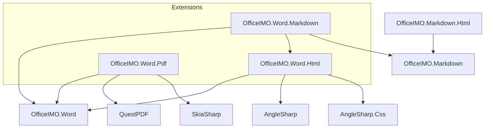
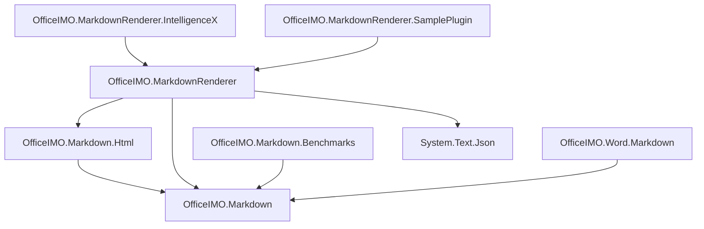
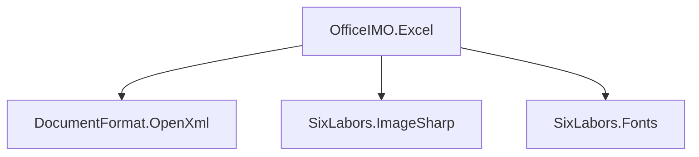
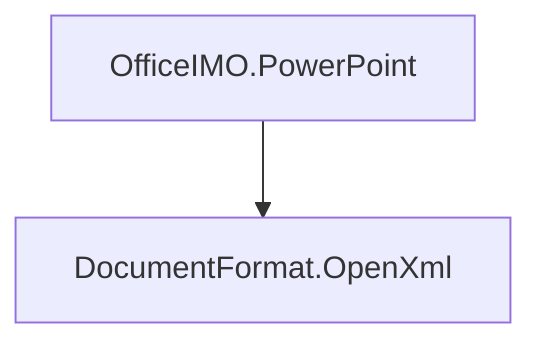
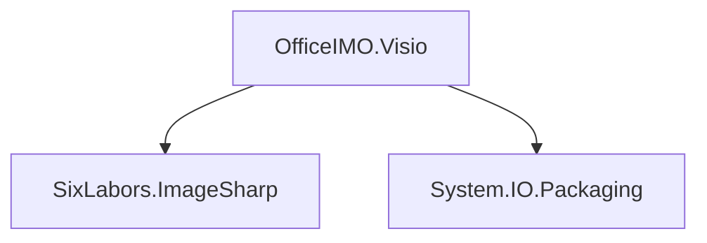

# OfficeIMO — Open XML utilities for .NET

If you would like to contact me you can do so via Twitter or LinkedIn.

OfficeIMO is a family of lightweight .NET libraries for working with Office and document-related formats without Office automation or COM.

- Word: create and edit `.docx` documents with a friendly object model
- Excel: read/write worksheets, tables, ranges, styles, and reports
- CSV: schema-aware CSV model with typed mapping and streaming helpers
- PowerPoint: generate `.pptx` slides programmatically
- Visio: basic `.vsdx` generation helpers
- Markdown: builder, typed reader/AST, HTML rendering, and host-oriented rendering helpers
- Reader: read-only extraction facade for ingestion scenarios

Each package is shipped independently under the MIT license unless noted otherwise.

## Project READMEs

- [OfficeIMO.Word](OfficeIMO.Word/README.md)
- [OfficeIMO.Excel](OfficeIMO.Excel/README.md)
- [OfficeIMO.CSV](OfficeIMO.CSV/README.md)
- [OfficeIMO.PowerPoint](OfficeIMO.PowerPoint/README.md)
- [OfficeIMO.Visio](OfficeIMO.Visio/README.md)
- [OfficeIMO.Markdown](OfficeIMO.Markdown/README.md)
- [OfficeIMO.Markdown.Html](OfficeIMO.Markdown.Html/README.md)
- [OfficeIMO.MarkdownRenderer](OfficeIMO.MarkdownRenderer/README.md)
- [OfficeIMO.MarkdownRenderer.IntelligenceX](OfficeIMO.MarkdownRenderer.IntelligenceX/README.md)
- [OfficeIMO.MarkdownRenderer.SamplePlugin](OfficeIMO.MarkdownRenderer.SamplePlugin/README.md)
- Converters
  - `OfficeIMO.Markdown.Html`
  - `OfficeIMO.Word.Html`
  - `OfficeIMO.Word.Markdown`
  - `OfficeIMO.Word.Pdf`
- Reader
  - `OfficeIMO.Reader`
- Benchmarks
  - `OfficeIMO.Markdown.Benchmarks`
- Release prep
  - [Docs/officeimo.markdown.release-checklist.md](Docs/officeimo.markdown.release-checklist.md)
## Package Families

### Word family

- `OfficeIMO.Word`: main Word document object model
- `OfficeIMO.Word.Html`: HTML conversion helpers
- `OfficeIMO.Word.Markdown`: Markdown conversion helpers
- `OfficeIMO.Word.Pdf`: PDF export helpers

### Markdown family

- `OfficeIMO.Markdown`: markdown builder, typed reader/AST, HTML renderer, front matter, TOC, callouts, and query helpers
- `OfficeIMO.Markdown.Html`: HTML-to-Markdown AST bridge targeting the OfficeIMO.Markdown document model
- `OfficeIMO.MarkdownRenderer`: WebView/browser-friendly rendering shell and incremental update helpers
- `OfficeIMO.MarkdownRenderer.IntelligenceX`: first-party IntelligenceX plugin pack layered on top of the generic renderer
- `OfficeIMO.MarkdownRenderer.SamplePlugin`: sample third-party-style plugin pack showing shared visual host rendering plus HTML round-trip hints
- `OfficeIMO.Markdown.Benchmarks`: representative parse/render benchmark harness

### Other packages

- `OfficeIMO.Excel`: workbook, worksheet, table, style, and reporting helpers
- `OfficeIMO.CSV`: typed CSV read/write and schema workflows
- `OfficeIMO.PowerPoint`: programmatic slide generation
- `OfficeIMO.Visio`: basic diagram generation
- `OfficeIMO.Reader`: unified read-only extraction facade for ingestion workflows

## Targets

- Word, PowerPoint, Visio: netstandard2.0, net472, net8.0, net10.0
- Excel, CSV: netstandard2.0, net472, net8.0, net10.0
- Markdown, MarkdownRenderer: netstandard2.0, net472, net8.0, net10.0

## AOT / Trimming

- Reflection-heavy convenience APIs remain available for dynamic and PowerShell scenarios.
- For trimming-sensitive workloads, prefer typed overloads and explicit selectors.
- `OfficeIMO.Markdown` and `OfficeIMO.MarkdownRenderer` are designed to stay lightweight and predictable for embedded/document-host scenarios.

## Dependencies at a glance

Arrows point from a package to what it depends on.

### Word

```mermaid
flowchart TB
  WCore["OfficeIMO.Word"]
  subgraph Extensions
    WHtml["OfficeIMO.Word.Html"]
    WMd["OfficeIMO.Word.Markdown"]
    WPdf["OfficeIMO.Word.Pdf"]
  end

  Angle["AngleSharp"]
  AngleCss["AngleSharp.Css"]
  Md["OfficeIMO.Markdown"]
  MdHtml["OfficeIMO.Markdown.Html"]
  Quest["QuestPDF"]
  Skia["SkiaSharp"]

  WHtml --> WCore
  WMd --> WCore
  WPdf --> WCore

  WMd --> WHtml
  WHtml --> Angle
  WHtml --> AngleCss
  MdHtml --> Md
  WMd --> Md
  WPdf --> Quest
  WPdf --> Skia
```

> Converters ship in-repo and continue to evolve before broader release packaging decisions.

### Markdown

```mermaid
flowchart TB
  Md["OfficeIMO.Markdown"]
  MdHtml["OfficeIMO.Markdown.Html"]
  MdRenderer["OfficeIMO.MarkdownRenderer"]
  MdRendererIx["OfficeIMO.MarkdownRenderer.IntelligenceX"]
  MdRendererSample["OfficeIMO.MarkdownRenderer.SamplePlugin"]
  MdBench["OfficeIMO.Markdown.Benchmarks"]
  WordMd["OfficeIMO.Word.Markdown"]
  Json["System.Text.Json"]

  MdHtml --> Md
  MdRenderer --> Md
  MdRenderer --> MdHtml
  MdRendererIx --> MdRenderer
  MdRendererSample --> MdRenderer
  MdRenderer --> Json
  MdBench --> Md
  WordMd --> Md
```

### Excel

```mermaid
flowchart TD
  Xl["OfficeIMO.Excel"]
  OXml["DocumentFormat.OpenXml"]
  ImgSharp["SixLabors.ImageSharp"]
  Fonts["SixLabors.Fonts"]

  Xl --> OXml
  Xl --> ImgSharp
  Xl --> Fonts
```

### PowerPoint

```mermaid
flowchart TD
  Ppt["OfficeIMO.PowerPoint"]
  OXml["DocumentFormat.OpenXml"]

  Ppt --> OXml
```

### Visio

```mermaid
flowchart TD
  Vsdx["OfficeIMO.Visio"]
  ImgSharp["SixLabors.ImageSharp"]
  Pkg["System.IO.Packaging"]

  Vsdx --> ImgSharp
  Vsdx --> Pkg
```

## When do I need what?

- Creating or editing Word documents: add `OfficeIMO.Word`
- Word to HTML: add `OfficeIMO.Word` + `OfficeIMO.Word.Html`
- Word to Markdown or Markdown to Word: add `OfficeIMO.Word` + `OfficeIMO.Word.Markdown`
- Word to PDF: add `OfficeIMO.Word` + `OfficeIMO.Word.Pdf`
- Building or parsing Markdown directly: add `OfficeIMO.Markdown`
- Hosting Markdown in WebView2 or a browser shell: add `OfficeIMO.MarkdownRenderer`
- Hosting IntelligenceX transcript/chat surfaces on top of the generic renderer: add `OfficeIMO.MarkdownRenderer.IntelligenceX`
- Benchmarking markdown parse/render behavior before release: use `OfficeIMO.Markdown.Benchmarks`
- Excel read/write and reporting: add `OfficeIMO.Excel`
- CSV schemas and typed CSV workflows: add `OfficeIMO.CSV`
- PowerPoint slides: add `OfficeIMO.PowerPoint`
- Visio diagrams: add `OfficeIMO.Visio`

## Markdown Release Prep

For the current markdown package line:

- package docs live in [OfficeIMO.Markdown/README.md](OfficeIMO.Markdown/README.md) and [OfficeIMO.MarkdownRenderer/README.md](OfficeIMO.MarkdownRenderer/README.md)
- benchmark harness lives in `OfficeIMO.Markdown.Benchmarks`
- release steps live in [Docs/officeimo.markdown.release-checklist.md](Docs/officeimo.markdown.release-checklist.md)

## Dependency versions (high level)

- DocumentFormat.OpenXml: 3.3.x (conservative version ranges)
- SixLabors.ImageSharp / SixLabors.Fonts: Excel and image-centric packages
- AngleSharp / AngleSharp.Css: HTML conversion layers
- QuestPDF / SkiaSharp: PDF conversion layers
- System.Text.Json: markdown renderer host helpers

See each project `.csproj` for exact package ranges.

## Licenses

- `OfficeIMO.Word`, `OfficeIMO.Excel`, `OfficeIMO.CSV`, `OfficeIMO.PowerPoint`, `OfficeIMO.Markdown`, `OfficeIMO.MarkdownRenderer`, `OfficeIMO.Markdown.Html`, `OfficeIMO.Word.Html`, `OfficeIMO.Word.Markdown`, `OfficeIMO.Word.Pdf`: MIT
- `OfficeIMO.Visio`: license still being finalized

Third-party dependency licenses are governed by their upstream projects.

## Support This Project

If you find this project helpful, please consider supporting its development.
Your sponsorship will help the maintainers dedicate more time to maintenance and new feature development for everyone.

It takes a lot of time and effort to create and maintain this project.
By becoming a sponsor, you can help ensure that it stays free and accessible to everyone who needs it.

To become a sponsor, you can choose from the following options:

- [Become a sponsor via GitHub Sponsors :heart:](https://github.com/sponsors/PrzemyslawKlys)
- [Become a sponsor via PayPal :heart:](https://paypal.me/PrzemyslawKlys)

Your sponsorship is completely optional and not required for using this project.
We want this project to remain open-source and available for anyone to use for free,
regardless of whether they choose to sponsor it or not.

If you work for a company that uses our .NET libraries or PowerShell modules, please consider sponsoring.
Thank you for considering support!

## Please share with the community

Please consider sharing a post about OfficeIMO and the value it provides. It really does help.

