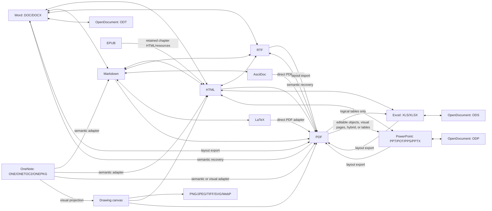

# OfficeIMO — Office and document libraries for .NET

[](https://github.com/EvotecIT/OfficeIMO/actions/workflows/dotnet-tests.yml)
[](https://codecov.io/gh/EvotecIT/OfficeIMO)
[](LICENSE)

[](https://evotec.xyz/hub)
[](https://www.linkedin.com/in/pklys)
[](https://evo.yt/discord)

OfficeIMO is a family of COM-free .NET libraries for creating, reading, editing, converting, and exporting Office and document formats. It runs in services, desktop applications, build agents, containers, and automation hosts without Microsoft Office, Excel, PowerPoint, Visio, or LibreOffice automation.

This is not one facade over a collection of unrelated document libraries. OfficeIMO owns its OneNote, PDF, Markdown, RTF, OpenDocument, AsciiDoc, LaTeX, OPML, DocBook, CSV, EPUB, ZIP, drawing, legacy Word `.doc`, legacy Excel `.xls`, and legacy PowerPoint `.ppt`/`.pot`/`.pps` implementations. Word, Excel, and PowerPoint use the Open XML SDK for package mechanics; HTML uses AngleSharp for DOM and CSS parsing. Converters compose the same first-party object models used by the native packages and return diagnostics when a target format cannot carry everything from the source.

Applications should keep OfficeIMO packages on the same coordinated version. Converters compose package-owned document models and expose result-bearing APIs when callers need fidelity diagnostics.

Upgrading an existing application? The [OfficeIMO migration guide](MIGRATION.md) covers package, API, and behavior changes across every format. Release history and downloadable artifacts are published through [GitHub Releases](https://github.com/EvotecIT/OfficeIMO/releases).

If OfficeIMO saves you time, please consider supporting the work through [GitHub Sponsors](https://github.com/sponsors/PrzemyslawKlys) or [PayPal](https://paypal.me/PrzemyslawKlys). PowerShell users should start with [PSWriteOffice](https://github.com/EvotecIT/PSWriteOffice).

## Sponsors

<!-- POWERFORGE:sponsors-readme:START -->
<p>
  <a href="https://github.com/KelvinTegelaar" title="KelvinTegelaar"></a>
  <a href="https://github.com/apbirch67" title="Andrew Birch"></a>
  <a href="https://github.com/thomas-moeller" title="Thomas M&#248;ller"></a>
  <a href="https://github.com/jakehildreth" title="Jake Hildreth"></a>
  <a href="https://github.com/complea" title="Complea"></a>
  <a href="https://github.com/DarthPanda12" title="DarthPanda12"></a>
</p>

[See all sponsors](SPONSORS.md)
<!-- POWERFORGE:sponsors-readme:END -->

## Dependency model

OfficeIMO keeps document engines first-party and optional integrations isolated. The table calls out direct non-OfficeIMO runtime dependencies that matter to package selection; Microsoft/BCL compatibility packages are still used where older target frameworks need platform APIs.

| Package family | Direct external runtime dependency | What OfficeIMO owns |
| --- | --- | --- |
| Drawing, OneNote, Markdown, RTF, OpenDocument, AsciiDoc, LaTeX, OPML, DocBook, CSV, EPUB, ZIP | No third-party document engine | Parsing, object models, writing, rendering primitives, safety limits, and diagnostics |
| Word, Excel, PowerPoint | [Open XML SDK](https://github.com/dotnet/Open-XML-SDK) | Fluent/editable object models, lifecycle, validation, conversions, managed image export, and first-party `.doc`/`.xls`/`.ppt` support |
| HTML | [AngleSharp](https://github.com/AngleSharp/AngleSharp) and AngleSharp.Css | Resource policy, media filtering, layout scene, and PNG/JPEG/TIFF/SVG/WebP output; opt-in bridges add RTF, MHTML, email-image, and PDF workflows |
| PDF | No third-party PDF or cryptographic dependency | PDF parsing/writing/rendering, password security, signature structure, preservation policy, limits, and diagnostics |
| Email, email stores, and address books | `System.Text.Encoding.CodePages` | EML/MIME, MSG/OFT, TNEF, mbox, PST/OST, OLM, EMLX, Outlook OAB, MAPI projection, protected-wrapper preservation, limits, and diagnostics |
| Optional Security provider | [Bouncy Castle](https://www.bouncycastle.org/csharp/) and `System.Security.Cryptography.Xml` | CMS/S/MIME/RFC 3161/X.509/XML DSig orchestration behind one typed provider explicitly supplied to Word, PDF, or Email |
| Optional ChartForgeX bridge | [ChartForgeX](https://github.com/EvotecIT/ChartForgeX) | Vector-first visual artifact conversion, OfficeDrawing fidelity reports, and Word, Excel, PowerPoint, and PDF placement |
| Visio | `System.IO.Packaging` | VSDX/VSTX/VSSX and macro-enabled package model, diagram builders, editing, validation, topology, and PNG/JPEG/TIFF/SVG/WebP export |
| Reader.Yaml | [YamlDotNet](https://github.com/aaubry/YamlDotNet) | Reader projection, chunking, limits, locations, and diagnostics |
| MarkdownRenderer.Wpf | Microsoft WebView2 | Rendering shell, presets, plug-in model, and WPF host contract |
| OCR packages | A caller-supplied executable or an installed Tesseract CLI | Candidate selection, bounded execution, protocol, result model, and diagnostics |
| Google Workspace packages | `System.Text.Json` and platform HTTP/cryptography | Credentials abstraction, request/retry logic, Drive placement, translation plans, and reports; no Google client SDK |
| Converter packages not listed above | Only the OfficeIMO format packages they connect | Feature mapping, limits, loss reports, and destination APIs |

## At a glance

| Surface | Current repository coverage |
| --- | ---: |
| Coordinated source packages | 101 |
| Documented package, tool, and example projects below | 108 |
| Native format, foundation, and shared-service packages | 29 |
| Conversion and cloud bridge packages | 36 |
| Unified Reader packages | 29 |
| Markdown renderer and OfficeIMO Markup surfaces | 10 |
| Runnable example projects | 1 |
| Modern Office authoring/editing | `.docx`, `.xlsx`, `.pptx`, `.vsdx`, `.vstx`, `.vssx`, `.vsdm`, `.vstm`, `.vssm` |
| First-party legacy binary support | Word 97–2003 `.doc`, Excel BIFF8 `.xls`, PowerPoint 97–2003 `.ppt`/`.pot`/`.pps` |
| First-party offline OneNote support | Desktop/FSSHTTP `.one`, `.onetoc2`, `.onepkg` |
| Managed PNG/JPEG/TIFF/WebP/SVG document export | Drawing; Word, Excel, PowerPoint, HTML, OneNote, Visio, and PDF; HTML-backed email and EPUB; ODT/ODS/ODP through their Office adapters |

The checkboxes describe the exact level of support: authoring, editing, reading, preserving, inspecting, converting, or exporting. A checked inspection or preservation item is not presented as full authoring support.

## Packages and tools

Every checked item below is implemented today. Detailed behavior, examples, and fidelity boundaries live in each project README.

### Native formats and shared foundations

#### [OfficeIMO.Core](OfficeIMO.Core/README.md)

- [x] Common `Save`, `SaveAsync`, `SaveCopy`, `ToBytes`, and `ToStream` lifecycle contracts used across formats
- [x] Immutable RGBA colors, named colors, hexadecimal parsing, palettes, and cross-format visual themes
- [x] Image identification, dimensions, MIME metadata, fit modes, projection, cropping, and transform helpers
- [x] Bounded async remote-image loading with URL policy, byte limits, media checks, and diagnostics
- [x] Font descriptors, deterministic text measurement, TrueType font discovery, and glyph-outline reading
- [x] One shaping-provider contract with a dependency-light managed core-Arabic/TrueType implementation and explicit fallback diagnostics
- [x] Shapes, paths, gradients, shadows, clipping, transforms, vector scenes, and text blocks
- [x] Shared chart kinds, chart snapshots, series data, renderers, and visual-quality reports
- [x] Dependency-free raster buffers, drawing canvases, compositing, patterns, data bars, and sparklines
- [x] First-party PNG/JPEG identification, decoding, encoding, and raster export paths
- [x] Explicit composited-GIF frame selection or animation rejection with typed loss evidence
- [x] Dependency-free TIFF output with uncompressed, PackBits, or Deflate strips and deterministic lossless WebP encoding with common raster export options
- [x] Shared SVG primitive writing and scalable drawing export
- [x] Single and batch image-export builders with dimensions, source metadata, and diagnostics
- [x] Reproducible, output-validated identification, decode, encode, resize, and placement-optimization benchmarks with opt-in library comparisons isolated from runtime packages

_Dependency footprint:_ zero third-party runtime dependencies.

#### [OfficeIMO.Data.Arrow](OfficeIMO.Data.Arrow/README.md)

- [x] Bounded synchronous and asynchronous Apache Arrow record batches from any forward-only `DbDataReader`
- [x] Native Boolean, numeric, decimal, temporal, GUID, binary, and text arrays with explicit unsupported-type policy
- [x] Shared adapter for OfficeIMO Excel, CSV, and ordinary ADO.NET providers without adding Arrow to their runtime graphs

_Dependency footprint:_ `OfficeIMO.Core` and Apache.Arrow; Excel and CSV remain independently usable.

#### [OfficeIMO.Data.Generators](OfficeIMO.Data.Generators/README.md)

- [x] Compile-time `RowMapper<T>` configuration shared by Excel, CSV, and other `DbDataReader` sources
- [x] Primary column names, aliases, inherited writable properties, and build diagnostics for unsupported model shapes
- [x] Reflection-free generated mapping validated in a NativeAOT consumer

_Dependency footprint:_ build-time Roslyn analyzer only; no generator assembly is deployed with the application.

#### [OfficeIMO.Drawing.HarfBuzz](OfficeIMO.Drawing.HarfBuzz/README.md)

- [x] Optional full OpenType GSUB/GPOS shaping through the shared `IOfficeTextShapingProvider` contract
- [x] Stable logical cluster mappings and positioned glyph advances for TrueType and OpenType/CFF fonts
- [x] Windows, Linux, macOS, and WebAssembly native assets kept out of the dependency-light Drawing and PDF cores

_Dependency footprint:_ `OfficeIMO.Core`, HarfBuzzSharp, and its platform-native runtime assets.

#### [OfficeIMO.Drawing.CodeGlyphX](OfficeIMO.Drawing.CodeGlyphX/README.md)

- [x] Optional typed bridge from CodeGlyphX QR, matrix, and linear barcode symbols to reusable `OfficeDrawing` scenes
- [x] Neutral SVG handoff without making either core package depend on the other
- [x] Searchable barcode label text and explicit unsupported-import counts

_Dependency footprint:_ only `OfficeIMO.Core` and CodeGlyphX; both core packages remain independently usable.

#### [OfficeIMO.ChartForgeX](OfficeIMO.ChartForgeX/README.md)

- [x] Optional bridge from every ChartForgeX `VisualArtifact` to reusable SVG and `OfficeDrawing` representations
- [x] Vector-native placement in Word, Excel, and PowerPoint plus first-party PDF composition through OfficeIMO.Drawing
- [x] Point-normalized sizing, accessibility text, region metadata, and explicit preserve-vector, raster-fallback, or require-vector policy
- [x] Native editable Visio projection for CFX topology, flow, and sequence semantics, including containers, Shape Data, hyperlinks, messages, notes, activations, and fragments
- [x] ChartForgeX watermarks and render options flow through the same conversion, while document/page watermarks remain owned by OfficeIMO

_Dependency footprint:_ ChartForgeX and the OfficeIMO Word, Excel, PowerPoint, PDF, Visio, and Core packages. Existing format packages remain independently usable and do not depend on ChartForgeX.

#### [OfficeIMO.Word](OfficeIMO.Word/README.md)

- [x] Create, load, edit, append, inspect, and save `.docx` documents
- [x] Read, write, and convert the supported first-party Word 97–2003 `.doc` subset with loss preflight
- [x] Rich runs, fonts, colors, highlights, borders, shading, tabs, spacing, line breaks, and custom paragraph styles
- [x] Bullets, numbering, picture bullets, nested lists, start values, cloning, and list-style detection
- [x] Tables with styles, borders, cell margins, merge/split, nested tables, repeated header rows, widths, heights, and page-break control
- [x] Images from files, streams, bytes, Base64, and URLs with alt text, crop, transparency, wrapping, rotation, flipping, and positioning
- [x] Native charts, shapes, lines, text boxes, equations, embedded documents/objects, and SmartArt inspection/mutation helpers
- [x] Fields, TOCs, bookmarks, hyperlinks, cross-references, document variables, bibliography sources, and field-update reports
- [x] Sections, page sizes, orientation, margins, columns, page/background color, watermarks, and page numbers
- [x] Default, first-page, and even-page headers and footers, including multi-section inheritance and cleanup
- [x] Footnotes, endnotes, comments, revisions, tracked-change helpers, comparison/redline reports, and document merging
- [x] Content controls for text, checkboxes, dates, lists, pictures, rich text, and repeating sections
- [x] Mail merge, formatting-preserving field replacement, conditional template blocks, Custom XML binding, and form-map validation
- [x] Macro add/extract/remove, document protection, encrypted packages, digital-signature inspection, cleanup, repair, and feature preflight
- [x] Managed document export to PNG, JPEG, TIFF, lossless WebP, and SVG; opt-in conversion packages add PDF, HTML, Markdown, RTF, ODT, and Google Docs

_Dependency footprint:_ Open XML SDK plus `OfficeIMO.Core`; legacy `.doc` support and image export are OfficeIMO implementations.

#### [OfficeIMO.Excel](OfficeIMO.Excel/README.md)

- [x] Create, load, edit, inspect, and save `.xlsx` workbooks
- [x] Read, write, and convert the supported first-party BIFF8 `.xls` subset with loss preflight
- [x] Worksheets, cells, range algebra, merges, mutable table schemas, complete filter state, freeze panes, hyperlinks, local/workbook names, and named styles
- [x] Object, dictionary, `DataTable`, `DataSet`, row, stream, and typed-model import/export with editable-row workflows
- [x] Streaming reads, direct package writers, parallel compute/apply phases, progress, cancellation, and large-workbook controls
- [x] Fonts, fills, borders, alignment, number formats, rich text, themes, row/column sizing, and reusable report styling
- [x] Transactional row/column/cell shifts plus copy/move/transpose with dry-runs, rollback budgets, reference remapping, and package diagnostics
- [x] Data validation, conditional formatting, icon sets, data bars, color scales, allowed-edit range management, ignored-error metadata preservation, and sparkline lifecycles
- [x] Shared A1/R1C1 formula/reference syntax, formula-aware search and state diagnostics, dependency graphs, and a bounded calculation engine for reporting functions
- [x] Charts across common 2-D/3-D, pie, radar, stock, surface, combo, secondary-axis, trendline, dashboard, and native ChartEx scenarios
- [x] Pivot tables with fields, layouts, styles, filters, grouping, calculated fields, shared caches, and native slicer/timeline views
- [x] Native query-backed tables with caller-hosted execution, explicit security policy, bounded transactional refresh, cancellation, and structural remapping
- [x] Templates with marker binding, repeated rows, repeated sheets, optional regions, formatters, image binding, and preflight diagnostics
- [x] Legacy comments plus threaded-comment/person metadata inspection and preservation
- [x] Worksheet/workbook protection, encrypted OOXML packages, document properties, and compatibility validation
- [x] Print areas, page breaks, page setup, and first/odd/even headers and footers with supported images
- [x] Native in-cell images plus feature inspection and relationship-preserving round trips for macros, external links, custom XML, embedded packages, signatures, controls, and unowned imported parts
- [x] Explicit file-backed editing with size/part budgets and deterministic cancellation, without changing established direct-write, streaming-read, or unchanged-package fast paths
- [x] Workbook, worksheet, and range export to PNG, JPEG, TIFF, lossless WebP, and SVG; adapters add PDF, HTML, ODS, and Google Sheets
- [x] Reproducible read, write, edit, package-size, and feature-rich cross-library benchmark suites with output validation and platform provenance

_Dependency footprint:_ Open XML SDK plus `OfficeIMO.Core`; legacy `.xls` support and image export are OfficeIMO implementations.

#### [OfficeIMO.PowerPoint](OfficeIMO.PowerPoint/README.md)

- [x] Create, load, edit, inspect, and save editable `.pptx` presentations
- [x] Read, author, edit, preserve, encrypt, and convert `.ppt`, `.pot`, and `.pps` through a versioned capability contract and loss preflight
- [x] Slide creation, duplication, deletion, reordering, sections, presentation sizes, layouts, placeholders, and templates
- [x] Text boxes, rich runs, paragraphs, bullets, alignment, spacing, auto-fit, hyperlinks, and theme-aware typography
- [x] PNG/JPEG/SVG pictures from files and streams with crop, replacement, validation, positioning, and effects
- [x] Tables with merges, cell formatting, borders, fills, pagination helpers, and data-driven creation
- [x] Shared chart authoring, data binding, formatting, markers, axes, combo charts, secondary axes, and chart updates
- [x] Auto-shapes, custom geometry, lines, groups, alignment, distribution, grids, sizing, anchors, stacking, and effects
- [x] Backgrounds, gradients, overlays, themes, color transforms, transitions, speaker notes, notes masters, metadata, and media inspection
- [x] Semantic deck plans and reusable executive-summary, chart-story, comparison, screenshot, appendix, architecture, and closing compositions
- [x] Deck preflight and rhythm analysis for density, repetition, long sections, layout balance, and missing closings
- [x] Feature/package inspection, validation, repair, accessibility metadata, SmartArt inspection, and preservation-aware editing
- [x] Encrypted presentation save/load and read-only, stream-backed, detached-load, and explicit-persistence lifecycles
- [x] Slide export to PNG, JPEG, TIFF, lossless WebP, and SVG plus presentation-wide image export; adapters add PDF, HTML, and ODP

_Dependency footprint:_ Open XML SDK plus `OfficeIMO.Core`; legacy binary support, composition, editing, charting, and managed image export are OfficeIMO implementations.

#### [OfficeIMO.Visio](OfficeIMO.Visio/README.md)

- [x] Create, load, edit, inspect, and save drawing, template, stencil, and macro-enabled Open XML Visio packages without Visio automation
- [x] Multi-page documents, page settings, scale, backgrounds, metadata, document settings, and stream/file lifecycles
- [x] Rectangles, ellipses, diamonds, triangles, callouts, custom/master geometry, groups, and shape duplication
- [x] Connectors, connection points, arrows, routing, line jumps, endpoint queries, and topology inspection
- [x] Shape text, text styles, fills, lines, themes, style sheets, Shape Data, hyperlinks, comments, and protection
- [x] Layers, containers, background pages, page instances, and fluent selection/query helpers
- [x] Built-in and learned masters, stencil profiles, master editing, replacement, and migration plans/artifacts
- [x] Flowchart, block, architecture, network, topology, swimlane, org-chart, sequence, timeline, dependency, and graph builders
- [x] Loaded-diagram editing, layout, selection, validation, package checks, desktop compatibility proof, and visual-quality analysis
- [x] Headless PNG, JPEG, TIFF, lossless WebP, and SVG export for individual pages plus document-wide batch export
- [x] Searchable PDF conversion through `OfficeIMO.Visio.Pdf`, with explicit semantic-fallback diagnostics

_Dependency footprint:_ `System.IO.Packaging` plus `OfficeIMO.Core`; the VSDX model and renderers are first-party, while PDF conversion reuses the shared Reader/PDF projection.

#### [OfficeIMO.Pdf](OfficeIMO.Pdf/README.md)

- [x] Create PDFs with page setup, rich text, TrueType/OpenType-CFF subsetting, bounded managed Arabic plus shaping-provider positioning, multilingual font fallback, dictionary hyphenation, mixed inline visuals, typed business recipes, page-aware components, styled multipage containers, balanced block-flow columns, tables, and images
- [x] Conditional and replayable flow, position capture, semantic sections, generated TOCs, named destinations, outlines, and generated optional-content layers
- [x] Vector drawings, chart scenes, backgrounds, page decorations, headers, first/even footers, watermarks, metadata, and viewer preferences
- [x] AcroForm creation, field values, choice fields, appearance generation, filling, flattening, and validation
- [x] Annotations, bookmarks/outlines, named destinations, attachments/associated files, optional-content layers, and structured/tagged output
- [x] Exact-artifact validator-backed generation and proof for PDF/A-2b, PDF/A-3b, PDF/UA-1, Factur-X, and ZUGFeRD, plus fail-closed readiness analysis for other formal profiles
- [x] Text extraction by page/range, layout-aware Markdown, logical paragraphs/headings/lists/tables, links, forms, images, and navigation
- [x] Inspect pages, boxes, fonts, images, attachments, outlines, forms, actions, layers, tags, catalog metadata, security, signatures, and revisions
- [x] Extract, split, merge, import, crop, delete, duplicate, reorder, move, rotate, and overlay/underlay complete source pages
- [x] Edit metadata, forms, annotations, bookmarks, attachments, and security; stamp text/images and apply watermarks
- [x] Redaction search/application/verification, sanitization, optimization, OCR hooks, and document-understanding pipelines
- [x] Standard and modern encrypted PDF read/write plus signature mutation and permissions analysis
- [x] Incremental object updates and append-only annotation paths where the source structure allows them
- [x] Managed page rendering to PNG, JPEG, TIFF, lossless WebP, and SVG with page selections, pixel/page limits, capability diagnostics, and continue-on-error batches
- [x] Shared mutation-portfolio and render-compatibility assessments backed by the canonical preflight/planner and generated capability registry
- [x] Bounded stream serialization with per-save peak-retention, spill, buffering, and passthrough evidence
- [x] Exact embedded TrueType outlines plus shared managed CMYK, Lab, XYZ, and calibrated-color conversion where supported
- [x] Logical recovery used by PDF-to-Word, PDF-to-Excel, PDF-to-PowerPoint, and PDF-to-RTF adapters
- [x] Conversion proof, visual comparison, external-validator hooks, and rewrite-preservation reports for warnings, blockers, and structure drift

_Dependency footprint:_ `OfficeIMO.Core`; no third-party PDF parser, writer, renderer, or cryptographic dependency. Install `OfficeIMO.Security` only for its built-in CMS/X.509/RFC 3161 adapter.

#### [OfficeIMO.Security](OfficeIMO.Security/README.md)

- [x] Detached and encapsulated CMS signing and verification with bounded parsing and structured findings
- [x] RSA and ECDSA verification, platform X.509 chain/revocation policy, and RFC 3161 timestamp validation
- [x] CMS EnvelopedData encryption/decryption for S/MIME recipients
- [x] Bounded XML Digital Signature creation, verification, and canonicalization for format-owned signing workflows
- [x] Platform-RSA signing without exporting private keys, including CNG/HSM-compatible key handles
- [x] One strongly typed provider explicitly supplied to thin format-package security adapters

_Dependency footprint:_ `OfficeIMO.Core` contracts plus `BouncyCastle.Cryptography` and `System.Security.Cryptography.Xml`; no dependency on Word, PDF, Email, or another format package. Format packages do not depend on Security.

| Format package | Security support without the provider | Optional provider-backed operations |
| --- | --- | --- |
| `OfficeIMO.Word` | OPC/VBA signature discovery, evidence reporting, and fail-safe mutation policy | OPC XML signature creation/validation and VBA CMS/trust/timestamp validation |
| `OfficeIMO.Pdf` | Signature dictionaries, byte ranges, external-signer hooks, preservation and mutation policy | Built-in CMS signing, X.509 validation, and RFC 3161 processing |
| `OfficeIMO.Email` | MIME parsing, S/MIME carrier discovery, and protected-source retention | CMS signing, encryption, verification, decryption, and sign-then-encrypt for RFC 5322/MIME output |
| `OfficeIMO.Excel` | OPC/VBA signature inspection and fail-safe mutation policy | OPC/VBA signature creation, validation, and trust evaluation |
| `OfficeIMO.PowerPoint` | OPC, legacy, and VBA signature inspection plus fail-safe mutation policy | OPC/VBA signature creation, validation, and trust evaluation |
| `OfficeIMO.Visio` | OPC signature inspection plus fail-safe mutation policy | OPC signature creation and validation |
| `OfficeIMO.OpenDocument` | First-party password encryption/decryption, signature discovery, and fail-safe mutation policy | Bounded XML package-manifest signature creation and validation |
| `OfficeIMO.Epub` | IDPF/Adobe font deobfuscation, signature discovery, and diagnostics | Bounded XML package-manifest signature creation and validation |

Install `OfficeIMO.Security` only in applications that use a provider-backed operation. Its cryptographic dependencies
therefore do not change the restore graph, trimming roots, or NativeAOT surface of ordinary format consumers.

#### [OfficeIMO.OpenDocument](OfficeIMO.OpenDocument/README.md)

- [x] Native ODT, ODS, and ODP package and flat-XML loading, editing, inspection, and deterministic saving
- [x] ODT paragraphs, headings, runs, styles, lists, tables, links, bookmarks, sections, page layout, headers/footers, images, and tracked changes
- [x] ODS sparse/repeated cells, typed values, formulas, styles, merges, sizing, visibility, names, validation, and print ranges
- [x] ODP slides, masters/layouts, text, shapes, groups, images, crop, tables, notes, backgrounds, transitions, and basic animation metadata
- [x] Unknown XML and package-part preservation with explicit loss and capability reports
- [x] Dependency-free AES-256-CBC password encryption/decryption with bounded aggregate KDF work and hash-pinned LibreOffice interoperability evidence

_Dependency footprint:_ only `OfficeIMO.Core`; no OpenDocument SDK and no LibreOffice runtime.

#### [OfficeIMO.Rtf](OfficeIMO.Rtf/README.md)

- [x] Bounded RTF lexer/parser with a lossless syntax tree and exact unchanged-source round trips
- [x] Editable semantic model for paragraphs, runs, styles, lists, tables, sections, headers/footers, notes, fields, images, shapes, objects, comments, and revisions
- [x] Canonical and preserve-mode writing with structured parser, binding, and conversion diagnostics
- [x] HTML bridge and dedicated Markdown, PDF, and Word workflow adapters

_Dependency footprint:_ `System.Text.Encoding.CodePages` plus `OfficeIMO.Core`; no third-party RTF parser.

#### [OfficeIMO.Markdown](OfficeIMO.Markdown/README.md)

- [x] Typed Markdown AST and fluent builder for headings, paragraphs, lists, tasks, tables, code, callouts, details, definitions, front matter, footnotes, TOCs, and semantic fenced blocks
- [x] Native parsing with source spans, anchors, stable block identities, transforms, and diagnostics
- [x] HTML fragment/document rendering with CSS profiles and optional Prism, Mermaid, chart, and math shell assets
- [x] AOT-friendly typed selectors and DTO-style AST projection for editor, chat, transcript, and document hosts

_Dependency footprint:_ only `OfficeIMO.Core`; Markdown parsing and writing are first-party.

#### [OfficeIMO.Adf](OfficeIMO.Adf/README.md)

- [x] Lossless Atlas Document Format JSON model with unknown nodes, marks, attributes, and extension properties preserved
- [x] Structural validation plus Markdown and HTML projections with explicit fidelity diagnostics
- [x] Markdown and HTML import through OfficeIMO's existing document engines

_Dependency footprint:_ OfficeIMO Markdown, Markdown.Html, and HTML plus `System.Text.Json` on compatibility targets; no Atlassian SDK.

#### [OfficeIMO.Html](OfficeIMO.Html/README.md)

- [x] Canonical `HtmlConversionDocument` with DOM, base-URI, media, resource, and URL-policy ownership
- [x] CSS-aware layout scene shared by PNG, JPEG, TIFF, SVG, WebP, PDF, and Office adapters
- [x] Direct PNG, JPEG, TIFF, SVG, and lossless WebP output with structured diagnostics and bounded local/remote resource loading
- [x] Bounded CSS math, deterministic media preferences, caller stylesheets, paged running strings, shared CSS/SVG color parsing, WOFF 1, and Unicode-range-aware font selection
- [x] Stable HTML contracts reused by Office, Markdown, Reader, PDF, and optional cross-format bridges

_Dependency footprint:_ `OfficeIMO.Core`, AngleSharp, and AngleSharp.Css. Email, RTF, MHTML, and PDF are not part of the base HTML restore graph.

#### [OfficeIMO.Html.Rtf](OfficeIMO.Html.Rtf/README.md)

- [x] Semantic HTML-to-RTF and RTF-to-HTML conversion with structured fidelity diagnostics
- [x] Existing `OfficeIMO.Html` conversion namespaces retained while package ownership becomes explicit

_Dependency footprint:_ `OfficeIMO.Core`, `OfficeIMO.Html`, and `OfficeIMO.Rtf`.

#### [OfficeIMO.Mhtml](OfficeIMO.Mhtml/README.md)

- [x] MHTML/MHT loading and deterministic saving with HTML root selection
- [x] CID and Content-Location resource resolution through the shared HTML resource policy

_Dependency footprint:_ `OfficeIMO.Core`, `OfficeIMO.Html`, and `OfficeIMO.Email` for MIME parsing.

#### [OfficeIMO.Email.Html](OfficeIMO.Email.Html/README.md)

- [x] One safe HTML/RTF/text body-selection contract with untrusted sanitization and remote resources blocked by default
- [x] CID, Content-Location, absolute-location, and filename resource resolution with bounded operation-scoped reads
- [x] Shared prepared projection consumed by `OfficeIMO.Email.Image` and `OfficeIMO.Reader.Email`

_Dependency footprint:_ `OfficeIMO.Email`, `OfficeIMO.Html`, and `OfficeIMO.Html.Rtf`; the base Email package remains HTML-free.

#### [OfficeIMO.Email.Image](OfficeIMO.Email.Image/README.md)

- [x] Email body export through the HTML image pipeline with plain-text and RTF fallbacks
- [x] Inline MIME/CID resources, page selection, diagnostics, and bounded output

_Dependency footprint:_ `OfficeIMO.Core`, `OfficeIMO.Email`, `OfficeIMO.Email.Html`, and `OfficeIMO.Html`.

#### [OfficeIMO.Mhtml.Pdf](OfficeIMO.Mhtml.Pdf/README.md)

- [x] Bounded MHTML-to-PDF conversion with embedded MIME resources and combined diagnostics
- [x] First-party PDF document, bytes, stream, path, sync, and async result paths

_Dependency footprint:_ `OfficeIMO.Core`, `OfficeIMO.Mhtml`, `OfficeIMO.Html.Pdf`, and `OfficeIMO.Pdf`.

#### [OfficeIMO.AsciiDoc](OfficeIMO.AsciiDoc/README.md)

- [x] Dependency-free, source-preserving AsciiDoc parser, typed tree, semantic model, and writer
- [x] Headings, paragraphs, lists, definitions, admonitions, delimited blocks, tables, images, anchors, attributes, and STEM content
- [x] Preserve and canonical output modes with source-located diagnostics
- [x] Explicit bounded processing with root-confined include policy; parsing never executes directives

_Dependency footprint:_ only `OfficeIMO.Core`; no Asciidoctor process or parser package.

#### [OfficeIMO.Latex](OfficeIMO.Latex/README.md)

- [x] Source-preserving parser for a bounded LaTeX2e interoperability profile
- [x] Tokens, groups, commands, environments, comments, headings, lists, figures, tables, labels, references, citations, theorems, and math
- [x] Exact unchanged-source writing and visible preservation of unknown commands/environments
- [x] Opt-in bounded expansion for safe document-local simple macros

_Dependency footprint:_ only `OfficeIMO.Core`; no TeX runtime, compiler, or parser dependency.

#### [OfficeIMO.Bibliography](OfficeIMO.Bibliography/README.md)

- [x] Format-neutral citation keys, item kinds, contributors, dates, identifiers, publication fields, keywords, notes, and ordered native extensions
- [x] Source-preserving read, edit, deterministic write, and reopen workflows for BibTeX/BibLaTeX, CSL JSON, RIS, NBIB/MEDLINE, and EndNote XML
- [x] Exact unchanged text and loaded-byte output, plus safe same-format unknown-field preservation after edits
- [x] Cross-format conversion reports with strict rejection of approximated or omitted data
- [x] Bounded file, stream, text, sync, and async APIs with cancellation and inert XML/TeX handling

_Dependency footprint:_ `System.Text.Json` and `System.Text.Encoding.CodePages` on compatibility targets; no dependency on another OfficeIMO package, Word, Open XML, TeX, EndNote, rendering, or network clients.

#### [OfficeIMO.Opml](OfficeIMO.Opml/README.md)

- [x] OPML 1.0/2.0 create, read, edit, validate, convert, and deterministic write
- [x] Nested outlines, subscription attributes, qualified extension attributes, and exact unchanged-source output
- [x] Explicit size, character, depth, outline, and attribute limits with DTD processing disabled

_Dependency footprint:_ only `OfficeIMO.Core`; no external parser or runtime dependency.

#### [OfficeIMO.DocBook](OfficeIMO.DocBook/README.md)

- [x] DocBook 4.5 and 5.2 article/book creation, bounded reading, editing, validation, conversion, and writing
- [x] Typed common structures for metadata, sections, lists, tables, code, links, notes, media, and indexes
- [x] Lossless extension preservation and exact schema identifiers without claiming exhaustive vocabulary validation

_Dependency footprint:_ only `OfficeIMO.Core`; external schemas are identified but not downloaded at runtime.

#### [OfficeIMO.CSV](OfficeIMO.CSV/README.md)

- [x] First-class headers/rows document model with file, stream, text, in-memory, and forward-only streaming lifecycles
- [x] Single- and multi-character delimiters, culture, encoding, newline, quote, escape, whitespace, comment, and null-token controls
- [x] Duplicate/blank header policy, W3C `#Fields:` support, static metadata columns, row-length policy, and custom date formats
- [x] Gzip, deflate, Brotli, and zlib CSV read/write with extension-based detection
- [x] Add/remove/transform columns and rows, filter, sort, materialize, and culture-aware save workflows
- [x] Schema inference and validation with required/optional typed columns, defaults, conversion delegates, and custom rules
- [x] Reflection-free typed object mapping suitable for trimming and NativeAOT-sensitive consumers
- [x] `DataTable`, `IDataReader`/`DbDataReader`, typed-reader, SQL/bulk-copy-shaped, reusable-row, field-span, and trusted-text paths
- [x] Ordered bounded parallel row projection plus a .NET 8 span-backed transient-record path for decoded text
- [x] Cancellation, progress, collected parse errors, quote normalization, field/input limits, string interning, and deterministic diagnostics
- [x] Spreadsheet formula-injection escaping and explicit malformed-input policy for ingestion boundaries
- [x] Cross-library BenchmarkDotNet coverage with row-count and payload checks so lanes cannot win by under-reading

_Dependency footprint:_ BCL compatibility packages only; no third-party CSV parser.

#### [OfficeIMO.Email](OfficeIMO.Email/README.md)

- [x] Read, create, edit, and write MIME/EML messages
- [x] Native Outlook MSG/OFT/MAPI model with messages, templates, contacts, appointments, tasks, attachments, recipients, properties, and named properties
- [x] TNEF/`winmail.dat` and mbox reading/writing with nested and embedded items
- [x] Standalone iCalendar/ICS and vCard/VCF read, write, mutation, validation, lossless extensions, recurrence, temporal, contact-group, and legacy syntax support
- [x] RTF and compressed-RTF body handling, MIME compatibility, safety limits, diagnostics, and package inspection
- [x] One mixed-artifact discovery API across individual messages, calendars, contacts, stores, and Offline Address Books
- [x] Structured artifact write evidence for preserved/regenerated source selection, attachment lifetime, diagnostic codes, and strict loss disposition
- [x] Explicit-provider S/MIME verification/decryption with trust-policy diagnostics and decrypt-then-verify ordering

##### [Store API](OfficeIMO.Email/Store/README.md)

- [x] Fully managed, lazy PST and OST sessions with bounded page caches, selective summaries, queries, and explicit item reads
- [x] Bounded Outlook for Mac OLM, individual EMLX, unified Mbox, lazy Apple Mail trees, Maildir, and EML/MIME directory ingestion
- [x] Common `OfficeIMO.Email.EmailDocument` projection instead of a second message or Outlook-item model
- [x] Resumable semantic content search, special-folder roles, offline-content availability, and deferred attachment streams
- [x] Inspection, bounded PST/OST structural validation, orphan discovery, EML/MSG/OFT/TNEF directory export, streaming mbox export, and native Maildir/EMLX output
- [x] Managed Unicode PST creation with folders, typed items, recipients, attachments, embedded messages, named properties, and multi-valued MAPI properties
- [x] Resumable, source-bound OST/PST/OLM/EMLX/Mbox/mailbox-directory conversion into a separate verified PST with item provenance and explicit partial-result policy
- [x] Existing Unicode PST folder/item mutation through a locked, verified, optionally backed-up atomic rewrite transaction
- [x] Configurable source, cache, tree, item, attachment, archive, XML, directory, and recursion limits with structured diagnostics

##### [AddressBook API](OfficeIMO.Email/AddressBook/README.md)

- [x] Bounded Outlook OAB component discovery with v4, display-template, and legacy v2/v3 role inspection
- [x] Lazy v4 Full Details entry and distribution-list enumeration with dynamic schemas and retained raw properties
- [x] Exact-offset resumable search across names, addresses, organization, phones, postal fields, comments, and membership
- [x] Seeded CRC, record-framing, and full-schema validation with progress, cancellation, and explicit limits
- [x] Shared `EmailAddress`, `OutlookContact`, `MapiProperty`, and diagnostics models instead of duplicate directory primitives

_Dependency footprint:_ `System.Text.Encoding.CodePages` plus first-party OfficeIMO Drawing and RTF. `OfficeIMO.Security` is optional for S/MIME signing, encryption, verification, and decryption and is never pulled transitively; there is no Outlook installation, native library, or third-party message/store/OAB parser.

#### [OfficeIMO.OneNote](OfficeIMO.OneNote/README.md)

- [x] Managed read, create, edit, save, and round-trip writing for desktop and FSSHTTP-encoded `.one` sections
- [x] Native `.onetoc2` notebook hierarchy and managed Cabinet `.onepkg` read/write
- [x] Pages/subpages, rich content, layout, OCR/media metadata, editable native ink/recognition and structured math, conflicts, versions, revisions, and opaque data
- [x] Shared Drawing canvas with PNG/JPEG/TIFF/SVG/WebP plus position-preserving visual HTML/PDF and semantic conversion paths
- [x] Correct half-inch image geometry, web-picture fallback, and loss-aware unresolved image relationship preservation
- [x] Lazy assets, bounded corruption-resistant parsing, structured diagnostics, legal desktop/FSSHTTP/handwriting fixtures, benchmarks, and Microsoft OneNote open/edit/save/reopen interoperability proof

_Dependency footprint:_ only first-party `OfficeIMO.Core`; zero third-party runtime dependencies and no Microsoft Graph, GraphEssentialsX, COM, installed OneNote, or commercial SDK.

#### [OfficeIMO.Epub](OfficeIMO.Epub/README.md)

- [x] EPUB container, OPF package, manifest, spine, nav, and NCX parsing
- [x] Metadata and deterministic spine-ordered chapter extraction
- [x] XHTML/XML text extraction and optional raw HTML retention
- [x] Bounded resource payload access with warnings and per-resource/total limits

_Dependency footprint:_ only `OfficeIMO.Core`; no third-party EPUB engine.

#### [OfficeIMO.Epub.Image](OfficeIMO.Epub.Image/README.md)

- [x] Direct chapter-to-image export through the shared HTML rendering scene
- [x] Retained EPUB resources, chapter selection, continuous or paged output, cancellation, batch budgets, and fidelity policy
- [x] PNG, JPEG, TIFF, lossless WebP, and SVG through the same result, diagnostics, save, and progress contracts as other document families

_Dependency footprint:_ only first-party OfficeIMO EPUB, HTML, and Drawing packages; no browser or second EPUB engine.

#### [OfficeIMO.Zip](OfficeIMO.Zip/README.md)

- [x] Deterministic ZIP entry traversal for ingestion pipelines
- [x] Guards against relative traversal, absolute paths, and drive paths
- [x] Depth, entry-count, per-entry size, total uncompressed size, and compression-ratio limits
- [x] Structured warnings for rejected and limited entries

_Dependency footprint:_ only `OfficeIMO.Core`; archive traversal uses platform compression APIs.

#### [OfficeIMO.GoogleWorkspace](OfficeIMO.GoogleWorkspace/README.md)

- [x] Application-owned OAuth/service-account credential abstraction and domain-wide delegation support
- [x] Shared session, safety-aware retry, timeout, diagnostics, scopes, normalized errors, and failure classification
- [x] Drive folder, shared-drive, and existing-file targeting contracts
- [x] Fidelity preflight and translation reports shared by Docs, Sheets, and Slides translators

_Dependency footprint:_ `System.Text.Json` and platform HTTP/cryptography; no Google client SDK.

#### [OfficeIMO.GoogleWorkspace.Drive](OfficeIMO.GoogleWorkspace.Drive/README.md)

- [x] Typed files, folders, metadata, capabilities, shared drives, copy/move/delete, and permissions
- [x] Import/export discovery, download/export, multipart/resumable upload, progress, and cancellation
- [x] Comments/replies, revisions, change tokens, and temporary public-content leases with cleanup reporting

_Dependency footprint:_ only OfficeIMO GoogleWorkspace plus `System.Text.Json` on compatibility targets.

#### [OfficeIMO.GoogleWorkspace.Auth.GoogleApis](OfficeIMO.GoogleWorkspace.Auth.GoogleApis/README.md)

- [x] Optional `GoogleCredential`, `UserCredential`, and `ITokenAccess` adapters
- [x] Installed-application authorization with PKCE
- [x] Application-owned token-store boundary; no default plaintext refresh-token persistence

_Dependency footprint:_ Google authentication libraries plus OfficeIMO GoogleWorkspace; not required by the core packages.

#### [OfficeIMO.GoogleWorkspace.Sync](OfficeIMO.GoogleWorkspace.Sync/README.md)

- [x] User and per-shared-drive change-feed consumption with independent checkpoint advancement
- [x] Minimal cursors and stable identity/version evidence without document-content storage
- [x] Dry-run, lossy approval, conflicts, cancellation, and item-level partial-failure outcomes

_Dependency footprint:_ only OfficeIMO GoogleWorkspace and Drive.

### Conversion and cloud bridges

#### [OfficeIMO.Confluence](OfficeIMO.Confluence/README.md)

- [x] Confluence Cloud v2 page read, cursor listing, create, update, dry-run request plans, and optimistic version contracts
- [x] Attachment listing/download plus non-retried upload/versioning, cancellation, timeouts, and caller-owned credentials
- [x] ADF, Markdown, HTML, and storage conversion with fidelity reports and marker-delimited managed-section replacement

_Dependency footprint:_ only OfficeIMO ADF and Markdown plus platform HTTP and `System.Text.Json` on compatibility targets; no Atlassian SDK.

#### [OfficeIMO.Word.Html](OfficeIMO.Word.Html/README.md)

- [x] Word to HTML and HTML to editable Word conversion
- [x] Headings, paragraphs, styles, lists, tables, captions, links, images/SVG, form controls, notes, comments, sections, headers, and footers
- [x] CSS, base URI, local/remote resource policy, limits, language metadata, and conversion diagnostics

_Dependency footprint:_ OfficeIMO Word, HTML, and Drawing plus the Open XML SDK already used by Word; no separate conversion engine.

#### [OfficeIMO.Word.Legacy](OfficeIMO.Word.Legacy/README.md)

- [x] Read-only bounded adapters for WordPerfect, WordStar, Ami Pro, Lotus Word Pro, Microsoft Works/Write, and selected Word for DOS profiles
- [x] Structured or salvage quality, explicit loss reports, inert active content, and normal editable `WordDocument` output
- [x] DOCX and plain-text output directly, with ODT, HTML, Markdown, and PDF through the existing Word converter packages

_Dependency footprint:_ only OfficeIMO Core and Word; no native office application, process execution, or third-party parser runtime.

#### [OfficeIMO.Word.Markdown](OfficeIMO.Word.Markdown/README.md)

- [x] Word to GitHub-friendly Markdown with headings, lists, tasks, tables, images, links, code, and footnotes
- [x] Typed Markdown AST to editable Word conversion
- [x] Image layout policy and selected inline-HTML formatting preservation

_Dependency footprint:_ only OfficeIMO Word, Markdown, HTML, and Drawing packages.

#### [OfficeIMO.Word.Pdf](OfficeIMO.Word.Pdf/README.md)

- [x] Word to PDF with sections, columns, headers/footers, tables, links, images, shapes, controls, notes, and TOC links
- [x] PDF to editable Word recovery for parser-supported text, headings, lists, tables, links, destinations, images, and form placeholders
- [x] Page-range import and structured export/import fidelity reports

_Dependency footprint:_ only OfficeIMO Word, PDF, and Drawing packages; no browser, native renderer, or commercial PDF SDK.

#### [OfficeIMO.Word.OpenDocument](OfficeIMO.Word.OpenDocument/README.md)

- [x] Word to ODT and ODT to Word conversion
- [x] Ordered body blocks, headings, formatting, links, lists, tables/merges, inline images, page layout, bookmarks, and default headers/footers
- [x] Feature-mapping reports for approximated, skipped, and unsupported content

_Dependency footprint:_ only OfficeIMO Word and OpenDocument packages.

#### [OfficeIMO.Word.Rtf](OfficeIMO.Word.Rtf/README.md)

- [x] RTF to editable Word and Word to semantic RTF conversion
- [x] Paragraphs, rich runs, tables, images, notes, sections, styles, numbering, links, bookmarks, revisions, and comments
- [x] Result-bearing mail merge, find/replace, field update, merge, and comparison workflows using the Word engine

_Dependency footprint:_ only OfficeIMO Word and RTF packages.

#### [OfficeIMO.Word.GoogleDocs](OfficeIMO.Word.GoogleDocs/README.md)

- [x] Plan, create, tab-aware revision-safe replace, native import, and Drive DOCX fallback
- [x] Core Word structures, links, comments, renderer-owned fallbacks, and explicit unsupported-feature policy
- [x] Format-specific checkpoints/diff plans plus Drive placement and structured diagnostics

_Dependency footprint:_ OfficeIMO Word and GoogleWorkspace plus `System.Text.Json`; no Google client SDK.

#### [OfficeIMO.Excel.Csv](OfficeIMO.Excel.Csv/README.md)

- [x] Bidirectional CSV-to-Excel and Excel-to-CSV conversion
- [x] File, stream, decoded-text, and materialized `CsvDocument` imports
- [x] Worksheet and range export to CSV text, files, streams, or `CsvDocument`
- [x] Canonical CSV parsing, schema, compression, and writing options with no duplicate parser

_Dependency footprint:_ only OfficeIMO Excel and CSV packages.

#### [OfficeIMO.Excel.Legacy](OfficeIMO.Excel.Legacy/README.md)

- [x] Read-only bounded adapters for Lotus 1-2-3, Quattro Pro, Multiplan, and selected Microsoft Works spreadsheet profiles
- [x] Structured WK record recovery plus explicit salvage, cached-formula, name, chart-metadata, and loss reporting
- [x] XLSX output through the normal workbook, with ODS, CSV, HTML, and PDF through the existing Excel converter packages

_Dependency footprint:_ only OfficeIMO Core and Excel; macros, embedded objects, and external connections stay inert.

#### [OfficeIMO.Excel.Html](OfficeIMO.Excel.Html/README.md)

- [x] Semantic Excel-to-HTML and HTML-to-editable-Excel round trips
- [x] Sheet names/visibility, used ranges, typed values, formulas, comments, merges, images, and chart inventory
- [x] Importable semantic tables and positioned visual-review HTML with bounded table spans

_Dependency footprint:_ only OfficeIMO Excel, HTML, and Drawing packages.

#### [OfficeIMO.Excel.Pdf](OfficeIMO.Excel.Pdf/README.md)

- [x] Excel to PDF using print areas, page setup, breaks, repeated titles, headers/footers, and images
- [x] Cell display values, number formats, fills, fonts, alignment, borders, merges, links, conditional visuals, tables, worksheet images, and chart snapshots
- [x] PDF logical-table recovery into editable Excel output and structured conversion reports

_Dependency footprint:_ only OfficeIMO Excel, PDF, and Drawing packages.

#### [OfficeIMO.Excel.OpenDocument](OfficeIMO.Excel.OpenDocument/README.md)

- [x] Excel to ODS and ODS to Excel conversion
- [x] Worksheets, typed values, formulas, links, merges, row/column layout, names, and basic styles
- [x] Bounded sparse expansion and feature-mapping reports for skipped content

_Dependency footprint:_ only OfficeIMO Excel and OpenDocument packages.

#### [OfficeIMO.Excel.GoogleSheets](OfficeIMO.Excel.GoogleSheets/README.md)

- [x] Plan, create, version-safe replace, native/range import, and Drive XLSX fallback
- [x] Formula policy, values batching, styles, validation, filters, protection, conditional rules, charts, pivots, outlines, and tables at documented levels
- [x] Format-specific checkpoints/diff plans plus Drive placement and structured diagnostics

_Dependency footprint:_ OfficeIMO Excel and GoogleWorkspace plus `System.Text.Json`; no Google client SDK.

#### [OfficeIMO.PowerPoint.GoogleSlides](OfficeIMO.PowerPoint.GoogleSlides/README.md)

- [x] Plan, create, template-copy, revision-safe replace, native import, and Drive PPTX fallback
- [x] Editable text, tables, pictures, basic shapes, backgrounds, links, and speaker notes
- [x] Renderer-owned full-slide fallback for complex content plus explicit support catalog and diff plan

_Dependency footprint:_ OfficeIMO PowerPoint, GoogleWorkspace, and Drive plus `System.Text.Json` on compatibility targets; no Google client SDK.

#### [OfficeIMO.PowerPoint.Html](OfficeIMO.PowerPoint.Html/README.md)

- [x] Semantic PowerPoint-to-HTML and HTML-to-editable-PowerPoint round trips
- [x] Slide order/visibility, drawing order, geometry, transforms, notes, table merges, pictures, and chart data
- [x] Importable semantic slides and positioned visual-review HTML with bounded table spans

_Dependency footprint:_ only OfficeIMO PowerPoint, HTML, and Drawing packages.

#### [OfficeIMO.PowerPoint.Pdf](OfficeIMO.PowerPoint.Pdf/README.md)

- [x] Slides, notes pages, and handout PDF profiles
- [x] Backgrounds, text boxes, hyperlinks, pictures, tables, charts, and basic auto-shapes
- [x] Shared visual snapshots for faithful PDF, PNG/SVG, and review-HTML output with conversion diagnostics

_Dependency footprint:_ only OfficeIMO PowerPoint, PDF, and Drawing packages.

#### [OfficeIMO.PowerPoint.OpenDocument](OfficeIMO.PowerPoint.OpenDocument/README.md)

- [x] PowerPoint to ODP and ODP to PowerPoint conversion
- [x] Slide size/order, hidden slides, text, images, tables/merges, basic shapes, backgrounds, transitions, and notes
- [x] Feature reports for advanced geometry, charts, SmartArt, media, animations, masters, and unsupported transitions

_Dependency footprint:_ only OfficeIMO PowerPoint and OpenDocument packages.

#### [OfficeIMO.Visio.Pdf](OfficeIMO.Visio.Pdf/README.md)

- [x] Document-shaped `ToPdf`, `ToPdfDocument`, and path/stream save entry points
- [x] Searchable diagram text and topology through the shared Reader projection
- [x] Explicit preview-versus-semantic-fallback diagnostics without claiming native Visio rendering fidelity

_Dependency footprint:_ OfficeIMO Visio, Reader.Visio, Reader.Pdf, and PDF; conversion behavior remains owned by the shared Reader/PDF pipeline.

#### [OfficeIMO.OpenDocument.Odt.Pdf](OfficeIMO.OpenDocument.Odt.Pdf/README.md)

- [x] Bidirectional ODT and PDF workflows through the Word semantic engine
- [x] Path, stream, synchronous, asynchronous, and result-bearing entry points
- [x] Combined OpenDocument feature mapping and PDF conversion diagnostics

_Dependency footprint:_ Word, Word OpenDocument, PDF, and native OpenDocument only; no Excel or PowerPoint stack.

#### [OfficeIMO.OpenDocument.Ods.Pdf](OfficeIMO.OpenDocument.Ods.Pdf/README.md)

- [x] Bidirectional ODS and PDF workflows through the Excel semantic engine
- [x] Editable detected-table recovery with non-table page-content loss reporting
- [x] Combined OpenDocument feature mapping and PDF conversion diagnostics

_Dependency footprint:_ Excel, Excel OpenDocument, PDF, and native OpenDocument only; no Word or PowerPoint stack.

#### [OfficeIMO.OpenDocument.Odp.Pdf](OfficeIMO.OpenDocument.Odp.Pdf/README.md)

- [x] Bidirectional ODP and PDF workflows through the PowerPoint semantic engine
- [x] Visual-page reconstruction by default, with explicit editable-table mode
- [x] Combined OpenDocument feature mapping and PDF conversion diagnostics

_Dependency footprint:_ PowerPoint, PowerPoint OpenDocument, PDF, and native OpenDocument only; no Word or Excel stack. The current package graph has no all-formats umbrella or bridge-specific Core package.

#### [OfficeIMO.Markdown.Html](OfficeIMO.Markdown.Html/README.md)

- [x] HTML to typed Markdown conversion
- [x] Headings, lists, quotes, code, tables, figures, details, definitions, links, images, and selected inline HTML
- [x] Base-URI resolution, visual-host hints, and custom block/inline converter registration

_Dependency footprint:_ only OfficeIMO HTML and Markdown packages; AngleSharp remains isolated in `OfficeIMO.Html`.

#### [OfficeIMO.Markdown.Pdf](OfficeIMO.Markdown.Pdf/README.md)

- [x] Markdown to PDF with metadata, outlines, headings, rich text, links, lists/tasks, tables, code, callouts, details, definitions, footnotes, and TOCs
- [x] Shared visual themes, Unicode/font fallback policy, page decoration, and structured conversion warnings
- [x] Direct Markdown-to-PDF workflows through the first-party Markdown, PDF, and Drawing engines

_Dependency footprint:_ only OfficeIMO Markdown, PDF, and Drawing packages.

#### [OfficeIMO.OneNote.Markdown](OfficeIMO.OneNote.Markdown/README.md)

- [x] Shared semantic projection for OneNote hierarchy, rich text, lists, tables, links, assets, math, conflicts, and version history
- [x] Markdown text, UTF-8 bytes, and typed `MarkdownDoc` output
- [x] Safe RichEdit/control/noncharacter normalization without mutating the native model
- [x] Bounded cycle, shared-instance, and depth validation across hierarchy, related pages, and recursive content

_Dependency footprint:_ only OfficeIMO OneNote and Markdown; it is the single semantic projection owner used by Reader and the semantic HTML/PDF paths.

#### [OfficeIMO.OneNote.Html](OfficeIMO.OneNote.Html/README.md)

- [x] Standalone HTML documents, embeddable fragments, bytes, streams, and sync/async save paths
- [x] Offline rendering through the shared OneNote projection and first-party Markdown HTML renderer
- [x] Position-preserving responsive SVG-page HTML from the shared OneNote Drawing canvas with optional assistive text

_Dependency footprint:_ OfficeIMO OneNote.Markdown, Markdown, and Drawing.

#### [OfficeIMO.OneNote.Pdf](OfficeIMO.OneNote.Pdf/README.md)

- [x] PDF document, bytes, streams, and sync/async save paths with first-party conversion diagnostics
- [x] OneNote hierarchy and semantic content rendered through the shared Markdown projection
- [x] Position-preserving image-backed PDF pages from the shared OneNote Drawing canvas with bounded configurable raster scale
- [x] Multilingual system-font fallback by default with explicit strict-font opt-out

_Dependency footprint:_ OfficeIMO OneNote.Markdown, Markdown.Pdf, PDF, and Drawing.

#### [OfficeIMO.Html.Pdf](OfficeIMO.Html.Pdf/README.md)

- [x] Direct HTML-to-PDF plus shared PNG, JPEG, TIFF, SVG, and WebP rendering from `HtmlConversionDocument`
- [x] CSS-aware page layout, media queries, local/remote resource policy, font fallback, links, tables, images, and vector content
- [x] PDF-to-HTML logical projection and result-bearing diagnostics

_Dependency footprint:_ only OfficeIMO HTML, PDF, and Drawing packages; no browser process or native HTML renderer.

#### [OfficeIMO.Html.Pdf.Browser](OfficeIMO.Html.Pdf.Browser/README.md)

- [x] Explicit Chromium capture for live websites, JavaScript-rendered pages, and browser layout
- [x] HtmlTinkerX lifecycle, navigation, readiness, authentication, and network-policy ownership
- [x] Standard `PdfDocumentConversionResult` output with browser diagnostics and the usual OfficeIMO extraction, inspection, preflight, and mutation APIs

_Dependency footprint:_ OfficeIMO Core and PDF plus HtmlTinkerX. This optional package does not change the managed `OfficeIMO.Html.Pdf` dependency graph.

#### [OfficeIMO.Tool](OfficeIMO.Tool/README.md)

- [x] One `officeimo` executable with explicit `html`, `reader`, `markup`, `agent`, and `mcp` command areas
- [x] Bounded HTML/MHTML-to-PDF conversion, document extraction, capability discovery, Markup validation, code emission, and Office export
- [x] Compact inspect/search/fetch operations for documents and mail stores, plus a local STDIO MCP server for Codex and other clients
- [x] Shared help, exit-code, packaging, NativeAOT, and stream contracts without duplicating document logic from the owning libraries

_Dependency footprint:_ the first-party HTML/PDF, Reader.All, and Markup exporter graphs; no browser process, hosted provider, or separate conversion engine.

#### [OfficeIMO.Rtf.Markdown](OfficeIMO.Rtf.Markdown/README.md)

- [x] Semantic RTF to Markdown and Markdown to RTF conversion
- [x] Rich inline formatting, lists, tables, links, images, footnotes, and endnotes
- [x] Visible flattening/omission diagnostics and `RequireNoLoss()` workflows

_Dependency footprint:_ only OfficeIMO RTF, Markdown, and Drawing packages.

#### [OfficeIMO.Rtf.Pdf](OfficeIMO.Rtf.Pdf/README.md)

- [x] RTF to PDF with page setup, sections, paragraph layout, tabs, lists, tables/merges, images, notes, annotations, and first/even headers and footers
- [x] PDF to editable RTF recovery for parser-supported metadata, headings, lists, paragraphs, and page transitions
- [x] Structured conversion warnings and an opt-in callback for WMF/EMF rasterization

_Dependency footprint:_ only OfficeIMO RTF, PDF, and Drawing packages.

#### [OfficeIMO.AsciiDoc.Markdown](OfficeIMO.AsciiDoc.Markdown/README.md)

- [x] AsciiDoc to typed Markdown and Markdown to canonical AsciiDoc
- [x] Inline formatting, metadata, lists/definitions, admonitions, tables/spans, images, code metadata, anchors, and STEM mappings
- [x] Source-located diagnostics and visible fallbacks for constructs without a safe equivalent

_Dependency footprint:_ only OfficeIMO AsciiDoc and Markdown packages.

#### [OfficeIMO.AsciiDoc.Pdf](OfficeIMO.AsciiDoc.Pdf/README.md)

- [x] Direct AsciiDoc-to-PDF lifecycle over the existing loss-aware Markdown projection
- [x] Combined native parser, semantic projection, and PDF diagnostics
- [x] Shared Markdown PDF resource, font, layout, proof, stream-ownership, and cancellation contracts

_Dependency footprint:_ only OfficeIMO AsciiDoc.Markdown and Markdown.Pdf; no additional renderer or external dependency.

#### [OfficeIMO.Latex.Markdown](OfficeIMO.Latex.Markdown/README.md)

- [x] Bounded-profile LaTeX to typed Markdown and Markdown to canonical LaTeX
- [x] Front matter, headings, formatting, links, lists/definitions, figures, tables, theorems, verbatim/code, and math transport
- [x] Deterministic escaping/labels and diagnostics for TeX layout or package behavior that cannot be represented

_Dependency footprint:_ only OfficeIMO LaTeX and Markdown packages.

#### [OfficeIMO.Latex.Pdf](OfficeIMO.Latex.Pdf/README.md)

- [x] Direct bounded-profile LaTeX-to-PDF lifecycle over the existing loss-aware Markdown projection
- [x] Combined native parser, semantic projection, and PDF diagnostics
- [x] Explicit math, citation, package-behavior, and source-fallback limitations without TeX execution

_Dependency footprint:_ only OfficeIMO Latex.Markdown and Markdown.Pdf; no additional renderer or external dependency.

### Unified Reader family

#### [OfficeIMO.Reader.Core](OfficeIMO.Reader.Core/README.md)

- [x] Dependency-light contracts, schemas, routing, limits, processors, and immutable instance-scoped readers
- [x] Normalized Markdown/text chunks, tables, visuals, assets, locations, hashes, metadata, diagnostics, and rich results
- [x] Explicit handler registration with stable capability manifests and `OfficeIMO`/`Custom` origins
- [x] Plain-text and unknown-payload fallbacks without a format-engine dependency

_Dependency footprint:_ no OfficeIMO format-engine dependency; only `System.Text.Json` on compatibility targets.

#### [OfficeIMO.Reader.All](OfficeIMO.Reader.All/README.md)

- [x] One composition-only `AddAllOfficeIMOHandlers()` preset for local optional Reader formats
- [x] Per-adapter options without duplicating parsers, providers, models, or global registration state
- [x] Explicit exclusion of OCR engines and other host-selected external processes
- [x] Explicit complete local managed graph, with OCR engines and external providers excluded

_Dependency footprint:_ the selective `OfficeIMO.Reader.*` adapter packages; this preset adds no parser or native runtime of its own.

#### [OfficeIMO.Reader.AsciiDoc](OfficeIMO.Reader.AsciiDoc/README.md)

- [x] `.adoc`, `.asciidoc`, and `.asc` registration
- [x] Block-aware chunks with source lines, heading paths, tables, compound lists, and typed Markdown projection
- [x] Parser and conversion warnings without duplicating the native AsciiDoc parser

_Dependency footprint:_ only OfficeIMO.Reader.Core, AsciiDoc, and AsciiDoc.Markdown.

#### [OfficeIMO.Reader.Csv](OfficeIMO.Reader.Csv/README.md)

- [x] CSV/TSV table-aware chunks with row locations and deterministic identifiers
- [x] Path/stream input, size limits, configurable chunk rows, headers, and Markdown previews

_Dependency footprint:_ only OfficeIMO.Reader.Core and CSV.

#### [OfficeIMO.Reader.DocBook](OfficeIMO.Reader.DocBook/README.md)

- [x] Dedicated `.dbk` and `.docbook` registration while generic `.xml` remains with Reader.Xml
- [x] Bounded common-structure chunks with section paths and profile warnings

_Dependency footprint:_ only OfficeIMO.Reader.Core and DocBook.

#### [OfficeIMO.Reader.Email](OfficeIMO.Reader.Email/README.md)

- [x] One adapter package for EML, MSG/OFT, TNEF, Mbox/MBX, iCalendar, vCard, PST/OST/OLM/EMLX, mailbox directories, and OAB
- [x] Dedicated MHT/MHTML registration with archive resources projected through the lean HTML Reader
- [x] Stable artifact/store/folder/item logical paths, typed metadata, semantic bodies, attachments, hashes, and rich results
- [x] Bounded selective store and address-book projection with visible truncation and opt-in complete-source hashing
- [x] Nested attachment delegation through only the Reader handlers configured by the host

_Dependency footprint:_ `OfficeIMO.Reader.Core`, `OfficeIMO.Email`, `OfficeIMO.Mhtml`, and `OfficeIMO.Reader.Html`; Store and AddressBook do not add NuGet layers.

#### [OfficeIMO.Reader.Word](OfficeIMO.Reader.Word/README.md)

- [x] DOCX/DOCM and legacy DOC extraction through the owning Word engine
- [x] Optional legacy-word handler over `OfficeIMO.Word.Legacy`, without duplicating parsing or conversion
- [x] Rich headings, tables, images, metadata, diagnostics, and password-aware detection

_Dependency footprint:_ `OfficeIMO.Reader.Core`, `OfficeIMO.Word`, and `OfficeIMO.Word.Legacy`.

#### [OfficeIMO.Reader.Excel](OfficeIMO.Reader.Excel/README.md)

- [x] XLSX/XLSM/XLSB and legacy XLS extraction through the owning Excel engine
- [x] Optional legacy-spreadsheet handler over `OfficeIMO.Excel.Legacy`, without duplicating parsing or conversion
- [x] Rich workbook, table, image, metadata, diagnostic, and password-aware projection

_Dependency footprint:_ `OfficeIMO.Reader.Core`, `OfficeIMO.Excel`, `OfficeIMO.Excel.Legacy`, and `OfficeIMO.Core`.

#### [OfficeIMO.Reader.PowerPoint](OfficeIMO.Reader.PowerPoint/README.md)

- [x] PPTX/PPTM and legacy PPT/POT/PPS extraction through the owning PowerPoint engine
- [x] Slide, notes, table, image, metadata, diagnostic, and password-aware projection

_Dependency footprint:_ `OfficeIMO.Reader.Core` and `OfficeIMO.PowerPoint`.

#### [OfficeIMO.Reader.Markdown](OfficeIMO.Reader.Markdown/README.md)

- [x] Typed Markdown parsing with source spans, heading paths, tables, and supported visual fences
- [x] Deterministic bounded chunks without a document-format dependency

_Dependency footprint:_ `OfficeIMO.Reader.Core` and `OfficeIMO.Markdown`.

#### [OfficeIMO.Reader.Epub](OfficeIMO.Reader.Epub/README.md)

- [x] Chapter-aligned text and Markdown chunks with virtual EPUB source paths
- [x] Pages, HTML blocks, tables, links, forms, manifest image assets, metadata, and parser diagnostics
- [x] Path/stream dispatch, non-seekable streams, limits, and propagated EPUB warnings

_Dependency footprint:_ only `OfficeIMO.Reader.Core`, Reader.Html, and EPUB.

#### [OfficeIMO.Reader.Html](OfficeIMO.Reader.Html/README.md)

- [x] HTML/HTM/XHTML-to-Markdown chunks with heading-aware splitting
- [x] Tables, figures, links, forms, media visuals, metadata, and bounded data-URI assets
- [x] HTML profile, transform, converter, and visual round-trip option pass-through

_Dependency footprint:_ `OfficeIMO.Reader.Core`, `OfficeIMO.Html`, and `OfficeIMO.Markdown.Html`; Email, RTF, and MHTML stay outside the HTML Reader graph.

#### [OfficeIMO.Reader.Image](OfficeIMO.Reader.Image/README.md)

- [x] Standalone PNG, JPEG, GIF, BMP, TIFF, SVG, EMF, WMF, ICO, PCX, and WebP registration
- [x] Header-level format, dimensions, DPI, asset, visual, and OCR-candidate projection
- [x] Optional payload retention without pixel decoding or OCR execution

_Dependency footprint:_ `OfficeIMO.Reader.Core` and `OfficeIMO.Core`; no pixel-decoding or OCR package.

#### [OfficeIMO.Reader.Json](OfficeIMO.Reader.Json/README.md)

- [x] JSON AST traversal into path/type/value rows
- [x] Chunked structured output and optional Markdown tables
- [x] Path/stream dispatch and malformed-input warnings

_Dependency footprint:_ `System.Text.Json` plus `OfficeIMO.Reader.Core`.

#### [OfficeIMO.Reader.Latex](OfficeIMO.Reader.Latex/README.md)

- [x] `.tex` ingestion without compiling TeX or loading packages
- [x] Source-located chunks for headings, paragraphs, lists, figures, tables, theorems, and math
- [x] Visible source fallbacks and warnings for content outside the bounded document profile

_Dependency footprint:_ only `OfficeIMO.Reader.Core`, LaTeX, and LaTeX.Markdown.

#### [OfficeIMO.Reader.Notebook](OfficeIMO.Reader.Notebook/README.md)

- [x] Bounded Jupyter `.ipynb` Markdown, raw, and code-cell projection
- [x] Text, Markdown, stream, and error outputs with explicit count and character limits
- [x] Deterministic ingestion without running kernels or executing cells

_Dependency footprint:_ only `OfficeIMO.Reader.Core`; JSON comes from Reader's established runtime graph.

#### [OfficeIMO.Reader.Opml](OfficeIMO.Reader.Opml/README.md)

- [x] `.opml` registration with one or more bounded chunks per nested outline
- [x] Stable IDs, hierarchy paths, and OPML validation warnings

_Dependency footprint:_ only OfficeIMO.Reader.Core and OPML.

#### [OfficeIMO.Reader.OneNote](OfficeIMO.Reader.OneNote/README.md)

- [x] Offline `.one`, `.onetoc2`, and `.onepkg` path/stream ingestion with async, non-seekable, cancellation, and input-limit behavior
- [x] Page/subpage hierarchy, chunks, tables, links, assets, metadata, conflicts/version counts, diagnostics, hashes, and Markdown/text projections
- [x] Current-only default with explicit conflict/version/recycle-bin opt-ins and unresolved-image metadata
- [x] Complete-graph projection validation before chunks, tables, assets, links, and metadata traversal
- [x] Thin registration over the native OneNote engine and shared OneNote.Markdown projection

_Dependency footprint:_ only `OfficeIMO.Reader.Core`, OneNote, and OneNote.Markdown.

#### [OfficeIMO.Reader.OpenDocument](OfficeIMO.Reader.OpenDocument/README.md)

- [x] ODT paragraph-, heading-, and table-aligned chunks
- [x] Bounded ODS sheet/table chunks with sheet and A1-range locations
- [x] ODP slide chunks with tables and optional speaker notes

_Dependency footprint:_ only `OfficeIMO.Reader.Core` and OpenDocument; no LibreOffice runtime.

#### [OfficeIMO.Reader.Ocr.Process](OfficeIMO.Reader.Ocr.Process/README.md)

- [x] Versioned JSON request/response protocol for caller-configured OCR executables
- [x] Shell-free process launch, isolated request directories, timeout/output bounds, and process-tree containment
- [x] Structured OCR results and diagnostics with configurable candidate and concurrency limits

_Dependency footprint:_ `OfficeIMO.Reader.Core` and `System.Text.Json`; the OCR executable is supplied by the application.

#### [OfficeIMO.Reader.Ocr.Tesseract](OfficeIMO.Reader.Ocr.Tesseract/README.md)

- [x] Optional `IOfficeOcrEngine` for an installed Tesseract CLI
- [x] Language discovery, version discovery, page-segmentation options, and TSV parsing
- [x] Word/line spans with bounds, normalized confidence, timeouts, and structured failures

_Dependency footprint:_ `OfficeIMO.Reader.Ocr.Process` plus an external Tesseract installation; no bundled native binaries or language data.

#### [OfficeIMO.Reader.Pdf](OfficeIMO.Reader.Pdf/README.md)

- [x] Page-aware text and Markdown chunks with logical tables and confidence/diagnostic signals
- [x] Metadata, outlines, links, forms, annotations, layers, attachments, tags, security/signatures, and passive-action summaries
- [x] Image placeholders, visual geometry, and typed fields where the PDF parser can recover them
- [x] Source-neutral normalized-document-to-PDF projection with explicit page, asset, link, and form policies plus merged source/PDF evidence

_Dependency footprint:_ only `OfficeIMO.Reader.Core`, `OfficeIMO.Core`, and the first-party OfficeIMO PDF engine.

#### [OfficeIMO.Reader.Rtf](OfficeIMO.Reader.Rtf/README.md)

- [x] Paragraph, list, table, note, header/footer, object, shape, and image chunks
- [x] Semantic blocks, links, fields, image/object assets, metadata, and structured parser/binder diagnostics
- [x] Shared reports for flattened, omitted, and blocked RTF features

_Dependency footprint:_ only `OfficeIMO.Reader.Core` and the first-party OfficeIMO RTF engine.

#### [OfficeIMO.Reader.Subtitles](OfficeIMO.Reader.Subtitles/README.md)

- [x] Local SubRip (`.srt`) and WebVTT (`.vtt`) ingestion
- [x] Source-ordered cue chunks with line locations and machine-readable timing metadata
- [x] Bounded cue parsing and optional markup stripping without media or transcription tooling

_Dependency footprint:_ only `OfficeIMO.Reader.Core` and platform APIs; no audio codec, downloader, or model.

#### [OfficeIMO.Reader.Visio](OfficeIMO.Reader.Visio/README.md)

- [x] Page-aware `.vsdx`, `.vstx`, `.vssx`, `.vsdm`, `.vstm`, and `.vssm` extraction, with valid page-less stencil handling
- [x] Pages, shapes, connectors, hyperlinks, Shape Data tables, and preview metadata
- [x] Point geometry and per-page topology visuals for graph-aware consumers

_Dependency footprint:_ only `OfficeIMO.Reader.Core` and Visio.

#### [OfficeIMO.Reader.Web](OfficeIMO.Reader.Web/README.md)

- [x] Explicit caller-injected HTTP(S) transport over an existing Reader instance
- [x] Response-byte, timeout, host, private-target, metadata-privacy, and concurrency bounds
- [x] Existing handler and processor reuse without implicit network registration

_Dependency footprint:_ only `OfficeIMO.Reader.Core` and framework `System.Net.Http`; no HTTP SDK, browser, process, model, or provider.

#### [OfficeIMO.Reader.Xml](OfficeIMO.Reader.Xml/README.md)

- [x] Element/attribute tree traversal into path rows
- [x] Chunked structured output and optional Markdown tables
- [x] Path/stream dispatch and malformed-input warnings

_Dependency footprint:_ `OfficeIMO.Reader.Core` plus platform XML APIs.

#### [OfficeIMO.Reader.Yaml](OfficeIMO.Reader.Yaml/README.md)

- [x] YAML representation traversal into path/type/value rows
- [x] Multi-document streams, chunked output, and optional Markdown tables
- [x] Path/stream dispatch and malformed-input warnings

_Dependency footprint:_ YamlDotNet plus `OfficeIMO.Reader.Core`.

#### [OfficeIMO.Reader.Zip](OfficeIMO.Reader.Zip/README.md)

- [x] Safe ZIP entry enumeration and best-effort extraction into Reader chunks
- [x] Bounded nested-archive traversal and non-seekable stream support
- [x] Warning chunks for rejected, limited, or failed entries

_Dependency footprint:_ only `OfficeIMO.Reader.Core` and Zip.

### Markdown rendering and OfficeIMO Markup

#### [OfficeIMO.MarkdownRenderer](OfficeIMO.MarkdownRenderer/README.md)

- [x] Complete browser/WebView HTML shells and body fragments for Markdown surfaces
- [x] Incremental update scripts and streaming-friendly output
- [x] Strict, portable, minimal, relaxed, and transcript presets
- [x] AST transforms, normalization, HTML post-processing, and plug-in registration

_Dependency footprint:_ OfficeIMO Markdown/Markdown.Html plus `System.Text.Json`; Mermaid, chart, math, and Prism support stays in optional shell assets.

#### [OfficeIMO.MarkdownRenderer.Wpf](OfficeIMO.MarkdownRenderer.Wpf/README.md)

- [x] WPF/WebView2 control hosting the OfficeIMO Markdown shell
- [x] Presets, CSS overrides, renderer options, link handling, and clipboard messages
- [x] Pre-rendered body HTML and explicit WebView2 resource disposal

_Dependency footprint:_ Microsoft WebView2 plus OfficeIMO MarkdownRenderer.

#### [OfficeIMO.MarkdownRenderer.IntelligenceX](OfficeIMO.MarkdownRenderer.IntelligenceX/README.md)

- [x] IntelligenceX transcript and desktop-shell presets
- [x] Transcript visual aliases and compatibility transforms
- [x] Shared registration for render and HTML round-trip flows

_Dependency footprint:_ only OfficeIMO MarkdownRenderer and Markdown.Html.

#### [OfficeIMO.MarkdownRenderer.SamplePlugin](OfficeIMO.MarkdownRenderer.SamplePlugin/README.md)

- [x] Demonstrates third-party-style renderer asset registration
- [x] Demonstrates Markdown document transforms and matching HTML round-trip hints
- [x] Keeps product-specific visuals outside the generic renderer

_Dependency footprint:_ OfficeIMO MarkdownRenderer/Markdown.Html plus `System.Text.Json`; this is a sample package, not part of the coordinated release set.

#### [OfficeIMO.Markup](OfficeIMO.Markup/README.md)

- [x] Markdown-inspired semantic authoring model for presentations, documents, and workbooks
- [x] Front matter, containers, slides, sections, sheets, charts, Mermaid, ranges, formulas, tables, text boxes, columns, and cards
- [x] Typed validation and target-aware attributes mapped by thin Office exporters

_Dependency footprint:_ only OfficeIMO Markdown and Drawing; this package is currently outside the coordinated release set.

#### [OfficeIMO.Markup.Word](OfficeIMO.Markup.Word/README.md)

- [x] Export markup headings, paragraphs, lists, tables, and images to editable `.docx`
- [x] Page breaks, sections, headers, footers, TOC directives, and native chart output
- [x] Relative asset resolution from the markup input path

_Dependency footprint:_ only OfficeIMO Markup, Word, and Drawing; currently outside the coordinated release set.

#### [OfficeIMO.Markup.Excel](OfficeIMO.Markup.Excel/README.md)

- [x] Export sheets, ranges, formulas, tables, and cell styles to editable `.xlsx`
- [x] Create dashboard charts from inline CSV, ranges, or named tables
- [x] Safe workbook defaults, defined-name repair, and validation controls

_Dependency footprint:_ only OfficeIMO Markup and Excel; currently outside the coordinated release set.

#### [OfficeIMO.Markup.PowerPoint](OfficeIMO.Markup.PowerPoint/README.md)

- [x] Export slides, real sections, text, lists, tables, images, and backgrounds to editable `.pptx`
- [x] Native gradients, overlays, notes, transitions, and charts
- [x] Optional Mermaid-to-image export through a caller-installed Mermaid CLI

_Dependency footprint:_ only OfficeIMO Markup, PowerPoint, and Drawing; Mermaid CLI is optional and external.

#### [OfficeIMO.Markup.VSCode](OfficeIMO.Markup.VSCode/README.md)

- [x] Syntax highlighting, snippets, inline validation, and live preview for `.omd` and `.office.md`
- [x] Generate C# or PowerShell and export Word, Excel, and PowerPoint from the editor
- [x] Bundled self-contained CLI builds for Windows, Linux, and macOS on x64 and arm64

_Dependency footprint:_ VS Code plus the bundled `officeimo markup` command; Mermaid CLI integration is optional.

#### [OfficeIMO.Examples](OfficeIMO.Examples/README.md)

- [x] Runnable Word, Excel, PowerPoint, Visio, OneNote, PDF, OpenDocument, Markdown, Markup, Reader, and conversion samples
- [x] Focused switches for PDF, presentation, OpenDocument, and Visio showcase artifacts
- [x] Machine-readable summaries and browsable galleries for reviewing generated output

_Dependency footprint:_ project references to the OfficeIMO libraries being demonstrated; this executable documentation project is not a runtime package.

## Conversion graph

The native packages are the source of truth. Adapter packages connect them without creating a second parser or document model.


```mermaid
flowchart LR
    Word["Word: DOC/DOCX"] <--> HTML["HTML"]
    Word <--> Markdown["Markdown"]
    Word <--> RTF["RTF"]
    Word <--> ODT["OpenDocument: ODT"]
    Word -->|"layout export"| PDF["PDF"]
    PDF -->|"semantic recovery"| Word
    Excel["Excel: XLS/XLSX"] <--> HTML
    Excel <--> ODS["OpenDocument: ODS"]
    Excel -->|"layout export"| PDF
    PDF -->|"logical tables only"| Excel
    PowerPoint["PowerPoint: PPT/POT/PPS/PPTX"] <--> HTML
    PowerPoint <--> ODP["OpenDocument: ODP"]
    PowerPoint -->|"layout export"| PDF
    PDF -->|"editable objects, visual pages, hybrid, or tables"| PowerPoint
    OneNote["OneNote: ONE/ONETOC2/ONEPKG"] -->|"semantic adapter"| Markdown
    OneNote -->|"semantic adapter"| HTML
    OneNote -->|"semantic or visual adapter"| PDF
    OneNote -->|"visual projection"| DrawingCanvas["Drawing canvas"]
    EPUB["EPUB"] -->|"retained chapter HTML/resources"| HTML
    DrawingCanvas --> Images["PNG/JPEG/TIFF/SVG/WebP"]
    DrawingCanvas --> HTML
    DrawingCanvas --> PDF
    Markdown <--> HTML
    Markdown <--> RTF
    Markdown <--> AsciiDoc["AsciiDoc"]
    Markdown <--> Latex["LaTeX"]
    Markdown --> PDF
    AsciiDoc -->|"direct PDF adapter"| PDF
    Latex -->|"direct PDF adapter"| PDF
    HTML <--> RTF
    HTML --> PDF
    RTF -->|"layout export"| PDF
    PDF -->|"semantic recovery"| RTF
```

Fixed-layout PDF import is necessarily semantic rather than visually lossless. Result-bearing APIs expose warnings and feature reports so applications can decide whether to accept, reject, or review a conversion.

## Install

Install only the native packages and adapters an application needs. Unversioned `dotnet add package` commands select the current stable NuGet release.

```powershell
dotnet add package OfficeIMO.Word
dotnet add package OfficeIMO.Word.Pdf

dotnet add package OfficeIMO.Excel
dotnet add package OfficeIMO.Excel.Html
dotnet add package OfficeIMO.Excel.Pdf

dotnet add package OfficeIMO.Epub
dotnet add package OfficeIMO.Epub.Image

dotnet add package OfficeIMO.Adf
dotnet add package OfficeIMO.Confluence

dotnet add package OfficeIMO.Reader.Pdf

# Add every Reader adapter only when a broad ingestion host genuinely needs all formats.
dotnet add package OfficeIMO.Reader.All

dotnet add package OfficeIMO.OneNote
dotnet add package OfficeIMO.OneNote.Markdown
dotnet add package OfficeIMO.OneNote.Html
dotnet add package OfficeIMO.OneNote.Pdf
dotnet add package OfficeIMO.Reader.OneNote
```

Keep OfficeIMO package references in one application on the same published version.

Install the unified CLI with `dotnet tool install --global OfficeIMO.Tool`. See the [OfficeIMO.Tool guide](OfficeIMO.Tool/README.md) for global and repository-local installation, common commands, and contributor usage.

## Common workflows

### Create, reopen, and convert an offline OneNote section

```csharp
using OfficeIMO.OneNote;
using OfficeIMO.OneNote.Html;
using OfficeIMO.OneNote.Markdown;
using OfficeIMO.OneNote.Pdf;

var section = new OneNoteSection { Name = "Planning" };
var page = new OneNotePage { Title = "Release" };
var paragraph = new OneNoteParagraph();
paragraph.Runs.Add(new OneNoteTextRun { Text = "Validate the packed artifact" });
page.DirectContent.Add(paragraph);
section.Pages.Add(page);

section.Save("Planning.one");
OneNoteSection reopened = OneNoteSectionReader.Read("Planning.one");
File.WriteAllText("Planning.md", reopened.ToMarkdown());
reopened.SaveAsHtml("Planning.html");
reopened.SaveAsPdf("Planning.pdf");
reopened.SaveAsVisualHtml("Planning-visual.html");
reopened.SaveAsVisualPdf("Planning-visual.pdf");
reopened.Pages[0].ToImage().AtDpi(144).AsPng().Save("Planning-page-1.png");
```

### Create a Word document with page variants

```csharp
using OfficeIMO.Word;

using var document = WordDocument.Create("report.docx");
document.AddParagraph("Quarterly report").Style = WordParagraphStyles.Heading1;
document.AddParagraph("Created without Microsoft Office automation.");

document.HeaderDefaultOrCreate.AddParagraph("Internal");
document.HeaderFirstOrCreate.AddParagraph("Quarterly report");
document.FooterDefaultOrCreate.AddParagraph().AddPageNumber();
document.FooterEvenOrCreate.AddParagraph("Confidential — even page");

document.Save();
document.SaveAsPng("report-preview.png");
```

### Create an Excel report and export a range image

```csharp
using OfficeIMO.Excel;

using var workbook = ExcelDocument.Create("sales.xlsx");
var sheet = workbook.AddWorksheet("Sales");

sheet.CellValue(1, 1, "Product");
sheet.CellValue(1, 2, "Revenue");
sheet.CellValue(2, 1, "Alpha");
sheet.CellValue(2, 2, 120);
sheet.CellValue(3, 1, "Beta");
sheet.CellValue(3, 2, 92);
sheet.AddTable("A1:B3", hasHeader: true, name: "SalesTable", style: ExcelTableStyle.TableStyleMedium2);
sheet.AutoFitColumns();

workbook.Save();
sheet.Range("A1:B3").SaveAsSvg("sales-preview.svg");
```

### Export Word to PDF with conversion evidence

```csharp
using OfficeIMO.Word;
using OfficeIMO.Word.Pdf;

using var document = WordDocument.Load("proposal.docx");
var result = document.SaveAsPdf("proposal.pdf");

foreach (var warning in result.Warnings) {
    Console.WriteLine(warning);
}
```

### Read, split, merge, and stamp PDFs

```csharp
using OfficeIMO.Pdf;

PdfDocument source = PdfDocument.Load("packet.pdf");
PdfDocumentReadResult firstPage = source.Read(new PdfReadOptions {
    PageSelection = PdfPageSelection.Parse("1")
});
string firstPageText = string.Join('\n', firstPage.Pages[0].TextBlocks.Select(block => block.Text));
source.Pages.Extract("1-3").Save("packet-summary.pdf");

PdfDocument.Load("packet.pdf")
    .MergeWith("appendix.pdf")
    .Pages.Delete("2")
    .Stamp.Text("Reviewed")
    .Save("packet-final.pdf");

PdfAnalysisReport health = PdfDocument
    .Load("packet-final.pdf")
    .Analyze();

Console.WriteLine($"Readable: {health.CanRead}; rewrite safe: {health.CanRewrite}");
```

### Extract normalized content for indexing or RAG

```csharp
using OfficeIMO.Reader;
using OfficeIMO.Reader.Pdf;
using OfficeIMO.Reader.Zip;

OfficeDocumentReader reader = new OfficeDocumentReaderBuilder()
    .AddPdfHandler()
    .AddZipHandler()
    .Build();

var chunks = reader.ReadFolder("KnowledgeBase",
    new ReaderFolderOptions {
        Recurse = true,
        MaxFiles = 500,
        DeterministicOrder = true
    },
    new ReaderOptions {
        MaxChars = 8_000,
        ComputeHashes = true
    }).ToList();
```

## Document lifecycle

OfficeIMO uses one vocabulary across mutable document packages:

| Intent | API |
| --- | --- |
| Save to the associated destination | `Save()` / `SaveAsync()` |
| Save and associate a path | `Save(path)` / `SaveAsync(path)` |
| Write once to a caller-owned stream | `Save(stream)` / `SaveAsync(stream)` |
| Write a copy without changing the associated destination | `SaveCopy(path)` / `SaveCopyAsync(path)` |
| Produce bytes without changing document state | `ToBytes()` |
| Produce a new stream positioned at the beginning | `ToStream()` |
| Convert in memory | `To{Format}()` or `To{Format}Result()` |
| Write another format | `SaveAs{Format}()` / `SaveAs{Format}Async()` |

Saving to a caller-owned stream does not replace the document's associated path or source stream. A later parameterless `Save()` uses the existing association, or throws when the document has none. Caller-owned streams stay open. Seekable input streams are restored to their original position. Pure in-memory conversions remain synchronous; async APIs are used for real I/O and remote-resource resolution.

## Target frameworks and platform support

Most shipping libraries target `netstandard2.0`, `net8.0`, and `net10.0`. Many also include `net472` when built on Windows. `OfficeIMO.MarkdownRenderer.Wpf` adds Windows-specific targets, while the Markup CLI targets modern .NET. Check the package README or project file for the exact matrix.

- [x] No COM automation
- [x] No requirement for Microsoft Office, Excel, PowerPoint, Visio, or LibreOffice
- [x] Cross-platform native engines and converters except explicitly Windows-specific WPF hosting
- [x] Caller-controlled optional external tools for OCR and Mermaid rendering

## More documentation

- [Documentation index](Docs/README.md)
- [OfficeIMO roadmap](Docs/ROADMAP.md)
- [Examples](OfficeIMO.Examples/README.md)
- [Image export capability matrix](Docs/officeimo.image-export-capability-matrix.md)
- [Text formatting support matrix](Docs/officeimo.text-formatting-support-matrix.md)
- [PDF current state](Docs/officeimo.pdf.current-state.md)
- [PDF conversion support matrix](Docs/officeimo.pdf-conversion-support-matrix.md)
- [HTML renderer support matrix](Docs/officeimo.html-support-matrix.md)
- [Word/HTML support matrix](Docs/officeimo.word-html-support-matrix.md)
- [RTF support matrix](Docs/officeimo.rtf-support-matrix.md)
- [Email support matrix](Docs/officeimo.email-support-matrix.md)
- [AsciiDoc support matrix](Docs/officeimo.asciidoc-support-matrix.md)
- [LaTeX support matrix](Docs/officeimo.latex-support-matrix.md)
- [Provenance support matrix](Docs/officeimo.provenance-support-matrix.md)
- [Markdown compatibility matrix](Docs/officeimo.markdown.compatibility-matrix.md)
- [OneNote current state](Docs/officeimo.onenote.current-state.md)
- [Migration guide](MIGRATION.md)
- [GitHub Releases](https://github.com/EvotecIT/OfficeIMO/releases)
